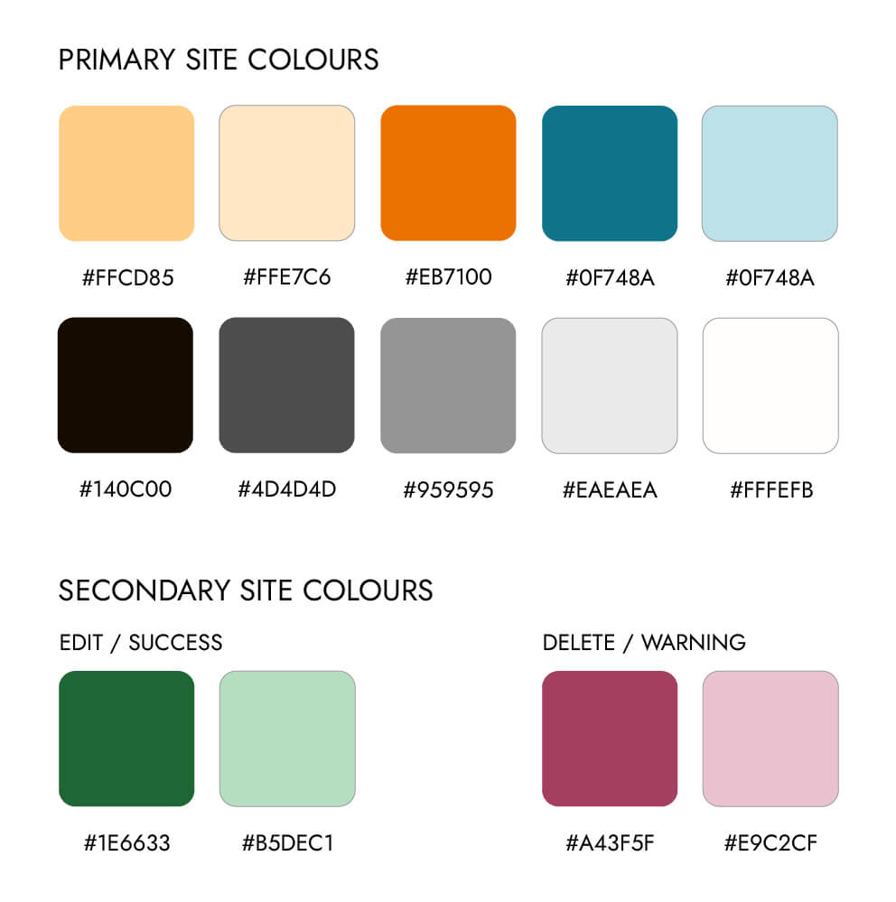

# Island Bees - E-Commerce Site

#### **By Emma Hewson**
[Click here to view the live web application](https://island-bees-5e7b15194c83.herokuapp.com/)

This is the documentation for my e-commerce web application: Island Bees. It has been built using Django, Python, JavaScript, CSS3 & HTML5 for educational purposes as part of Code Institute’s Diploma in Web Application Development Course.

- - -
## Table of Contents

1. [User Experience](#)
    * [Project Aims](#)
    * [User Stories](#)
    * [Design](#)
        * [Wireframes](#)
        * [Colour](#)
        * [Typography](#)
        * [Images & Graphics](#)
        * [Database Schema](#)
        * [Flow Diagram](#)
        * [Design Changes](#)
2. [Features](#)
    * [Site Features](#)
    * [Future Features](#)
3. [Technologies Used](#technologies-used)
    * [Languages](#languages)
    * [Frontend Frameworks / Libraries](#frontend-frameworks--libraries)
    * [Backend Modules / Packages & Frameworks](#backend-modules--packages--frameworks)
    * [Other Tools](#other-tools)
    * [External Sites / Resources / Software](#external-sites--resources--software)
4. [Testing](#)
    * [Bugs](#)
        * [Fixed Bugs](#)
        * [Remaining Bugs](#)
5. [Deployment](#deployment)
  * [Forking the GitHub Repository]()
  * [Making a Local Clone]()
  * [Deploying with Heroku]()
6. [Credits]()
  * [Online resources]()
  * [Code]()
  * [Media]()
  * [Acknowledgments]()

- - -

## User Experience

### Project Aims

The initial aims of the project were to create an e-commerce website for an imaginary company called Island Bees, a North Wales based apiary and merchants, who stock a variety of good relating to bee-keeping as well as running courses for bee keepers. The website's main purpose was to allow customers to browse the company's products and make purchases, tell the customers about Island Bees and information about their online shop and allow user interactions through reviews and messages.

- - -

###  User Stories

1. As a general user:
  - 1.1: I want to understand the purpose of the site immediately upon entering
  - 1.2: I want to be able to find what I need immediately and for the navigation to be easy to follow & intuitive
  - 1.3: I want to be able to view the site on any device and for it to be fully responsive
  - 1.4: I want to be able to find answers to common questions
  - 1.5: I want to be able to contact the company with any questions or queries
  - 1.6: I want to be able to find the company on social media to find out more
  - 1.6: I want to be able to return to the main site without having to use the browser buttons if I end up on a non-existent page
  - 1.7: I want to get feedback when interacting with the site to know if my actions have been successful

2. As a shopper:
  - 2.1: I want to be able to browse products easily, with options to filter & search to find what I need
  - 2.2: I want to be able to find out information about products
  - 2.3: I want to see ratings & reviews of a product to know more about the quality and whether it's right for me
  - 2.4: I want to be able to shop for multiple items at once, from across the site
  - 2.5: I want to be able to add multiples of a single product to my bag at once
  - 2.6: I want to be able to edit my shopping bag if I change my mind
  - 2.7: I want to know what I will be charged for delivery
  - 2.8: I want my payment and order to be fully secure and trustworthy
  - 2.9: I want to be able to set up an account to save my order history

3. As a user with an account:
  - 3.1: I want my account to be secure & easy to set up
  - 3.2: I want to be able to see my order history
  - 3.3: I want to be able to update & save my personal information
  - 3.4: I want to leave reviews of products I have purchased for the benefit of other customers
  - 3.5: I want to be able to edit my reviews
  - 3.6: I don't want admins or other customers to be able to edit my reviews

4. As an admin of the site:
  - 4.1: I want to be able to add & edit products
  - 4.2: I want to be able to remove products from sale
  - 4.3: I want to see customer messages, reply easily and manage whether they need further action
  - 4.4: I want to approve customer reviews before they go live & delete any with inappropriate content only
  - 4.5: I want to be able to update the site FAQs
  - 4.6: 

- - -

### Design

#### Wireframes

- - -

#### Colour

I used a colour palette of yellows and greys with a blue highlight colour to create contrast. I also added additional colours for all success/edit/info features and delete/warning/error features as well as to help categorise different statuses of messages & reviews on the profile & manage pages. I used a number of shades of the colours to help create contrast, to make the site legible and got give more flexibility in the design. The colours changed slightly during the validation stage as the yellow & grey on the rating hexagons were causing some contrast errors, so I introduced an orange tone to replace the yellow and darkened the grey hexagons to make sure the site was fully accessible.

- - -

#### Typography

The website uses 2 typefaces that I felt worked well together and complemented each other:
- [Oxygen](https://fonts.google.com/specimen/Oxygen) for headings & the site logo
- [Source Sans 3](https://fonts.google.com/specimen/Source+Sans+3) for the main body text

- - -

#### Images & Graphics

- **Logo:** I created a logo for the site in the shape of a simplified bee as it is a strong iconic image and gives an immediate sense of the purpose of the site and a strong brand image. I created 2 versions, one with text for larger screens and another without which works as an icon. I also created a Favicon with a yellow background using the same logo.

- **Hexagons:** There are recurring hexagon shapes and background patterns throughout the site, on the Hero image on the home page, on the bag icon in the nav bar, in the products div as a background pattern and as a rating 'star' on the products. The hexagon continues the bee theme and creates a unique graphic element that runs through the site.

- **Error Bee:** The error pages contain a bee cartoon from Freepik (see credits section) to make these pages tie in with the rest of the site.

- **No Image Graphic:** I also created a 'no-image' graphic to be used whenever a product doesn't have an image using the site logo.

- - -

#### Database Schema

- - -

#### Flow Diagram

- - -

#### Design Changes

- - -
[Go to Top](#island-bees---e-commerce-site)
- - -

## Features

### Site Features

Mention
using widget-tweak to add style classes to the form inputs in the auth templates
The delivery charge calculations when no delivery is chargeable
Additional titles and description meta tags on each page
Reviews - superuser cannot edit, only delete
Reviews - approval
Product rating only takes in to account approved reviews & is updated upon add, edit, delete & toggle

- - -

### Future Features

In Original Design
- Blog

Admin notification when a review / message is submitted 
A more comprehensive system for messages with admins able to review chain of communication and reply on the site
A booking system for courses with a calendar and tracking of availability on courses
A stock control system for products
An order tracking system for admins

- - -
[Go to Top](#island-bees---e-commerce-site)
- - -

## Technologies Used

### Languages

- [HTML:](https://en.wikipedia.org/wiki/HTML5) Used to build the main structure of the site
- [CSS:](https://en.wikipedia.org/wiki/Cascading_Style_Sheets) Used to style the website (Combination of bespoke styling and Bootstrap)
- [JavaScript:](https://en.wikipedia.org/wiki/JavaScript) Used for front end interactive features
  - Bag / Product Quantity Input
  - Stripe Payment Handling
  - Message is_open toggle functionality
  - Review is_authorised toggle functionality
  - Manage page scroll on refresh
  - Product form image field text
  - Product sorting page reload
  - Countryfield on address forms
  - Review rating select interactive styling
  - Scroll to Top button
  - Remove & Update products from bag
- [Python: ](<https://en.wikipedia.org/wiki/Python_(programming_language)>) Used to build the core of the backend of the project within the Django framework

### Frontend Frameworks / Libraries

- [Bootstrap:](https://getbootstrap.com/) Used throughout the site for the styling, layout & responsiveness
- [Font Awesome:](https://fontawesome.com/) Used to add icons to the site to help with UX and to add more character
- [JQuery:](https://jquery.com/) JavaScript library for making JavaScript quicker and easier to write

### Backend Modules / Packages & Frameworks

- [Django:](https://www.djangoproject.com/) High Level Python-based Web Framework.
- [AllAuth:](https://django-allauth.readthedocs.io/en/latest/) Integrated Django authentication & sign in.
- [Django Countries:](https://pypi.org/project/django-countries/) Django application that provides country choices for forms
- [Django Widget Tweaks:](https://pypi.org/project/django-widget-tweaks/) Django form field advanced styling & customisation
- [Django Storages:](https://django-storages.readthedocs.io/en/latest/) Collection of custom storage backends for Django
- [Freezegun:](https://pypi.org/project/freezegun/) Library to aid automated testing by giving control over the datetime module
- [Gunicorn:](https://gunicorn.org/) A Python WSGI HTTP Server for UNIX
- [Pillow:](https://pypi.org/project/Pillow/) Python imaging Library for extended image handling capabilities
- [Psycopg2:](https://www.psycopg.org/) Postgres adaptor to allow smooth communication between the backend and the database
- [s3transfer:](https://pypi.org/project/s3transfer/) Python library for managing Amazon AWS S3 Transfers
- [Boto3](https://boto3.amazonaws.com/v1/documentation/api/latest/index.html) & [Botocore:](https://github.com/boto/botocore) Used to create, configure & manage AWS services using Python
- [Stripe:](https://stripe.com/gb) Stripe package part of the Stripe ecosystem to manage secure online payments
- [dj-database-url:](https://pypi.org/project/dj-database-url/) Allows you to use DATABASE_URL env variable in settings.py
- [Coverage:](https://coverage.readthedocs.io/en/7.3.1/) Tool for measuring code coverage of Python Programs
- [oauthlib](https://pypi.org/project/oauthlib/) & [requests-oauthlib:](https://pypi.org/project/requests-oauthlib/) Handles authentication using the OAuth request signin logic
- [python3-openid:](https://pypi.org/project/python3-openid/) Set of python packages to support the use of teh OpenID decentralised identity system
- [sqlparse:](https://pypi.org/project/sqlparse/) SQL parser for Python
- [urllib3:](https://pypi.org/project/urllib3/) HTTP client for Python
 

### Other Tools

- [Git:](https://git-scm.com/) Used for version control via Code Anywhere by using the terminal to Git and Push to GitHub
- [GitHub:](https://github.com/) Used to store the project code
- [Gitpod:](https://www.gitpod.io/) Used to create, edit & preview the project's code
- [Heroku:](https://dashboard.heroku.com/apps) Used to deploy the live site

### External Sites / Resources / Software

- [Figma:](https://www.figma.com/) Used to develop the wireframes in to a full site design including colours, fonts, proportions etc
- [Google Fonts:](https://fonts.google.com/) Used to select & import the fonts to the project (Oxygen & Source Sans 3)
- [Adobe Illustrator:](https://www.adobe.com/uk/products/illustrator.html) Used to create the site logo
- [Adobe Photoshop:](https://www.adobe.com/uk/products/photoshop.html) Used to crop, adjust and resize the photos to optimise them for the site
- [Bulk Photo Resize:](https://bulkresizephotos.com/en) Used to resize & convert images 
- [Tiny PNG:](https://tinypng.com/) Used to further optimise the images for the site and reduce file size
- [ezGIF:](https://ezgif.com/) Creating GIFs for the README
- [tableconvert.com:](https://tableconvert.com/csv-to-markdown) Converting CSV files to Markdown tables for README
- [Favicon.io:](https://favicon.io/favicon-converter/) Used to create and add the favicon to the browser tab
- [Google Chrome Dev Tools:](https://developers.google.com/web/tools/chrome-devtools) Used to inspect page elements, debug issues with the site & test responsiveness on different mockup devices
- [Techsini:](http://techsini.com/multi-mockup/index.php) Website mockup image generator for images in this README.
- [Temp Mail:](https://temp-mail.org/en/) Temporary email generator for testing account verification & order confirmation

- - -
[Go to Top](#island-bees---e-commerce-site)
- - -

### Test Results & Bugs

The full test results and details of any bugs and their fixes can be found in the [TESTING document](TESTING.md)

- - -
[Go to Top](#island-bees---e-commerce-site)
- - -

## Deployment

### Forking the GitHub Repository

- - -

#### Making a Local Clone

- - -

#### Deploying with Heroku

- - -
[Go to Top](#island-bees---e-commerce-site)
- - -

## Credits

### Online resources

CHATGPT to produce the text for the products & reviews. It was not used for any code production or problem solving, just as a quick way to produce text content to populate the site.

- - -

### Code

- - -

### Media

- - -

### Acknowledgments

- - -

[Go to Top](#island-bees---e-commerce-site)

