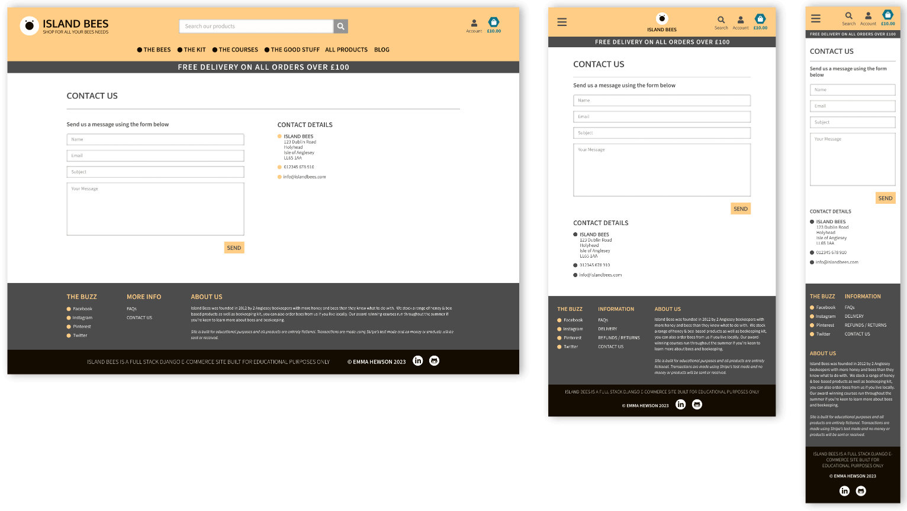

# Island Bees - E-Commerce Site


#### **By Emma Hewson**
[Click here to view the live web application](https://island-bees-5e7b15194c83.herokuapp.com/)

This is the documentation for my e-commerce web application: Island Bees. It has been built using Django, Python, JavaScript, CSS3 & HTML5 for educational purposes as part of Code Institute’s Diploma in Web Application Development Course.


- - -
## Table of Contents

- [Planning, Design & User Experience](#planning-design--user-experience)
    - [Strategy](#strategy)
    - [Scope](#scope)
    - [Structure](#structure)
    - [Skeleton](#skeleton)
    - [Surface](#surface)
- [Features](#features)
    - [Future Features](#)
- [Technologies Used](#technologies-used)
    - [Languages](#languages)
    - [Frontend Frameworks / Libraries](#frontend-frameworks--libraries)
    - [Backend Modules / Packages & Frameworks](#backend-modules--packages--frameworks)
    - [Other Tools](#other-tools)
    - [External Sites / Resources / Software](#external-sites--resources--software)
- [Testing & Bugs](#testing--bugs)
- [Deployment](#deployment)
    - [Forking the GitHub Repository](#forking-the-github-repository)
    - [Making a Local Clone](#making-a-local-clone)
    - [Deploying Your App](#deploying-your-app)
- [Credits](#credits)
    - [Code](#code)
    - [Content](#content)
    - [Acknowledgments](#acknowledgments)


- - -

## Planning, Design & User Experience

I approached the planning & design of this project using the principles of User Experience and the 5 stages of strategy, scope, structure, skeleton & surface. This is a large, complex project and I wanted to make sure it remained on course, on time and the best it could be whilst meeting all its initial aims. 

### Strategy

#### Project Aims

The initial aims of the project were to create an e-commerce website for an imaginary company called Island Bees, a North Wales based apiary and merchants, who stock a variety of good relating to bee-keeping as well as running courses for bee keepers. The website's main purpose was to allow customers to browse the company's products and make purchases, tell the customers about Island Bees and information about their online shop and allow user interactions through reviews and messages.

#### Research

I did some research in to other similar websites as well as in the wider e-commerce world. I wanted to make sure that Island Bee's website conformed to the expectations that users have for an e-commerce site, this is extra important because it involves financial transactions and I wanted to create a feel of trustworthiness and professionalism in order to encourage users to make purchases. I also gathered design ideas for the look of this site including colour, layout and typography.

Websites visited for research:
- [BS Honey Bees](https://www.bshoneybees.co.uk/)
- [Anglesey Bees](https://www.angleseybees.co.uk/)
- [Local Honey Man](https://localhoneyman.co.uk/)
- [Bee Equipment](https://bee-equipment.co.uk/)


####  User Stories

Based on my research and the project aims I created a set of user stories that would inform all the choices made in designing and developing the site.

1. As a general user:
  - 1.1: I want to understand the purpose of the site immediately upon entering
  - 1.2: I want to be able to find what I need immediately and for the navigation to be easy to follow & intuitive
  - 1.3: I want to be able to use all features on the site on any device and for it to be fully responsive
  - 1.4: I want to be able to find answers to common questions
  - 1.5: I want to be able to contact the company with any questions or queries
  - 1.6: I want to be able to find the company on social media to find out more
  - 1.7: I want to be able to return to the main site without having to use the browser buttons if I end up on a non-existent page
  - 1.8: I want to get feedback when interacting with the site to know if my actions have been successful

2. As a shopper:
  - 2.1: I want to be able to browse products easily, with options to filter & search to find what I need
  - 2.2: I want to be able to find out information about products
  - 2.3: I want to see ratings & reviews of a product to know more about the quality and whether it's right for me
  - 2.4: I want to be able to shop for multiple items at once, from across the site
  - 2.5: I want to be able to add multiples of a single product to my bag at once
  - 2.6: I want to be able to edit my shopping bag if I change my mind
  - 2.7: I want to know what I will be charged for delivery
  - 2.8: I want my payment and order to be fully secure and trustworthy
  - 2.9: I want to be able to set up an account to save my order history

3. As a user with an account:
  - 3.1: I want my account to be secure & easy to set up
  - 3.2: I want to see my order history
  - 3.3: I want to be able to update & save my personal information
  - 3.4: I want to leave reviews of products I have purchased for the benefit of other customers
  - 3.5: I want to be able to edit my reviews
  - 3.6: I don't want admins or other customers to be able to change my reviews

4. As an admin of the site:
  - 4.1: I want to be able to add & edit products
  - 4.2: I want to be able to remove products from sale
  - 4.3: I want to view & filter customer messages and manage whether they need further action
  - 4.4: I want to approve customer reviews before they go live & delete any with inappropriate content only
  - 4.5: I want to be able to update the site FAQs
  - 4.6: I want all the admin controls to be quick and easy to find and use

- - -

### Scope

I then created a list of all the features I would like to add to the site in order to meet all these user stories, as well as some extras that I'd like to include should time allow. I rated these in terms of difficulty and importance and this would help inform the decisions throughout the next stages of planning.

| Feature                                                                 | Difficulty | Importance |
|-------------------------------------------------------------------------|------------|------------|
| Responsive Design                                                       | 1          | 5          |
| Navigation - all page links                                             | 1          | 5          |
| Navigation - search facility                                            | 3          | 3          |
| Navigation - Shopping bag & current total                               | 3          | 4          |
| Footer - company info                                                   | 1          | 3          |
| Footer - social links                                                   | 1          | 3          |
| Home Page - branding & explanatory text                                 | 1          | 4          |
| Home Page - Featured Products                                           | 2          | 2          |
| Products - Product cards with summary info                              | 2          | 5          |
| Products - Sorting/searching/filtering                                  | 5          | 4          |
| Products - Detail Page with more info                                   | 2          | 5          |
| Products - Detail Page add to bag & quantity select                     | 4          | 5          |
| Products - CRUD functionality for admins                                | 3          | 5          |
| User Reviews of products                                                | 3          | 3          |
| User Reviews - update product average ratings                           | 5          | 3          |
| User Reviews - CRUD functionality (user only)                           | 3          | 3          |
| User Reviews - Admin approval system                                    | 4          | 2          |
| Bag - Users can store items in a bag for purchase                       | 4          | 5          |
| Checkout - Page with bag summary and delivery info                      | 4          | 5          |
| Checkout - Secure payment system                                        | 5          | 5          |
| Checkout - Page to show order summary on successful checkout            | 3          | 3          |
| User accounts - all standard login/out/register functionality           | 4          | 5          |
| User accounts - secure & reliable                                       | 4          | 5          |
| Profile - User profile page showing order history & reviews             | 3          | 4          |
| Profile - Page to show historical order information                     | 2          | 3          |
| Profile - Users can save & update their personal info for future orders | 4          | 4          |
| Frequently Asked Questions Page - company info                          | 1          | 4          |
| FAQs - CRUD functionality for admins                                    | 3          | 2          |
| Contact Us Page                                                         | 1          | 4          |
| Contact Us - Creates message in DB                                      | 3          | 2          |
| Contact Us - Admins can toggle status open/closed                       | 4          | 2          |
| Blog - Company insights & stories                                       | 3          | 1          |
| Site Management - useful links to admin jobs                            | 2          | 4          |
| Site Management - Customer Messages                                     | 3          | 2          |
| Site Management - Reviews for approval                                  | 3          | 2          |


---

### Structure

#### Flow Diagram

I created a flow diagram using [Lucidchart](https://www.lucidchart.com/pages/) to map out the structure of the site. This was an important step in the user experience design process, working out the structure and skeleton of the site, to provide the best user experience whilst keeping the user stories at the heart of the decision-making process. It allowed me to think through the paths of users through the site and what would need to link to where based on the different user stories and. It would also allowe me to make sure the site functioned as expected and everything was easy to find. It was also a vital tool to manage the scope of the project during the design and development stages, a blueprint to keep everything on track.


- - -

### Skeleton

#### Database Schema

An important stage in the planning was building a database schema, planning my data clearly, from the beginning, to make the development process as easy as possible. This database schema was informed by my work in the previous planes, the user stories, my scope chart and my flow diagram. I used [DrawSQL](https://drawsql.app/) to create a visual representation of the database, which I used throughout the development process to keep track of what my database looked like, updating it and amending it as the project grew and adapted as I learned. The original schema I created also included a blog, which I ended up rejecting from the final site due to time constraints as I wanted to focus my efforts on doing the project well rather than making it bigger and bigger. I have left it in the schema to demonstrate the work I did towards this and how it would connect to the rest of the database should I add it in in the future.


#### Models

Below is a breakdown of all the models included in the final app. The site uses a relational database model using Postgres (SQLite & Elephant SQL). The app uses a number of models adapted from the Boutique Ado walkthrough (User, Email, UserProfile, Category, Product) as well as 3 original models (Faq, Review, Message).

<details><summary>User / Email Models (Created by Django allauth)</summary>

The User model is created by Django allauth and connects to a separate Email Address Model. I have created relationships to these models throughout the project but as I have not created them myself I have not included a breakdown of the fields. More information about Django allauth can be found [here](https://docs.allauth.org/en/latest/index.html).

</details>

<details><summary>UserProfile Model</summary>

| **Field**                   | **Field Type** | **Validation** | **null** | **blank** | **default** | **on_delete** | **editable** | **related_name** |
|-----------------------------|----------------|----------------|----------|-----------|-------------|---------------|--------------|------------------|
| **user**                    | ForeignKey     | n/a            | FALSE    | FALSE     | n/a         | CASCADE       | TRUE         | n/a              |
| **default_street_address1** | Char           | max_length=80  | TRUE     | TRUE      | n/a         | n/a           | TRUE         | n/a              |
| **default_street_address2** | Char           | max_length=80  | TRUE     | TRUE      | n/a         | n/a           | TRUE         | n/a              |
| **default_town_or_city**    | Char           | max_length=40  | TRUE     | TRUE      | n/a         | n/a           | TRUE         | n/a              |
| **default_county**          | Char           | max_length=80  | TRUE     | TRUE      | n/a         | n/a           | TRUE         | n/a              |
| **default_postcode**        | Char           | max_length=20  | TRUE     | TRUE      | n/a         | n/a           | TRUE         | n/a              |
| **default_country**         | Country        | n/a            | TRUE     | TRUE      | n/a         | n/a           | TRUE         | n/a              |
| **default_phone_number**    | Char           | max_length=20  | TRUE     | TRUE      | n/a         | n/a           | TRUE         | n/a              |


</details>

<details><summary>Category Model</summary>

| **Field**         | **Field Type** | **Validation** | **null** | **blank** | **default** | **on_delete** | **editable** | **related_name** |
|-------------------|----------------|----------------|----------|-----------|-------------|---------------|--------------|------------------|
| **Name**          | Char           | max_length=254 | FALSE    | FALSE     | n/a         | n/a           | TRUE         | n/a              |
| **Friendly Name** | Char           | max_length=254 | TRUE     | TRUE      | n/a         | n/a           | TRUE         | n/a              |


</details>

<details><summary>Product Model</summary>

| **Field**           | **Field Type** | **Validation**                   | **null** | **blank** | **default** | **on_delete** | **editable** | **related_name** |
|---------------------|----------------|----------------------------------|----------|-----------|-------------|---------------|--------------|------------------|
| **category**        | ForeignKey     | n/a                              | TRUE     | TRUE      | n/a         | SET_NULL      | TRUE         | n/a              |
| **name**            | Char           | max_length=50                    | FALSE    | FALSE     | n/a         | n/a           | TRUE         | n/a              |
| **description**     | Text           | n/a                              | FALSE    | FALSE     | n/a         | n/a           | TRUE         | n/a              |
| **price**           | Decimal        | "max_digits=6, decimal_places=2" | FALSE    | FALSE     | n/a         | n/a           | TRUE         | n/a              |
| **is_featured**     | Boolean        | n/a                              | FALSE    | FALSE     | FALSE       | n/a           | TRUE         | n/a              |
| **delivery_charge** | Boolean        | n/a                              | FALSE    | FALSE     | TRUE        | n/a           | TRUE         | n/a              |
| **discontinued**    | Boolean        | n/a                              | FALSE    | FALSE     | FALSE       | n/a           | TRUE         | n/a              |
| **image**           | Image          | n/a                              | TRUE     | TRUE      | n/a         | n/a           | TRUE         | n/a              |
| **rating**          | Integer        | "Min=0, Max=5"                   | FALSE    | FALSE     | n/a         | n/a           | TRUE         | n/a              |


</details>

<details><summary>Order Model</summary>

| **Field**           | **Field Type** | **Validation**                    | **null** | **blank** | **default**    | **on_delete** | **editable** | **related_name** |
|---------------------|----------------|-----------------------------------|----------|-----------|----------------|---------------|--------------|------------------|
| **order_number**    | Char           | max_length=32                     | FALSE    | FALSE     | n/a            | n/a           | FALSE        | n/a              |
| **user_profile**    | ForeignKey     | n/a                               | TRUE     | TRUE      | n/a            | SET_NULL      | TRUE         | orders           |
| **full_name**       | Char           | max_length=50                     | FALSE    | FALSE     | n/a            | n/a           | TRUE         | n/a              |
| **email**           | Email          | max_length=254                    | FALSE    | FALSE     | n/a            | n/a           | TRUE         | n/a              |
| **phone_number**    | Char           | max_length=20                     | TRUE     | TRUE      | n/a            | n/a           | TRUE         | n/a              |
| **street_address1** | Char           | max_length=80                     | FALSE    | FALSE     | n/a            | n/a           | TRUE         | n/a              |
| **street_address2** | Char           | max_length=80                     | TRUE     | TRUE      | n/a            | n/a           | TRUE         | n/a              |
| **town_or_city**    | Char           | max_length=40                     | FALSE    | FALSE     | n/a            | n/a           | TRUE         | n/a              |
| **county**          | Char           | max_length=80                     | FALSE    | FALSE     | n/a            | n/a           | TRUE         | n/a              |
| **postcode**        | Char           | max_length=20                     | FALSE    | FALSE     | n/a            | n/a           | TRUE         | n/a              |
| **country**         | Country        | n/a                               | FALSE    | FALSE     | n/a            | n/a           | TRUE         | n/a              |
| **date**            | DateTime       | n/a                               | FALSE    | FALSE     | n/a            | n/a           | TRUE         | n/a              |
| **order_total**     | Decimal        | "max_digits=10, decimal_places=2" | FALSE    | FALSE     | 0              | n/a           | TRUE         | n/a              |
| **delivery_cost**   | Decimal        | "max_digits=6, decimal_places=2"  | FALSE    | FALSE     | 0              | n/a           | TRUE         | n/a              |
| **grand_total**     | Decimal        | "max_digits=10, decimal_places=2" | FALSE    | FALSE     | 0              | n/a           | TRUE         | n/a              |
| **original_bag**    | Text           |                                   | FALSE    | FALSE     | [empty string] | n/a           | TRUE         | n/a              |
| **stripe_pid**      | Char           | max_length=254                    | FALSE    | FALSE     | [empty string] | n/a           | TRUE         | n/a              |


</details>

<details><summary>OrderLineItem Model</summary>

| **Field**          | **Field Type** | **Validation**                   | **null** | **blank** | **default** | **on_delete** | **editable** | **related_name** |
|--------------------|----------------|----------------------------------|----------|-----------|-------------|---------------|--------------|------------------|
| **order**          | ForeignKey     | n/a                              | FALSE    | FALSE     | n/a         | CASCADE       | TRUE         | lineitems        |
| **product**        | ForeignKey     | n/a                              | FALSE    | FALSE     | n/a         | PROTECT       | TRUE         | lineitems        |
| **quantity**       | Integer        | n/a                              | FALSE    | FALSE     | 0           | n/a           | TRUE         | n/a              |
| **lineitem_total** | Decimal        | "max_digits=6, decimal_places=2" | FALSE    | FALSE     | n/a         | n/a           | FALSE        | n/a              |


</details>

<details><summary>Faq Model</summary>

| **Field**    | **Field Type** | **Validation** | **null** | **blank** | **default** | **on_delete** | **editable** | **related_name** |
|--------------|----------------|----------------|----------|-----------|-------------|---------------|--------------|------------------|
| **question** | Char           | max_length=100 | FALSE    | FALSE     | n/a         | n/a           | TRUE         | n/a              |
| **answer**   | Char           | n/a            | FALSE    | FALSE     | n/a         | n/a           | TRUE         | n/a              |


</details>

<details><summary>Message Model</summary>

| **Field**      | **Field Type** | **Validation** | **null** | **blank** | **default** | **on_delete** | **editable** | **related_name** |
|----------------|----------------|----------------|----------|-----------|-------------|---------------|--------------|------------------|
| **user**       | ForeignKey     | n/a            | TRUE     | TRUE      | n/a         | SET_NULL      | TRUE         | messages         |
| **name**       | Char           | max_length=50  | TRUE     | FALSE     | n/a         | n/a           | TRUE         | n/a              |
| **email**      | Email          | max_length=254 | TRUE     | FALSE     | n/a         | n/a           | TRUE         | n/a              |
| **subject**    | Char           | max_length=40  | FALSE    | FALSE     | n/a         | n/a           | TRUE         | n/a              |
| **content**    | Text           | max_length=500 | FALSE    | FALSE     | n/a         | n/a           | TRUE         | n/a              |
| **created_on** | Date           | n/a            | FALSE    | FALSE     | n/a         | n/a           | TRUE         | n/a              |
| **is_open**    | Boolean        | n/a            | FALSE    | FALSE     | TRUE        | n/a           | TRUE         | n/a              |


</details>


<details><summary>Review Model</summary>

| **Field**       | **Field Type** | **Validation** | **null** | **blank** | **default** | **on_delete** | **editable** | **related_name** |
|-----------------|----------------|----------------|----------|-----------|-------------|---------------|--------------|------------------|
| **product**     | ForeignKey     | n/a            | TRUE     | TRUE      | n/a         | CASCADE       | n/a          | reviews          |
| **user**        | ForeignKey     | n/a            | TRUE     | TRUE      | n/a         | SET_NULL      | n/a          | reviews          |
| **created_on**  | Date           | n/a            | FALSE    | FALSE     | n/a         | n/a           | n/a          | n/a              |
| **title**       | Char           | max_length=40  | FALSE    | FALSE     | n/a         | n/a           | n/a          | n/a              |
| **content**     | Text           | max_length=500 | FALSE    | FALSE     | n/a         | n/a           | n/a          | n/a              |
| **rating**      | Integer        | "Min=0, Max=5" | FALSE    | FALSE     | 0           | n/a           | n/a          | n/a              |
| **is_approved** | Boolean        | n/a            | FALSE    | FALSE     | FALSE       | n/a           | n/a          | n/a              |


</details>


#### Wireframes (see below)

Whilst traditionally wireframes are included in the Skeleton section I have included mine in the Surface section below. I have developed a way of working where I flesh out the full design of the site in [Figma](https://www.figma.com/), including making all colour, typography and layout decisions at this stage, to make sure that during development I am free to focus on the nuts and bolts of how to build the site, rather than getting distracted by design decisions at that stage. It has been successful for me in the past and so I have chosen to develop the site in this way again. 

---

### Surface

#### Wireframes

At this point I was able to bring together all the work I had done in creating the flow diagram (which included a lot of page content and structure decisions), my user stories, my scope chart and my database schema to create full visual designs for my site. This was more than just making colour and font choices however. Every design decision creates questions about what goes where, what colour should it be, does it even need to be there or would it be better somewhere else. I was able to ask informed questions at each stage to make sure the design reflected the user stories and site aims. E.g. What does a user need to see when they arrive on a page? What is the most important thing on a page and how can the design emphasise that? etc.

I created the designs below, making sure that all pages would work just as well on mobile and tablet as on desktop devices.

**View the Wireframes/Site Designs in the Dropdowns Below**

<details><summary>HOME</summary>

</details>
<details><summary>PRODUCTS</summary>

*All Products*

*Filtered Products*
</details>
<details><summary>PRODUCT DETAILS</summary>

</details>
<details><summary>ADD/EDIT PRODUCT</summary>

</details>
<details><summary>ADD/EDIT REVIEW</summary>

</details>
<details><summary>BAG</summary>

</details>
<details><summary>CHECKOUT</summary>

</details>
<details><summary>CHECKOUT SUCCESS</summary>

</details>
<details><summary>PROFILE</summary>

</details>
<details><summary>ORDER DETAILS</summary>

</details>
<details><summary>FAQS</summary>

</details>
<details><summary>ADD/EDIT FAQ</summary>

</details>
<details><summary>CONTACT US</summary>

</details>
<details><summary>SITE MANAGEMENT</summary>

</details>
<details><summary>SIGN IN</summary>

</details>
<details><summary>REGISTER</summary>

</details>

*Please note - designs for all authorisation pages will be replicated across all AllAuth templates. Sign In and Register have been created as a template for the others.*
- - -

#### Colour


I used a colour palette of yellows and greys with a blue highlight colour to create contrast. I also added additional colours for all success/edit/info features and delete/warning/error features as well as to help categorise different statuses of messages & reviews on the profile & manage pages. I used a number of shades of the colours to help create contrast, to make the site legible and got give more flexibility in the design. The colours changed slightly during the validation stage as the yellow & grey on the rating hexagons were causing some contrast errors, so I introduced an orange tone to replace the yellow and darkened the grey hexagons to make sure the site was fully accessible. [See design changes.](#design-changes)

- - -

#### Typography

The website uses 2 typefaces that I felt worked well together and complemented each other:
- [Oxygen](https://fonts.google.com/specimen/Oxygen) for headings & the site logo
- [Source Sans 3](https://fonts.google.com/specimen/Source+Sans+3) for the main body text

- - -

#### Images & Graphics

All images are fully credited in the [here](#credits).

##### Logo
I created a logo for the site in the shape of a simplified bee as it is a strong iconic image and gives an immediate sense of the purpose of the site and a strong brand image. I created 2 versions, one with text for larger screens and another without which works as an icon. I also created a Favicon with a yellow background using the same logo.

<details><summary>Island Bees Logo - Favicon Version</summary>

</details>

##### Hexagons
There are recurring hexagon shapes and background patterns throughout the site, on the Hero image on the home page, on the bag icon in the nav bar, in the products div as a background pattern and as a rating 'star' on the products. The hexagon continues the bee theme and creates a unique graphic element that runs through the site.

<details><summary>Hex Background</summary>

</details>

##### Error Bee
The error pages contain a bee cartoon from Freepik (see credits section) to make these pages tie in with the rest of the site.

<details><summary>Error Bee</summary>

</details>

##### No Image Graphic
I also created a 'no-image' graphic to be used whenever a product doesn't have an image using the site logo.

<details><summary>No Image</summary>

</details>

- - -


#### Design Changes

During development there were a number of changes that mean the final site has deviated from the above designs slightly. These came about for a number of reasons but were usually related to technical problems during the development process which could be solved through small design changes, or to improve the User Experience, accessibility or general feel of the site once it was up and running. It is important to make a plan and stick to it, however it is also important to be flexible enough to adapt when a new and better idea comes along. All of these decisions were taken keeping the user stories and user experience in mind at all times.

##### Review / FAQ form
I had planned to make these forms appear as modals, rather than separate pages, I thought it would improve user experience to give users the sense of staying in the same area whilst filling in the form. However, I quickly realised that this would present some technical challenges, mostly relating to having multiple modals on a page, and having a modal trigger another modal. I felt that the difficultly and time that this would add to the project was not worth it, so these pages became separate pages, with a form that looks more like the other forms. In the case of the review form I kept a slightly more unique styling as this is a form for users, rather than admins and I felt it would add a nice design touch to the site.

##### Colour changes
There were a number of changes to the colour scheme during the development process. In the wireframes you can see the original colours, however the colour palette above reflects the final colours used in the site. These changes happened during the accessibility testing stage, where it flagged up a number of issues with the yellow in particular, against the white background. The biggest change that most people would notice is on the rating hexagons, which are a bright orange on the final site, rather than a soft yellow.

##### Home Page Category Hexagons
Whilst developing the site I found that using a hexagon shape in CSS is somewhat challenging, particularly when it comes to stacking, moving and repeating them in rows, they are a difficult shape to work with. However, I persevered and managed to include them in a number of different places using a variety of techniques. On the home page I created a lovely stacking set of 4 hexagons which was fully responsive, based on this excellent piece of CSS work by [Temani Afif](https://dev.to/afif/responsive-hexagon-grid-without-media-query-57g7). Sadly, during CSS Validation, it threw up an error, despite working perfectly, and I couldn't find a way around it without my project failing CSS validation, so the hexagons had to go. I replaced them with squares which do the same job. For more information and a look at the original hexagon grid in action go to CSS Validation in [TESTING.md](TESTING.md)

##### Edit / Delete Product Buttons on Cards
I made the decision to remove the CRUD functionality buttons from the product cards. This came about when I discovered there was an issue with deleting products which had previously been ordered by a customer, it caused huge problems to delete them and was not good practice as all of the orders would then be incorrect as the product and its cost would be removed from them. This led to a number of changes on the site, one of which was making delete only accessible from the product details page. I felt that it provided a better user experience to remove both buttons from the cards and provide a single point of access to site admins.

##### Discontinued Tick Box on Product Forms
Following on from the above changes I also added a 'discontinued' field to the product forms to allow admins to mark a product as 'discontinued' rather than delete it, which solved the problem of deleting products which were connected with past orders.

##### Review approval
This is a feature that I added later in the process, which gives admins the ability to approve a review before it goes live, it also removed the admin's access to editing reviews as I felt this was poor business logic and would undermine customer trust in the reviews. This led to a couple of design changes; the addition of a 'PENDING APPROVAL' flag to the reviews on the user profile page so that users could see the status of their review & adding the unapproved reviews to the site management page with a toggle switch for admins to approve them.

##### Other minor changes
There were also other small tweaks to the site in terms of layout, margins, sizing and style, which are part of the natural course of development. As with all these changes they were made whilst keeping the User Stories in mind at all times.

- - -
[Go to Top](#island-bees---e-commerce-site)
- - -

## Features

Details of all features on the site including details of their value to the user.

### Whole Site


<details><summary>Meta Tags</summary>

- All pages have title & description meta tags to improve their SEO performance

**Value To User**
Allows the site to be found easily by shoppers when searching online. Gives clarity to the site's purpose and content.

</details>

<details><summary>Layout</summary>

- Site width is restricted to 1400px so that the contents display correctly on wider screens as well as limiting the width of the hero image on the home page to maintain the quality. The area around the site has been set to a grey that fits with the site branding.

**Value To User**
Makes the site look good & be easy to use and navigate no matter what device a user is on. Enhances user experience and creates a positive emotional response.

</details>

<details><summary>General Responsiveness</summary>

- The site is fully responsive across all pages to help all features appear correctly and look their best on all devices. This includes:
    - Changes to font size
    - Changes to padding & margins
    - Changes to the height of divs/sections
    - Layout changes including stacking elements on smaller screens
- Details of more specific changes can be found in the feature sections below.

**Value To User**
Makes the site look good & be easy to use and navigate no matter what device a user is on. Enhances user experience and creates a positive emotional response.

</details>

<details><summary>Favicon</summary>

- The site has a Favicon using the brand's bee icon.

**Value To User**
Builds the brand & creates brand consistency, continues the site design in the user's browser tab, makes the site feel professional the trustworthy.

</details>

<details><summary>Nav Bar</summary>

- Fully responsive nav bar
- Nav changes based on screen size, with completely bespoke layout & content for each
- Large & XL screens:
    - Clickable logo which takes the user back to the home page
    - Search box (permanently visible) which allows users to search for products. Site searches based on product name & description.
    - Account Menu - links to account based pages including authentication pages (sign in, sign out, register), profile page and site management. These links vary based on whether a user is logged in and whether they are an admin.
    - Shopping bag current contents icon - this icon's styling dynamically changes based on whether the current user has contents in their bag. It also tells the user the current total of all products in their bag.
    - Home page link
    - Products dropdown - links to the products page with a number of options to view products by category or all products.
- Medium screen & smaller:
    - Dropdown burger icon with links to:
        - Home Page
        - Products dropdown - links to the products page with a number of options to view products by category or all products.
    - Clickable logo which takes the user back to the home page (Medium Screens Only)
    - Search icon which triggers a search bar dropdown which allows users to search for products. Site searches based on product name & description.
    - Account Menu - links to account based pages including authentication pages (sign in, sign out, register), profile page and site management. These links vary based on whether a user is logged in and whether they are an admin.
    - Shopping bag current contents icon - this icon's styling dynamically changes based on whether the current user has contents in their bag. It also tells the user the current total of all products in their bag.
- Nav links have hover effects with smooth transitions. For the text-based links this is an underline which fades in. For icons it is a smooth colour transition.
- The navbar sticks to the top of the screen to aid navigation on longer pages

**Value To User**
Makes the site easy to navigate no matter where a user is on the site. Allows users to navigate on any device. Adds search and filter functionality allowing users to find the products they need very smoothly and intuitively. Provides feedback on bag contents so users can keep track of their shopping.


</details>


<details><summary>Delivery Banner</summary>

- Banner which is visible on all pages and extends the nav, telling users the free delivery threshold.

**Value to User**
This encourages users to spend more to reach this amount, as well as informing them of the offer of free delivery, which helps to push up sales.

</details>


<details><summary>Back To Top Button</summary>

- Fixed position button which scrolls the page back up to the top with a smooth scroll
- The button only appears when the user has scrolled down the page slightly. This means it won't appear when a page is very short and doesn't require scrolling e.g. 404 page.
- Uses JavaScript to implement functionality.
- I had originally only included this on the products page but I decided it was really useful and included in on all pages.

**Value to User**
Allows users to move around the site easily, particularly on longer pages and smaller screens where contents are stacked and pages are longer. This aids navigation and avoids users getting lost or frustrated, improving user experience.

</details>


<details><summary>Buttons & Links</summary>

- There are buttons and links across the site for a variety of purposes. They have consistent styling and specific colours have been used to manage the UI and lead users smoothly and intuitively through the site.
    - Main action buttons
        - Yellow is used for actions which don't relate to purchases e.g. adding a review, sending a message
        - Blue is used for purchasing items e.g. bag, checkout
        - Grey is used for secondary buttons e.g. 'back to shop' or 'cancel'
        - The only exceptions to the above colour system is in the Site Management page where blue is used to indicate admin actions and to differentiate the useful link buttons.
    - CRUD buttons - used for edit / delete functionality
        - These are styled differently to make it clear that they have a very different purpose, helping to avoid confusion and to enhance user experience
        - Green (success) is used for positive actions e.g. 'EDIT'
        - Red (warning / error) is used for riskier actions e.g. 'DELETE'
- There are also text-based links around the site
    - Nav & Footer links use an underline on hover styling
    - The rest of the site uses a bold blue colour with a colour transition hover to differentiate the text from the non-link text around it.

**Value to User**
Buttons allow users to take actions on the site such as purchasing, adding reviews, CRUD functionality. The consistency in design means that the site has an intuitive UI and users feel confident when taking actions. The colour system improves user experience and helps to avoid mistakes.

</details>

<details><summary>Footer</summary>

- Visible on all pages of the site, separated in to 2 sections
    - Upper footer
        - Social links - include both the social icon & name with a hover underline effect. All external links open in a new tab.
        - More Info - Links to FAQs & Contact Us pages. Have the same underline hover styling as the nav links.
        - About Us - Description of the company including a disclaimer that the site is fictional and payments will not be taken, nor items dispatched.
    - Lower Footer (Separated out as this is information is separate to the main site and relates to the reasons for it being created)
        - Disclaimer about site being for educational purposes
        - Site creator's name and social links (open in a separate tab)

**Value to User**
Provides additional links to aid site navigation. Links in the footer are for secondary features such as FAQs & Contact and so are separated from the main site links to keep the navigation simple. Allows users to connect with the company on social media. Provides context to the purpose of the site with the company info. Explains that the site is fictional to add context and clarity for users.

</details>


<details><summary>Messages & User Feedback</summary>

- Throughout the site I have used the Django messaging framework along with Bootstrap's Toast element to communicate with users as they take actions on the site. These appear as a popup message in the corner of the site which lets the user know if their action has been successful or not. It offers reassurance for the user, provides a good user experience and helps make the site seem robust and secure. The messages use conditional colours based on the type of message (success - green / error or warning - red / info - blue )
- Examples of usage
    - Adding an item to bag (success message and bag summary)
    - Updating or changing bag contents (success message)
    - Placing an order (info message including email details)
    - Adding / Editing / Deleting a review, product, FAQ etc (success message)
    - Attempting to visit a restricted page (Info message)
    - Failed payment (error message)
    - Successful log in/out (success message)
    - Registration - email sent for verification (info message)

**Value to User**
Provides user feedback at all stages so that users know if their actions have been successful. Avoids confusion and provide a positive user experience. Creates confidence in the site for users when making purchases.

</details>

<details><summary>Authentication & Security - Whole App Summary Table</summary>

Throughout the site I have implemented security & authentication which restricts certain pages & actions to specific users. I have summarised this information for all features in the table below.

| **Feature / Page**   | **Page Visible To**                       | **Front End Authentication**                                                                                       | **Backend Authentication**                                                                        | **Other**                                                                                                                     |
|----------------------|-------------------------------------------|--------------------------------------------------------------------------------------------------------------------|---------------------------------------------------------------------------------------------------|-------------------------------------------------------------------------------------------------------------------------------|
| **HOME**             | All Users                                 | None                                                                                                               | None                                                                                              |                                                                                                                               |
| **PRODUCTS**         | All Users                                 | None                                                                                                               | None                                                                                              |                                                                                                                               |
| **PRODUCT DETAILS**  | All Users                                 | Edit/Delete Products Buttons - Admin only / Edit Review Button - creator only / Delete Review - creator/admin only | None                                                                                              |                                                                                                                               |
| **ADD PRODUCT**      | Admin Only                                | None                                                                                                               | Logged out users redirected to log in. Non-admin redirected to home.                              |                                                                                                                               |
| **EDIT PRODUCT**     | Admin Only                                | None                                                                                                               | Logged out users redirected to log in. Non-admin redirected to home.                              |                                                                                                                               |
| **DELETE PRODUCT**   | Admin Only                                | None                                                                                                               | Logged out users redirected to log in. Non-admin redirected to home.                              | Only products which aren’t associated with line items on orders can be deleted                                                |
| **ADD REVIEW**       | Logged In Only                            | None                                                                                                               | Logged out users redirected to log in.                                                            | New reviews need to be approved by an admin before appearing on site.                                                         |
| **EDIT REVIEW**      | Logged In creator of review only          | None                                                                                                               | Logged out users redirected to log in. Non-creator redirected to product detail page.             | Edited reviews need to be approved by an admin before appearing on site.                                                      |
| **DELETE REVIEW**    | Logged In creator of review or superusers | None                                                                                                               | Logged out users redirected to log in. Non-creator / superuser redirected to product detail page. |                                                                                                                               |
| **BAG**              | All Users                                 | None                                                                                                               | None                                                                                              |                                                                                                                               |
| **CHECKOUT**         | All Users - must have bag contents        | None                                                                                                               | If bag empty user redirected to products page.                                                    | Stripe Security & validation for payments. Logged in users - form populates with user details. Order is associated with user. |
| **CHECKOUT SUCCESS** | All Users                                 | Checks if user is visiting page as checkout success or order history & changes contents accordingly.               | None                                                                                              |                                                                                                                               |
| **PROFILE**          | Logged In Only                            | Edit Review Button - creator only / Delete Review - creator/admin only                                             | "Logged out users redirected to log in. Only current user orders, reviews & data visible."        |                                                                                                                               |
| **ORDER HISTORY**    | Logged in creator of order only.          | Checks if user is visiting page as checkout success or order history & changes contents accordingly.               | Logged out users redirected to log in. Non-creator redirected to profile page.                    |                                                                                                                               |
| **FAQS**             | All users                                 | Add/Edit/Delete FAQ Buttons - Admin only                                                                           | None                                                                                              |                                                                                                                               |
| **ADD FAQ**          | Admin Only                                | None                                                                                                               | Logged out users redirected to log in. Non-admin redirected to faqs.                              |                                                                                                                               |
| **EDIT FAQ**         | Admin Only                                | None                                                                                                               | Logged out users redirected to log in. Non-admin redirected to faqs.                              |                                                                                                                               |
| **DELETE FAQ**       | Admin Only                                | None                                                                                                               | Logged out users redirected to log in. Non-admin redirected to faqs.                              |                                                                                                                               |
| **CONTACT US**       | All Users                                 | None                                                                                                               | None                                                                                              | Logged in users - form populates with name & email. Message is associated with user.                                          |
| **SITE MANAGEMENT**  | Admin Only                                | Edit Review Button - creator only / Delete Review - creator/admin only                                             | Logged out users redirected to log in. Non-admin redirected to home.                              |                                                                                                                               |
| **SIGN IN**          | Logged Out Users Only                     | None                                                                                                               | Logged in users - redirect to home                                                                |                                                                                                                               |
| **REGISTER**         | Logged Out Users Only                     | None                                                                                                               | Logged in users - redirect to home                                                                |                                                                                                                               |
| **SIGN OUT**         | Logged In Users Only                      | None                                                                                                               | Logged out users - redirect to home                                                               |                                                                                                                               |
| **MANAGE EMAIL**     | Logged In Users Only                      | None                                                                                                               | Logged out users redirected to log in.                                                            |                                                                                                                               |
| **CHANGE PASSWORD**  | Logged In Users Only                      | None                                                                                                               | Logged out users redirected to log in.                                                            |                                                                                                                               |
| **FORGOT PASSWORD**  | All Users                                 | Logged in users - message telling them they’re logged in                                                           | None                                                                                              |                                                                                                                               |
| **400**              | All Users                                 | None                                                                                                               | None                                                                                              |                                                                                                                               |
| **403**              | All Users                                 | None                                                                                                               | None                                                                                              |                                                                                                                               |
| **404**              | All Users                                 | None                                                                                                               | None                                                                                              |                                                                                                                               |
| **500**              | All Users                                 | None                                                                                                               | None                                                                                              |                                                                                                                               |


**Value to User**
Allows certain actions to be taken by certain users to protect parts of the site from malicious activity. Allows admins to have additional privileges, giving them the ability to manage the site. Stops admins editing reviews which promotes trust for users leaving reviews. Allows admins to approve reviews to avoid inappropriate content appearing on site.

</details>


- - -


### Home Page


<details><summary>Hero & Intro Sections</summary>

- A visually impactful, colourful image of bees on comb to grab the user's attention and make the site's purpose clear on first arrival
- A hexagon grid to represent the theme of the site with a 'SHOP NOW' button with smooth hover effect which leads to the products page
- Text on a pale blue background to create separation and hierarchy in the design with info about the company to help expand on the site's purpose and what users can expect to find there.

**Value to User**
Makes the site's purpose and brand identity clear upon first arrival. Encourages users to head to the products section and start shopping.

</details>


<details><summary>Shop By Category</summary>

- A section with 4 buttons, 1 for each category, allowing users to navigate directly to the products page showing only products in that category.
- The buttons have friendly icons to represent each category as well as text to make them accessible.
- The buttons have a smooth hover effect where the text and background colours swap.

**Value to User**
This is useful to users as they might have a very specific product in mind e.g. a new bee hive, and they can easily navigate to the 'kit' category and find what they need. Allows purchases to be made quickly and easily with intuitive user journeys through the site and a number of different ways to navigate to the products section.

</details>

<details><summary>Featured Products</summary>

- This section shows product cards for products that have their 'is_featured' field set to true. 
- The section has a hexagon background graphic to fit with the company and site style. This graphic is used consistently in the background for product cards across the site.
- The product cards contain summary info about the product including image (with clickable link to product details page), name, price, cateogory (with clickable link to products page filtered by category) & rating represented by hexagons. For more information on product cards go to [Products](#products) below.

**Value to User**
This allows admins of the site to promote certain products to shoppers and gives them more control over what users are finding and buying.

</details>


- - -


### Products


<details><summary>Products</summary>

- Products appear across the site. They have a number of fields which provide information about the product and give the site admins functionality for site management.
    - Product Image - an image to show users what they are buying. Admins can add an image of the product, or if no image is uploaded or an image fails to load a placeholder image will appear with site branding. This improves the site's design and the sense of professionalism and trustworthiness of the site which builds user confidence.
    - Product name - tells the user what they are buying
    - Product description - gives more information about the product to users - allows them to see if its right for them.
    - Product category - each product is linked to a category, this allows users to easily find the products they are looking for and helps them narrow down their search as well as encouraging users to look at other products they may not have planned on buying originally.
    - Price - Tells the user how much the product will cost them
    - Rating - Average rating of all approved reviews of the product. If no ratings them the product has a score of 0 to make it clear that it doesn't have a low rating, just that it hasn't been rated yet. The rating is represented by orange hexagons across the site, giving a quick, clear indication of what other users have thought of the product. Users are also able to order results by rating to help them find the most popular products.
    - is_featured field allows admins to promote certain products and have them appear on the home page.
    - delivery_charge field allows products which don't involve physical objects (e.g. courses) to be exempted from the delivery calculations
    - discontinued field allows admins to remove items from sale without deleting them as this can cause issues if the product has previously been ordered due to the relational database models and would change historic data which could cause problems for the business.

**Value to User**
Products are the heart of the site functionality and purpose - the ability to buy/sell goods. The variety of fields add functionality to products, information for users and site management tools to admins.

</details>


<details><summary>Product Cards</summary>

- Products are represented in summary cards on both the products and home pages.
- Cards are clickable and link to the product details page
- Cards feature a clickable category link which takes users to the products page with the results filtered by that category.
- Cards feature a strong image or a no-image replacement (see 'products' dropdown above)
- Cards feature the product name so users can quickly understand what a product is
- Cards feature the product rating which can also be used to sort cards
- Cards feature the product price so users can know if the cost is suitable for them.
- Product cards sit in a section with a hexagonal background pattern, which extends the site's purpose and design.
- Cards stack on smaller screens and are clear and easy to read on any device.

**Value to User**
These summary cards allow users to quickly browse products and find basic information about them. The ability to sort, search and filter products goes hand in hand with the product cards as users can see multiple products at once.

</details>

<details><summary>Products Page</summary>

- The products page is the main product browsing area. This is where a user is able to see product cards, filter them by category or search term, sort them by price, rating, name or category as well as clicking through to view more information about them.
- Aside from the featured products section on the home page all user interaction with product cards takes place on the products page. If a user clicks on a category they are taken here and see filtered results.
- Users are given information about the number of products they are viewing, which is useful to know how many options they have to look through.
- Users are told if there are any category or search terms being used to filter the results, these are clearly marked at the top which improves user experience. Whenever a filter is active a link appears to show all products, making navigation easy.

**Value to User**
A well-designed, user-friendly place for users to search, filter and compare products. The first step in the purchasing journey. Allows users to easily find what they need. Helps site owners to increase sales by showing shoppers other products that they might be encouraged to buy.

</details>

<details><summary>Product Details Page</summary>

- This is the 2nd step in a buyer's purchasing journey. Once they have selected a product from the product cards they can click through to here to find more information about the product.
- The page includes all the information about the product. It also includes a clickable category link which takes them back to the products page with products filtered by that category. This allows easy navigation, filtering and improves user experience.
- In addition to the information which the user will have already seen on the product cards they can also see additional information to help them decide whether to purchase it:
    - Product description text
    - Number of product reviews (with a clickable link to the reviews section below)
    - Product reviews
        - All reviews of the product that have been approved by an admin are visible here with their full text and rating. This allows users to get a balanced view of the product.
        - The reviews contain the review title, contents, username, date & rating.
        - If a review is a user's own they will see EDIT/DELETE buttons for it. Superusers will see DELETE buttons only.
        - For more information about reviews see [Features - Reviews](#reviews)
- The page also allows users to add the product to their shopping bag, with the option to add multiples of the product.
    - The quantity input box allows users to either type in an number (from 1-99) or use the +/- buttons to increment the quantity. These buttons are controlled by JavaScript and dynamically enable/disable when the number is at the min/max. This creates a positive user experience.
    - Once a quantity has been selected users can add the product to the bag using the 'add to bag' button which is styled blue for purchasing actions. [See Whole Site Features](#whole-site)
- Users can also return to the products page using the 'keep shopping' button which is styled in secondary action grey. [See Whole Site Features](#whole-site)
- Users can also add a review of a product from this page using the 'add review' button. This allows users to provide feedback on products and help share information with other users. This button is styled in the non-purchasing yellow colour [See Whole Site Features](#whole-site)
- Admins of the site will also see 'EDIT' and 'DELETE' links which allow CRUD functionality for products. (More information below.)


**Value to User**
This is the page which helps users decide if they are going to buy the product, as well as the ability to add it to their bag. This is an essential part of the purchasing journey with lots of useful information for a shopper. The reviews help users to decide if the product is for them as well as giving users the opportunity to provide feedback. This is also the the access point for EDIT/DELETE functionality for a product for admins.

</details>

<details><summary>Add Product</summary>

- The add product page is accessible via the Site Management Page [see below](#site-management). This is restricted to site admins only. Admins can use this form to add a new product to the site and set all its information.
- The form has built in validation to make sure that all required information is provided.
- The category field is pre-populated by the categories listed in the database
- The text fields (name & description) have maximum limits to avoid overly long information being added which could have a negative impact on the site design.
- The price is restricted to being numbers only and has a fixed 2 decimal place to avoid errors.
- Admins can upload an image of the product.
    - There is a button with bespoke styling to open the upload window
    - Admins can see information about best practice for photos
    - Once an image has been selected admins see a message telling them that the image has been chosen - providing clear and positive feedback.
- There are 3 checkbox inputs with bespoke themed styling which allow admins to quickly set information about the product as well as have control over where it appears on the site
    - The 'featured' field allows admins to promote the product on the home page
    - Delivery required allows admins to exempt the product from delivery charges (e.g. for courses)
        - This information is used in the bag & checkout stage to work out the grand total
    - The discontinue product checkbox is separated from the rest of the form with explanatory text as it removes the product from sale on the site, as well as using the 'warning' red styling. This makes it clear to admins that selecting it has important consequences and they need to make their choice carefully.
        - This checkbox allows admins to add a product to the site but not put it on sale (e.g. to delay its launch) or to remove it from sale (e.g. if it is no longer available) without deleting it due to being associated with historic orders. See products dropdown above for more info.
- The form then has an 'add product' button using the site admin blue styling, or a cancel button in secondary grey. [See Whole Site Features](#whole-site).
- Once submitted users are directed to the product details page for that product so they can see their newly added product immediately appearing on the site. The only exception for this is if the product has been set to discontinued, in which case they are sent to the products page and an info message appears. However in the form there is text to explain that discontinued are accessible in the admin panel.

**Value to User**
This gives admins the ability to create a new product and set all its information in a simple to use form with bespoke site styling. It is an essential part of the site management for admins.

</details>

<details><summary>Edit Product</summary>

- The edit product page includes all of the same functionality and value as the 'add product' form (see above)
- In addition, in the image field, it includes a thumbnail of the current image (if one exists) and the ability to remove it or replace it.
- Once submitted users are directed back to the product details page for that product so they can see their changes immediately reflected on the page. The only exception for this is if the product has been set to discontinued, in which case they are sent to the products page and an info message appears. However in the form there is text to explain that discontinued are accessible in the admin panel.

**Value to User**
This gives admins the ability to create edit or update a product and set all its information in a simple to use form with bespoke site styling. It is an essential part of the site management for admins.

</details>

<details><summary>Delete Product</summary>

- Admins have the ability to remove a product from the site in one of 2 ways
    - By deleting the product
        - This is only possible if the product has never been ordered. Once it has been ordered deleting it causes errors in the order history as it is associated with an OrderLineItem object. It would change the total of historic orders which would mean the business' records were incorrect. It can also cause errors in the functionality of the site.
    - By setting the product to 'discontinued'
        - This keeps the product in the database but removes it from appearing on the site. This avoids the issues listed above.
- When an admin clicks on 'delete' they are presented with a modal which is dynamically populated based on whether a product has associated OrderLineItem objects. If it is possible to delete it (ie no associated OrderLineItem objects) then they have the option to delete, if it isn't they can mark it as discontinued.
- Admins are also able to mark an object as discontinued by using the edit product form.

**Value to User**
This gives admins the ability to control their product catalogue and which products are available for sale. It means shoppers will only see products which are currently for sale.

</details>


- - -


### Reviews


<details><summary>Product Reviews</summary>

- The site includes product reviews so that users can find out what other users thought of products.
- Reviews appear in 3 places:
    - The product details page (reviews of that product only)
    - The user profile page (user's own reviews)
    - The site management page (unapproved reviews only - with a toggle to approve the review)

- Review objects include the following field:
    - Title (summary of review)
    - Content (main review text)
    - Rating (0-5)
    - User (linked to User model)
    - Product (linked to Product model)
    - Created on date (automatically populated on creation)
    - is_approved boolean field - set to false by default to allow admins to approve review before it appears on the site. This is reset to unapproved if the review is edited.

- Reviews also contain EDIT/DELETE buttons which are only visible to certain users
    - Logged in users can add, edit & delete their own reviews.
    - Admins need to approve reviews before they appear on the site (to avoid inappropriate content)
    - Admins cannot edit reviews (this would undermine trust in the site)
    - Admins can delete reviews (but users are told that this is only for inappropriate content)

- Product ratings are calculated based on review ratings:
    - Once a review is approved the average of all review ratings is calculated and rounded to create the product rating.
    - If a review is edited or deleted or 'un-approved' in the admin panel the product rating is re-calculated
        - This means that the product rating always reflects the average of the product reviews that appear on the product details page.


**Value to User**
The Reviews model allows users to find out more information about a product, as well as the opinion of other users, to help them to decide whether to purchase a product. The ability to leave a review allows users to provide feedback and feel like their opinion matters. The ability to edit or delete a review is a way for users to adjust their opinion over time or change their mind. Editing being restricted to the review creator only creates trust in the company and makes people feel like their opinion is important. The ability to approve reviews for admins avoids inappropriate content on the site.

</details>


<details><summary>Add Review</summary>

- The add review form is accessible from the product details page.
- The form is an easy to use, user friendly page with bespoke branded styling.
- The form has built in validation to make sure that all required fields are completed and contain valid content.
- The form header has the name and image of the product to remind the user what they are reviewing.
- The text fields (title & content) have max limits to avoid overly long reviews ruining the design of the site and to keep information easy to digest for users viewing reviews.
- The rating select has a user-friendly clickable hexagon styling, which matches the styling of the ratings on the product pages. A user can click on a hexagon to set the rating, or change their mind and select another hexagon to revise their choice.
- If no rating is selected it is set to 0
- The rating selection is not appropriate for screen readers so to make the page accessible there is a hidden input which is visible to screen readers only where a user can input a numeric value.
- The form has bespoke styled buttons to either submit the form using the non-purchasing themed yellow button or cancel using the button in secondary grey. [See Whole Site Features](#whole-site)
- On submission the review is set to 'unapproved' with an explanatory message that an admin will need to approve it and information about where to find the review in the mean time (profile page). It also reassures users that reviews are only rejected for inappropriate content, not for bad reviews, which helps build trust.

**Value to User**
The ability to add a review allows users to provide feedback and to feel that their opinion matters to the company. This builds trust in the company and the site. The form is easy to fill in and short, encouraging users to leave reviews.

</details>


<details><summary>Edit Review</summary>

- The edit review form contains the same content and value as the add review form (see above).
- The form is reach by clicking on the EDIT button on a review, though the EDIT button is only visible to the review creator.
- This form is only accessible to the creator of the review and not to site admins.
- The form is pre-populated with the existing review content
- On submission the review is reset to 'unapproved' with an explanatory message that an admin will need to approve it and information about where to find the review in the mean time (profile page). It also reassures users that reviews are only rejected for inappropriate content, not for bad reviews, which helps build trust.


**Value to User**
The ability to edit a review is a useful tool for users who have changed their mind about their opinion of a product, perhaps it started well but didn't last, or improved with time. The fact that only the review creator can edit it builds trust in the site and the company. Setting the approval to 'unapproved' means if users add inappropriate content by editing a review that it doesn't appear on the site without admin approval.

</details>


<details><summary>Delete Review</summary>

- Reviews can be deleted by the review creator or by site admins.
- The functionality is available by clicking on the DELETE button on a review, though the DELETE button is only visible to the review creator and site admins.
- Clicking on delete launches a modal which warns the user that the review will be deleted, this adds a layer of protection against accidental deletion. Users can then click on cancel/cross to cancel the action, or delete to confirm they want to delete the review.


**Value to User**
The ability to delete a review gives regular users control of their reviews, if they submit one by accident or change their mind about posting it. It gives admins the ability to remove reviews which contain inappropriate content. Of course it could also give them the ability to hide bad reviews, but with the correct ethical policies in place this can be avoided.

</details>


<details><summary>Review Approval</summary>

- All reviews that are added or edited require admin approval prior to appearing on the site
- This functionality is available on the site management page
- All reviews that are unapproved appear and have a toggle switch to easily toggle them to approved, or delete them if they contain inappropriate content.
- If a review is approved but needs to be 'unapproved' by an admin this can be done in the admin panel. This is unlikely to occur. I made the decision not to include this functionality in the site management page to avoid populating the page with hundreds of reviews. Having a quick approval toggle was the best user experience for the situation.


**Value to User**
Putting in a layer of approval prior to a review appearing on the site allows admins a level of control over what people are posting on their site, without giving them full review editing privileges. It should stop inappropriate content appearing whilst not undermining customer trust. It of course requires the admins to use it appropriately and ethically and not as a way to hide bad reviews.

</details>


- - -


### Shopping Bag


<details><summary>Shopping Bag</summary>

- The shopping bag is an important part of purchasing process for a user. It allows them to store products as they navigate the site, then purchase them all at once when they are finished shopping.
- The items in the bag can be removed or the quantities amended on the shopping bag page.
- Users can add additional items to the bag. If the product is already in the bag its quantity will be adjusted.
- The shopping bag is stored in the session data, that means that it is kept until the user signs out or the session cookies reset.
- Users do not have to be signed in to store items in their bag or make purchases.
- The bag contains information about the total cost of all the items as well as the delivery charge and grand total. It also tells the user how much more they need to spend to get free delivery.
- The shopping bag information appears in a number of places on the site
    - On the shopping bag page
    - In the nav bar bag icon (includes the bag total)
    - In the success message toast - which includes a bag summary and link to the bag page.

**Value to User**
The bag is a vital tool for an e-commerce site. It allows users to gather multiple products to purchase at once, storing them in the session cookie so that they can browse the site without losing their shopping information. It provides a smooth user experience and encourages users to buy more items.

</details>


<details><summary>Summary Message</summary>

- When adding, removing or updating an item in their bag users are presented with a success message which includes a shopping bag summary.
- This summary only appears when taking these actions - if the success message contains other information the summary is hidden e.g. signing in, editing a review, editing a product.
- This bag summary message toast appears on any page where a user had updated their bag from.
- It includes:
    - The number of items in the bag
    - Image / name / quantity for each item in the bag
    - The total excluding delivery
        - I made the decision to exclude delivery so that how close they were to the free delivery threshold was clear to users
    - If the total is less than the free delivery threshold users are told how much more they need to spend for free delivery.
    - A link button (button styled using 'purchasing' action blue [See Whole Site Features](#whole-site)) with a lock icon to show that the checkout is secure.
        - The content and link are set dynamically depending on what page the user is on:
            - If the user is not on the bag page the button takes them to the bag page
            - If the user is on the bag page already the button takes them to the checkout page 
        

**Value to User**
The bag summary gives users instant feedback on what is in their bag every time they adjust its contents. It allows them to keep track of their purchases and totals, creating a positive user experience and clear information. By providing a link directly to the checkout users who are in a hurry can quickly complete their shopping, rather than having to navigate to the bag page first.

</details>

<details><summary>Nav Shopping Bag</summary>

- The nav bar contains a shopping bag icon with updates dynamically based on the contents of a user's shopping bag
- The bag icon appears within a grey hexagon to continue the brand styling & site theme
- The styling of the bag changes based on whether the bag is empty or not
    - The bag icon turns white when there are contents or yellow (the same colour as the nav behind) if the bag is empty to appear empty
    - The total is bold if the bag has contents, or regular weight if it doesn't.
- The icon is a clickable link to the bag page with a colour change hover effect

**Value to User**
This provides users with a constant point of information about the contents of their shopping bag. In a similar way to the bag summary it provides immediate feedback about how much they are spending and whether their actions of adding products to the bag have been successful. This creates a great user experience and smooth shopping journey.


</details>

<details><summary>Bag Page</summary>

- The bag page expands on the summary and nav icon to provide users with all the information they need about their shopping bag and purchases.
- It contains
    - A table with a summary of all items, each item is a row containing the following info:
        - Image
        - Product name
        - Price
        - Editable quantity
            - Number input to manually input values (min 1 / max 99)
            - +/- buttons to increment/decrement the value
                - These buttons are handled using JavaScript & are disabled/enabled and dynamically change styling based on the min/max value in the input
            - update link to update the bag after changing the quantity
            - remove link to remove the item from the bag
        - Subtotal (quantity x price)
    - Bag total (total without delivery)
    - Delivery cost
    - Grand total (Bag total + delivery)
    - If the bag total is less than the free delivery threshold users see a message telling them how much more they need to spend to get free delivery
    - Checkout button (button styled using 'purchasing' action blue [See Whole Site Features](#whole-site)) with a lock icon to show that the checkout is secure.
    - Keep Shopping button to return users to products page (button styled using secondary action grey [See Whole Site Features](#whole-site))
- Delivery is calculated as follows:
    - Some items are not subject to delivery charges e.g. courses [See products](#products)
    - The delivery charge is 10% of the total amount spent on items that are subject to delivery
    - If a user has spent over £100 (including on products that are not subject to delivery) then delivery is free.
- If the bag is empty users see a message telling them that the bag has no contents with a link back to products to encourage them to shop.


**Value to User**
The bag page provides users with a comprehensive breakdown of the items they have chosen so far. From here they have controls to remove & update items in their bag and can see what their total cost will be with breakdown values for delivery. They can also see if they are close to the free delivery threshold which may encourage them to buy more. It gives users a great user experience with a clear responsive layout and user friendly interface.

</details>


- - -


### Checkout


<details><summary>Checkout Page</summary>


- The checkout page is where users can check everything in their bag, set their delivery information, and finalise their purchase and payment information then finally make their purchase.
- It contains:
    - A summary of the bag contents and totals, similar to the bag page but without the option to adjust the contents.
    - A form to add delivery information
        - All fields are required apart from street_address2 & phone_number
    - If a user is logged in:
        - The form will be pre-populated with their profile information if previously provided
        - They can elect to update their profile information based on the form using a simple checkbox
        - The order will be saved in their profile and associated with their User object
    - If a user is not logged in they are directed to register/sign in if they wish to save their information
    - A secure payment form using Stripe as a simple, single input for card number, expiry and CVC.
        - The form comes built in with Stripe's comprehensive security and validation functionality
        - Site admins cannot access this information, it is sent to Stripe securely and the site is only notified if the payment has been successful or not.
        - Error messages below card input field
        - More information in "Checkout Process" below.
    - A Place Order button (button styled using 'purchasing' action blue [See Whole Site Features](#whole-site)) with a lock icon to show that the checkout is secure.
    - A Back to Bag button which takes users back to their bag to amend the contents
    - A warning message that the user's card will be charged with the bag total.
- The site uses webhooks to manage the functionality, listening for activity from Stripe to make sure that certain actions happen at the right times, that orders are created correctly in the database for a successful payment or not created if a payment fails. This ensures the site functions correctly, that users orders are fulfilled correctly and that payments work.

**Value to User**
A functioning checkout is a key part of an e-commerce site. This allows users to make purchases using secure payments, this is a vital aspect of the site for users who value security and want to protect their data. The use of webhooks and Stripe allows the site to function correctly, to make sure that orders are being stored correctly so that they can be fulfilled and tracked correctly by the company. The correct functioning of the company and the website relies on this working properly and it is of vital importance to both shoppers and site admins.

</details>


<details><summary>Checkout Process</summary>

- The checkout process is as follows:
    1. The user fills in their details and delivery information
    2. If any required fields are left blank attempted submission has front end validation that stops the form submitted and points out the field which has a problem
    3. The user fills in their card information
    4. If there is an error in the card details the user is notified in a message under the Stripe input either in realtime using JavaScript.
    5. The user clicks 'Place Order'
    6. The form is disabled and a loading animation appears
    7. If there is an error at this stage with the form or payment information the user is returned to the form to amend the error with an error message to tell them what the problem is.
    8. Once the order has gone through successfully the user is directed to the Checkout Success page (see below)
    9. The user sees a success message containing their order number and information about email confirmation
    10. The site sends the user a confirmation email to the email address provided
    11. An order is created in the database.


</details>


<details><summary>Checkout Success Page</summary>

- Once a successful purchase has been made the user is directed to the checkout success page.
- This page contains:
    - Order information:
        - Order number
        - Order date
        - Delivery Details
    - Order summary:
        - Product name
        - Quantity purchased
        - Total
        - Delivery charge
        - Grand total
    - Back to Shop button (button styled using 'purchasing' action blue [See Whole Site Features](#whole-site)) whilst this is not strictly a purchasing action it is the button colour that the user has been following to make their purchases, styling it blue subtly encourages them back to the store to continue that path to browse more products.


**Value to User**
This page gives the user a clear indication that their purchase has been successful, and summarises what they have bought and how much they have spent. It gives them a sense of security and that everything has functioned correctly, which is a vital part of the user experience for e-commerce sites. It also allows users to see what the next step is and to know that an email confirmation is on the way.

</details>


- - -


### Profile


<details><summary>Profile</summary>

- The User Profile gives users a way to store their information and site actions
- In connects them to their personal information, their order history & their reviews
- The profile page gives them access to viewing, updating and amending this information in a single location
- The page is only visible to logged in users and users can only view their own information, not that of other users.
- More details below

**Value to User**
The profile page gives users a single point to access all of their information. It allows them to update their info, see their order and view, edit & delete their reviews without having to search around the site for them. It provides a quick, efficient way to manage their data.

</details>

<details><summary>Profile Page - User Details Forms</summary>

- The profile form contains the information about the user that they have saved on the site, either on this page or during checkout
- It is pre-populated with any information they have previous stored
- When a user is created they have no information other than email address, username and password
- The form gives them a way to add extra information for use in future purchases
- The first and last names connect to the User model
- The default delivery info is stored in the UserProfile model
- Model models are updated using a single update button located at the bottom of the form (button styled using 'non-purchasing' action yellow [See Whole Site Features](#whole-site))
- None of the form inputs are required, users can choose to add their data each time they place an order, rather than store it on their profile
- The form also contains links to 2 authentication pages which control other fields in their User model - both handled by allauth [see below](#authentication)
    - Manage Email (allows them to change, add and remove their email addresses)
    - Change Password (allows them to change their User password)
- On submission the form updates their data and refreshes the page

**Value to User**
This form allows users to store their information to make future purchases quicker and easier without the need to enter their data every time. It also provides them convenient links to manage their email and password, providing easy navigation and good user experience.

</details>


<details><summary>Profile Page - Order History</summary>

- The order history section of the profile page gives users a quick summary of all their historic orders to browse and click through to see more details
- It contains:
    - Order number
    - Date
    - Items purchased with quantity
    - Total order cost
- The list is contained in a fixed-height box to stop it getting too long and affecting the site design and contents lower down the page, the contents of the container are scrollable.

**Value to User**
This allows users to view their orders, to find out information about what they have previously purchased or to find out information about an order that has a problem or hasn't turned up so they can follow it up with the site.

</details>

<details><summary>Profile Page - User Reviews</summary>

- The user reviews section shows all reviews created by the current user.
- It also contains unapproved reviews, so offers a place for users to view, edit or delete reviews that they have recently submitted but have not yet been approved (these do not appear on the rest of the site until they have been approved.)
- If a review is unapproved it has a 'Approval pending' label on it to make its status clear.
- Reviews contain EDIT/DELETE links - as all reviews are the user's own they will all have these links.
- The review contains product name & image (clickable link to the product details page), review title, date, content & rating
- The review doesn't contain the username as they all belong to the same user (this is different to the reviews on the product details page which contain the username but not the product image/name.)
- For more information about reviews see [Features - Reviews](#reviews)

**Value to User**
This section gives users a single point to view, edit & delete their reviews as well as seeing which reviews have not yet been approved. If these were not on the profile page a user would have to navigate to each product that they had reviewed to edit them which would provide a poor user experience.

</details>

<details><summary>Order History Info Page</summary>

- When a user clicks on an order number on their profile page they arrive on the order history page, which uses the same template as the checkout success page, with dynamically amended text to reflect that this is a past order.
- This page contains:
    - Order information:
        - Order number
        - Order date
        - Delivery Details
    - Order summary:
        - Product name
        - Quantity purchased
        - Total
        - Delivery charge
        - Grand total
    - Back to Profile button - takes the user back to their profile and order history. (Button styled using 'purchasing' action blue [See Whole Site Features](#whole-site))

**Value to User**
Gives users ability to dig deeper in to the details of historic orders to see what they have previously purchased, to track their spending and to find out order details if any questions or problems arise. It is an important part of their purchasing journey after the purchase is complete.

</details>


- - -


### FAQs


<details><summary>FAQs Page</summary>

- The FAQs (Frequently Asked Questions) Page provides users with answers to common questions that users might have about the site.
- Each question is clickable to reveal the answer, this keeps the page short and manageable and provides a good user experience
- The intro text also contains a link to the Contact page if users have a question that is not covered in the FAQs as well as text to explain how to reveal the answers.
- Admins of the site will also see an 'Add FAQ' button to add additional FAQs and EDIT/DELETE options on each FAQ to amend or remove them.


**Value to User**
Provides a quick reference for common questions that users might have, giving them an instant answer. This provides them with good customer service and user experience. It also avoids the business having to answer the same question all the time which save them time and effort. The contact us link allows users who don't find their answer here to navigate easily and find what they need.


</details>

<details><summary>Add FAQ</summary>

- The Add FAQ form is a simple to add FAQs to the site
- It uses the branded form formatting seen across the site
- It has 2 fields, question & answer, both of which are required
- Attempting to submit the form with empty fields will indicate to the user that they must fill these in in order to submit
- The question has a maximum limit to avoid them getting too long, which improves user experience and site layout
- The answer has no limit, giving the site admin the ability to answer more complex, longer questions
- Users are presented with 2 buttons (Buttons styled using standard site button colours [See Whole Site Features](#whole-site)):
    - Cancel - to go back to the FAQs page 
    - Add FAQ to submit the form and take user back to the FAQs page.
- On submission the admin will see the FAQ appear on the FAQs page.


**Value to User**
Provides admins with a quick, easy way to add FAQs to the site which will appear on the FAQ page immediately with the site styling. This allows them to adjust their FAQs as they develop the site.

</details>

<details><summary>Edit FAQ</summary>

- The Edit FAQ form has all the same functionality as the Add FAQ form (see above)
- The form is pre-populated with the FAQ content
- On submission the admin is returned to the FAQ page and sees the changes to the FAQ reflected on the page immediately.

**Value to User**
Provides admins with a quick, easy way to edit FAQs on the site. This allows them to adjust their FAQs as they develop the site.

</details>

<details><summary>Delete FAQ</summary>

- Accessible from the FAQs page this allows admins to delete an FAQ if it is no longer relevant
- Clicking on delete triggers a modal pop up confirming whether the user wants to delete, this avoids accidental deletion
- Clicking cancel closes the modal and doesn't delete the FAQ
- Clicking delete on the modal deletes the FAQ and returns the user to the FAQs page
- The FAQ is immediately removed from the site and the database.

**Value to User**
Provides admins with a quick, easy way to remove FAQs from the site. This allows them to adjust their FAQs as they develop the site.

</details>


- - -


### Contact / Messages


<details><summary>Contact Us Page</summary>

- Provides the ability to contact the company using either a contact form or with their contact details
- Contact form
    - If the user is logged in the Name & email will pre-populate with their information
    - A non-logged in user can still fill in the form by providing their name & email as well as message subject & content
    - All fields are required - attempting to submit the form with empty fields will indicate to the user that they must fill these in in order to submit
    - The form has a bespoke styled button to submit using the non-purchasing themed yellow button [See Whole Site Features](#whole-site)
    - On submission the user sees a success message (as a Bootstrap Toast) telling them that their message has successfully sent. The page is reloaded and the form resets to its original state (either empty, or pre-populated with the user's name / email if the user is logged in).
- Contact Details
    - Includes the company name, address, phone and email
    - Phone and Email are clickable to allow users to email or phone using a single click

**Value to User**
Getting in touch with the company gives users access to customer service, to ask questions about products or the company in general and improves user experience as users are able to communicate with the company. The form is easy to use and pre-populating it allows logged in users to get in touch without repeating their information. For users who don't like contact forms or prefer phone or email details are provided. All of these things enhance user experience and provide multiple options for getting in touch.

</details>

<details><summary>Messages</summary>

- Once a message has been submitted the site creates a Message object on the database which then appears on the site management page
- This gives admins the ability to track customer communication from within the site, including which messages need further action
- The message model contains the following fields:
    - user - connects to the User model, set to whoever was logged in when the message was sent. If the user wasn't logged in then this is set to Null
    - Name - populated by the User model by combining first_name and last_name or by the contact form if the user is not logged in
    - Email - populated by the User model or by the contact form if the user is not logged in
    - Subject - populated by the contact form
    - Content - populated by the contact form
    - created_on - automatically populated when the message is created
    - is_open -  a boolean field which states whether the message is open or closed. Set to open on creation
- Admins are able to toggle the 'is_open' status on the site management page [see below](#site-management)

**Value to User**
The message model is a valuable tool for the site admins to access all their user communication in a single place and to track the status of messages and toggle them once they are dealt with, rather than having all the messages as separate email chains in their inbox. This is a feature that I would like to extend in the future to allow the admins to then reply from within the site management page, rather than having to reply in a separate email. [See future features - admin messaging](#admin-messaging-system---expand)

</details>


- - -


### Site Management


<details><summary>Site Management</summary>

- This page provides a single point for a site admin to manage different aspects of site management without having to visit multiple places to achieve the same thing.
- This page is only visible to site admins
- It contains:
    - Useful links - links to admin actions & areas they're likely to need to access regularly
    - Customer messages - dashboard for viewing, filtering and toggling the status of customer messages
    - Review approval - dashboard for viewing and approving / deleting unapproved product reviews

**Value to User**
This made administering the site more efficient and provides a good user experience to site admins.

</details>

<details><summary>Site Management Page - Useful Links</summary>

- The useful links section provides a set of useful links that the admin may need to regularly visit.
- Includes:
    - Add product - for adding new products to the site
    - FAQs - a link to the FAQs page for viewing, adding, editing & deleting FAQs
    - Admin Area - a link to the Django admin panel for more complex administrative tasks

**Value to User**
Brings together all the useful links that an admin might regularly need. Saves admins time and effort in their site administration.

</details>

<details><summary>Site Management Page - Messages</summary>

- The messages panel displays all messages received by users from the Contact Us form
- The messages are stored in a container which has a fixed height, it is internally scrollable to view all the messages. This avoids the page getting too long and affecting content further down.
- The section contains
    - Message count and current filter info
    - Filter buttons (open / closed / all)
        - These can be clicked to show only open / closed or all messages
        - Allows admins to easily filter messages to find what they need
        - On click the page refreshes and the messages are filtered with the filter info text on the left reflecting the change
        - This filter information is retained on subsequent page loads - this means that when the toggles are used the current filter is preserved.
    - Messages - styled according to their status (pink for open, green for closed)
        - Date sent
        - Email address - clickable to open an email client and email the sender.
        - Subject
        - Content
        - Toggle switch - set to current message status (open / closed)
- Admins can toggle the switch on each message to change the status
    - This will change the message to the opposite state (closed -> open, open -> closed) and adjusts the message styling accordingly
    - Toggling a message refreshes the page, stores the current page scroll position and reload it at that point
        - If 'All' messages are visible the scroll position of the messages container is also preserved, so that, on page relaod, the messages stays in the same place in the viewport and simply appears to change colour. This makes it very clear that the toggle has worked and avoids the user having to scroll back to find the message again. This is achieved using JavaScript.
            - This is not implemented if the messages are filtered by open/closed as toggling the message means it will disappear from the current filtered messages and so scrolling to it is pointless as it won't be there.

**Value to User**
This is a great tool for site admins to manage their user communication in a single place and to track the status of messages and toggle them once they are dealt with. This is a feature that I would like to extend in the future to allow the admins to then reply from within the site management page, rather than having to reply in a separate email. [See future features - admin messaging](#admin-messaging-system---expand)
</details>

<details><summary>Site Management Page - Unapproved Reviews</summary>

- The unapproved reviews creates a quick and easy way for admins to approve newly added or edited reviews
- The review contains product name & image (clickable link to the product details page), review title, user, date, content & rating
- Reviews contains EDIT/DELETE buttons with limited visibility
    - EDIT is only visible to the review creator (in this case the admin would have to be the review author)
    - DELETE is always visible to admins
- Reviews also contain a toggle switch to approve the review and make it visible on the site
- Only unapproved reviews appear here, I did consider making all reviews visible but I felt that it would get too long and hard to find. There is explanatory text telling the admins that to unapprove an approved review they can go to the admin panel. This I felt provided the best balance of user experience and control.
- For more information about reviews see [Features - reviews](#reviews)


**Value to User**
This allows admins to have a quick, easy way of checking reviews before they go live, to avoid having inappropriate content appearing on the site without their knowledge. This section of the site management page means they can access all these reviews in 1 place without having to search the site for new content. It saves them time, effort and provides a great user experience for admins.

</details>

- - -


### Authentication


<details><summary>Authentication Pages (AllAuth)</summary>

- The project uses AllAuth to implement User login and authentication functionality. AllAuth comes with a whole load of backend functionality and front end templates that make the user, registration, sign in/out and user management easy and quick to create.
- AllAuth provides a series of templates for all the actions required to implement authentication. The site uses these with its own bespoke styling to make them feel part of the site.
- All the form have been styled using the [widget-tweak](https://pypi.org/project/django-widget-tweaks/) package to add styling classes to inputs, labels and error messages from within the form templates

**Value to User**
A strong authentication system is vital to an e-commerce site, allowing users to log in, register, manage their profile, see their order history and store their data for the next time they want to make a purchase. It improves user experience and make the process of visiting the site and making purchases quicker and smoother. The styling of the forms matches the rest of site making it feel like it belongs and building confidence and trust in the site.

</details>


<details><summary>Register</summary>

- The register page allows users to set up an account
- Accessible via the account menu to logged out users
- A link to 'sign-in' is provided if a user already has an account
- Form is in the standard site bespoke form styling
- Users provide an email address (repeated to check accuracy) which is used to send a verification email
- User also provide a username and password to access the site
- AllAuth provides built in verification to check the password and username to make sure they are strong and not commonly used
- Passwords are protected and site admins cannot view them (they are hashed in the admin panel).
- If a user attempts to register with an email that is already in use the form will throw an error
- (Buttons styled using standard site button colours [See Whole Site Features](#whole-site))
    - Home button in grey - takes user back to home page without registering
    - Sign Up in yellow - submits the form
- On successful form submission users will receive a verification email in which they must click a link to verify their email in order to sign in to their account, visiting a couple of additional pages in the process (both of which have been styled with the bespoke site styling). This provides additional security and makes sure that user emails are correct.
- Once verified users can sign in using the Sign In form with their new details.


**Value to User**
Setting up an account allows users to access benefits such as storing their information & order history for future use & creating reviews. The verification and security provided by allauth makes this a secure process for users which improves their user experience and trust in the site.

</details>

<details><summary>Sign In</summary>

- Allows users to sign in to their account
- Accessible via the account menu to logged out users
- A link to 'register' is provided if a user doesn't yet have an account
- Form is in the standard site bespoke form styling
- Users can sign in using their email or username
- Users provide their account password (not visible to admins)
- There is a checkbox to tell the site to remember the user (using standard site checkbox styling).
- If an incorrect username/email & password are entered users the form fails to submit and users are shown an error message
- (Buttons styled using standard site button colours [See Whole Site Features](#whole-site))
    - Home button in grey - takes user back to home page without registering
    - Sign Up in yellow - submits the form
- The page contains a 'forgot password' link if a user cannot log in
- On successful log in users are redirected to the home page, or, if they had previously attempted to visit a page that only logged in users could visit, they will be redirected there instead.

**Value to User**
This allows users to access their account to use their default information for purchases as well as accessing their past orders and reviews. This improves their user experience and speeds up the process of making purchases.

</details>

<details><summary>Sign Out</summary>

- Allows users to sign out of their account
- Accessible via the account menu to logged in users
- Users are taken to a page to confirm they to sign out
- Page is in the standard site bespoke styling with a yellow button to confirm sign out
- On sign out users and their bag contents are removed from the session and they are redirected to the home page


**Value to User**
The ability to sign out is an important security measure to stop other users on the same computer being able to view the user's data. This makes the site more secure and promotes trust and confidence in the site.

</details>

<details><summary>Manage Email</summary>

- The manage email page is accessible via the user profile page
- Only logged in users can access this page & users can only view their own emails
- Page is in the standard site bespoke styling with a yellow button to add an email address
- There are 3 additional buttons for managing email actions which are styled using the site colours but are smaller to signify that they are less important actions.
- From here users can view their associated email addresses, change their primary email, re-send verification for emails and remove email addresses. They can also add additional email addresses.
- Adding a new email sends a verification to that address.
- There is a button to take users back to their profile page using the secondary grey styling.

**Value to User**
This page allows users to add or change their email as well as defining which email is used as their primary form of contact. This is a useful bonus tool for users to manage their account and improve their user experience.

</details>

<details><summary>Change Password</summary>

- The change password is accessible via the user profile page
- Only logged in users can access this page & users can change their own password
- Page is in the standard site bespoke styling with a yellow button to submit form
- There is a button to take users back to their profile page using the secondary grey styling.
- Users must submit their current password and their new password twice to check for accuracy
- The new password is checked for common or insecure passwords, the form will not submit if these are used and the users are shown an error message.
- This page is only for users who know their current password and wish to change it. The forgot password page is available for users who have forgotten their password and cannot sign in. (See below).

**Value to User**
This page allows users to change their current password if they are concerned about security and password management. This improves their trust in the site, the site's security and their user experience.


</details>

<details><summary>Forgot Password</summary>

- The forgot password page is accessible via the sign in page for users who attempt to sign in but cannot remember their password.
- The user is prompted to enter their email address
- If a user enters an email address that is not in the database they will be notified in an error message
- If the user enters a correct email they will be sent an email with a link to the password reset page
- Once on the password reset page the user is able to reset their password and sign in to the site with the new password but submitting another form.
- All pages are in the standard site bespoke styling with a yellow button to submit forms, a grey home button to return to the home page and colours and fonts that reflect the rest of the site. 

**Value to User**
The ability to reset a password is very important to users who have forgotten their password, it allows them to gain access to their account data including their order history and reviews which would otherwise be inaccessible to them. It is a vital part of site authentication.

</details>


- - -


### Future Features

There are a number of features I would like to implement in the future, particularly if I were adapting this in to a real live site for an online shop as there is some functionality I feel it would really benefit from.

#### Blog
This was something I had actually planned for in my original designs but I soon discovered that the development would be a time consuming process and I made the decision, based on my original [project scope planning document](#scope) that the blog's low importance and the difficulty of creating the responsive hexagon grid for the blog post summaries made it the best thing to put aside for later. However it would be a great tool for a company to have to build their brand and engage their users, and I'm very keen to build the hexagon grid when time allows! I have included the original designs for a taste of what it might look like.

<details><summary>BLOG</summary>

</details>
<details><summary>BLOG POST</summary>

</details>
<details><summary>ADD/EDIT BLOG POST</summary>

</details>

#### Admin Messaging System - Expand
I would like to build on the messaging system that I included in the Site Management page, giving the site admins the ability to reply directly from the site, to be able to view the historic chain of communication, to have multiple statuses for messages e.g. in-process, and to connect messaging to the user so that users could also reply from within the site rather than via email. I would also like to add notifications to both admins and users when they receive a message, with an icon appearing in the navbar to alert them.

#### Booking and Scheduling system for Beekeeping courses
I would also like to add a live calendar for beekeeping courses where users can book a place on a course with a specific date & check availability for courses.

#### Order Tracking
I feel that an e-commerce site would also benefit from an order-tracking system which notifies admins when an order is placed and then can be tracked from within the site management area, with its status changing depending on what stage the order is at e.g. 'out for delivery' 'cancelled' etc.

#### Stock Control
I also think some sort of stock control would be useful for an e-commerce site, with products having stock supply levels and logic to hide items that are out of stock as well as notify admins when things need to be re-supplied. This would also need to be integrated with any physical shop that the owners might have and so would be a significant project.


- - -
[Go to Top](#island-bees---e-commerce-site)
- - -


## Technologies Used

### Languages

- [HTML:](https://en.wikipedia.org/wiki/HTML5) Used to build the main structure of the site
- [CSS:](https://en.wikipedia.org/wiki/Cascading_Style_Sheets) Used to style the website (Combination of bespoke styling and Bootstrap)
- [JavaScript:](https://en.wikipedia.org/wiki/JavaScript) Used for front end interactive features
  - Bag / Product Quantity Input
  - Stripe Payment Handling
  - Message is_open toggle functionality
  - Review is_authorised toggle functionality
  - Manage page scroll on refresh
  - Product form image field text
  - Product sorting page reload
  - Countryfield on address forms
  - Review rating select interactive styling
  - Scroll to Top button
  - Remove & Update products from bag
- [Python: ](<https://en.wikipedia.org/wiki/Python_(programming_language)>) Used to build the core of the backend of the project within the Django framework


### Frontend Frameworks / Libraries

- [Bootstrap:](https://getbootstrap.com/) Used throughout the site for the styling, layout & responsiveness
- [Font Awesome:](https://fontawesome.com/) Used to add icons to the site to help with UX and to add more character
- [JQuery:](https://jquery.com/) JavaScript library for making JavaScript quicker and easier to write


### Backend Modules / Packages & Frameworks

- [Django:](https://www.djangoproject.com/) High Level Python-based Web Framework.
- [AllAuth:](https://django-allauth.readthedocs.io/en/latest/) Integrated Django authentication & sign in.
- [Django Countries:](https://pypi.org/project/django-countries/) Django application that provides country choices for forms
- [Django Widget Tweaks:](https://pypi.org/project/django-widget-tweaks/) Django form field advanced styling & customisation
- [Django Storages:](https://django-storages.readthedocs.io/en/latest/) Collection of custom storage backends for Django
- [Freezegun:](https://pypi.org/project/freezegun/) Library to aid automated testing by giving control over the datetime module
- [Gunicorn:](https://gunicorn.org/) A Python WSGI HTTP Server for UNIX
- [Pillow:](https://pypi.org/project/Pillow/) Python imaging Library for extended image handling capabilities
- [Psycopg2:](https://www.psycopg.org/) Postgres adaptor to allow smooth communication between the backend and the database
- [s3transfer:](https://pypi.org/project/s3transfer/) Python library for managing Amazon AWS S3 Transfers
- [Boto3](https://boto3.amazonaws.com/v1/documentation/api/latest/index.html) & [Botocore:](https://github.com/boto/botocore) Used to create, configure & manage AWS services using Python
- [Stripe:](https://stripe.com/gb) Stripe package part of the Stripe ecosystem to manage secure online payments
- [dj-database-url:](https://pypi.org/project/dj-database-url/) Allows you to use DATABASE_URL env variable in settings.py
- [Coverage:](https://coverage.readthedocs.io/en/7.3.1/) Tool for measuring code coverage of Python Programs
- [oauthlib](https://pypi.org/project/oauthlib/) & [requests-oauthlib:](https://pypi.org/project/requests-oauthlib/) Handles authentication using the OAuth request signin logic
- [python3-openid:](https://pypi.org/project/python3-openid/) Set of python packages to support the use of teh OpenID decentralised identity system
- [sqlparse:](https://pypi.org/project/sqlparse/) SQL parser for Python
- [urllib3:](https://pypi.org/project/urllib3/) HTTP client for Python


### Databases 
- [SQLITE:](https://docs.djangoproject.com/en/4.1/ref/databases/#sqlite-notes) Used as the built in Django database for development
- [Elephant SQL:](https://www.elephantsql.com/) Postgres-based database host. Used to host the database for the live production app.

### Other Tools

- [Git:](https://git-scm.com/) Used for version control via Code Anywhere by using the terminal to Git and Push to GitHub
- [GitHub:](https://github.com/) Used to store the project code
- [Gitpod:](https://www.gitpod.io/) Used to create, edit & preview the project's code
- [Heroku:](https://dashboard.heroku.com/apps) Used to deploy the live site
- [Amazon Web Services:](https://aws.amazon.com/) Used to host the static files and images for the live production site.
- [Google Chrome Dev Tools:](https://www.google.com/intl/en_uk/chrome/) Used to test and debug the production and live apps


### External Sites / Resources / Software

- [Figma:](https://www.figma.com/) Used to develop the wireframes in to a full site design including colours, fonts, proportions etc
- [Google Fonts:](https://fonts.google.com/) Used to select & import the fonts to the project (Oxygen & Source Sans 3)
- [Lucidchart](https://www.lucidchart.com/pages/) To create the flow diagram of the website
- [DrawSQL](https://drawsql.app/) Used to visually design the database schema
- [ChatGPT:](https://chat.openai.com/auth/login) Used to generate copy to populate site (not used for any code)
- [Adobe Illustrator:](https://www.adobe.com/uk/products/illustrator.html) Used to create the site logo
- [Adobe Photoshop:](https://www.adobe.com/uk/products/photoshop.html) Used to crop, adjust and resize the photos to optimise them for the site
- [Bulk Photo Resize:](https://bulkresizephotos.com/en) Used to resize & convert images 
- [Tiny PNG:](https://tinypng.com/) Used to further optimise the images for the site and reduce file size
- [ezGIF:](https://ezgif.com/) Creating GIFs for the README
- [tableconvert.com:](https://tableconvert.com/csv-to-markdown) Converting CSV files to Markdown tables for README
- [Favicon.io:](https://favicon.io/favicon-converter/) Used to create and add the favicon to the browser tab
- [Google Chrome Dev Tools:](https://developers.google.com/web/tools/chrome-devtools) Used to inspect page elements, debug issues with the site & test responsiveness on different mockup devices
- [Techsini:](http://techsini.com/multi-mockup/index.php) Website mockup image generator for images in this README.
- [Temp Mail:](https://temp-mail.org/en/) Temporary email generator for testing account verification & order confirmation


- - -
[Go to Top](#island-bees---e-commerce-site)
- - -


### Testing & Bugs

The site has been thoroughly tested using both automated and manual testing as well as validation for code, performance & accessibility full test results and details of bugs and their fixes can be found in the [TESTING document](TESTING.md)


- - -
[Go to Top](#island-bees---e-commerce-site)
- - -

## Deployment

### Forking the GitHub Repository

Forking the GitHub repository allows you to create a duplicate repository in order to make changes without affecting the original.

1. Log in to GitHub and go to the [Island Bees GitHub repository](https://github.com/emmahewson/island-bees)
2. Click on Fork (top right) to fork the repository
3. Give the fork a name and description if you wish and click "Create Fork"
4. You can now open the repository in your IDE of choice e.g. GitPod
5. Once in your IDE you can install the project requirements from the requirements.txt file using the command `pip3 install -r requirements.txt`

---

### Making a Local Clone

A local clone allows you to create a copy of the project to work on locally on your own computer in your code editor of choice (e.g. VS Code)

1. Log in to GitHub and go to the [Island Bees GitHub repository](https://github.com/emmahewson/island-bees)
2. Click on "Code"
3. To clone using HTTPS copy the provided link on the HTTPS tab
4. Open your own terminal for your coding environment (making sure you have Git installed)
5. Set your current directory to the location you want to store your new clone
6. Type `git clone`, followed by the copied link you copied from GitHub e.g. `git clone https://github.com/emmahewson/island-bees.git`
7. Press Enter to create your local clone of the project
8. Set up your local development environment
9. Install the project requirements from the requirements.txt file in the project using the command `pip3 install -r requirements.txt`
10. Create your own env.py file containing all the required environment variables
11. You are now ready to start working on your own clone of the project - enjoy!


For more details and information go to GitHub's useful guide to [cloning repositories](https://docs.github.com/en/repositories/creating-and-managing-repositories/cloning-a-repository#cloning-a-repository-to-github-desktop)

---

### Deploying Your App

Deployment allows you to transfer your project from your local environment or IDE to hosting it publicly for other people to view and enjoy. There are certain steps you will need to take to do this and they are detailed below. **These instructions are based on using an IDE like GitPod and having followed the instructions for Forking the repository above, especially installing the requirements.** For users wishing to deploy from a local clone different steps may be required which will depend on your local development environment.

#### Setting up a Database

When working on the app in GitPod a local database (sqlite) is used which will not be available on the deployed app. You will need to set up a separate database for the deployed site.

1. Go to [ElephantSQL](https://www.elephantsql.com/) and click on 'get a managed database'
2. Select 'Tiny Turtle'
3. Sign in using your GitHub account & authorise ElephantSQL to access your GitHub account
4. Set up a team and go through the login credential process or log in if you already have an account
5. Once you are logged in name your plan (usually the project name)
6. Select your nearest region
7. If you're happy click on 'create instance'
8. Go to your dashboard (click on the ElephantSQL logo) and click on the instance name
9. Copy the database URL... you will need this for the next steps

---

#### Set up Heroku & connecting your new Database


1. Go to [Heroku](https://www.heroku.com/) and log in (or set up an account if you don't have one - please note you may incur charges for using Heroku)
2. Click on the 'New' button then 'create new app'
3. Name your app and select your nearest region
4. With your app set up go to the app's settings tab and under config variable click on 'reveal config variables' and add a new variable with the Key of `DATABASE_URL` and the value as the database URL that you copied from ElephantSQL
5. Back in GitPod go to settings.py and paste the following in to your DATABASE section to tell it to connect to the new database **Note - do not push your code to GitHub whilst this value is in your settings.py, it is a secret value that must not be shared, we will remove it later**

```
DATABASES = {
        'default': dj_database_url.parse(os.environ.get('your elephanySQL database url here'))
    }
```

6. In you GitPod terminal type `python3 manage.py showmigrations` to check you are connected to the new database, if you are you will see a list of migrations with no ticks next to them
7. Run the following command `python3 manage.py migrate` to migrate the database structure from your project to the new database
8. Any data that you have added to your SQLite database will not transfer to the new one. You will need to populate the site on the deployed app once it is up and running or using Fixtures (JSON files with all your database content) if you have them. You can find out more about Fixtures and how to use them in the [Django documentation.](https://docs.djangoproject.com/en/4.2/howto/initial-data/#:~:text=you%20use%20TransactionTestCase.-,fixtures%20.,the%20manage.py%20dumpdata%20command.)
9. Create a superuser for your deployed site and new database (this will allow you to check if the database is working and access the site admin on the deployed site) using the following command in the terminal: `python3 manage.py createsuperuser` and set up login details for them following the instructions.
10. Go to the ElephanySQL site, click on your database, go to the browser tab and click on 'table queries' and select 'auth_user (public)' and click on execute, you should see your newly created user.
11. You now need to remove your new database settings from settings.py and set it up to know which version of the site you are on (development or live) to know which database to use. Go back to your GitPod dashboard, click on your avatar to go your your GitPod user settings and select 'variables'
12. Add a key of DEVELOPMENT and a value of True
13. Got to your settings.py file to the DATABASES section and replace what's there with the following code (this checks to see if there is a value called DEVELOPMENT in your environment variables - ie your development environment, rather than the deployed app and sets the database accordingly.)

```
if 'DATABASE_URL' in os.environ:
    DATABASES = {
        'default': dj_database_url.parse(os.environ.get('DATABASE_URL'))
    }
else:
    DATABASES = {
        'default': {
            'ENGINE': 'django.db.backends.sqlite3',
            'NAME': os.path.join(BASE_DIR, 'db.sqlite3'),
        }
    }
```

14. Now that you have removed your ElephantSQL database url from the settings.py file it is safe to push your code to GitHub again. Your deployed database is set up and GitPod knows which one to use for which version of the site.


#### Deploying to Heroku

1. Create a Procfile in your app in the root directory with the following content `web: gunicorn island_bees.wsgi:application` and a blank line at the end.
2. Log in to Heroku using the GitPod terminal using the command `Heroku login`` and enter your Heroku email and password
  - if you have 2 factor authentication set up you will need to use `Heroku login -i` followed by your email and your Heroku API key as the password which you can find in your account settings on Heroku
4. Temporarily disable Heroku from collecting static files during deployment using the command `heroku config:set DISABLE_COLLECTSTATIC=1 --app heroku-app-name`
5. Commit your changes to GitHub using `git add .`, `git commit` & `git push` in the terminal
6. Then to deploy your site to Heroku use the command `git push Heroku main`
7. Your site will now be deployed without any of the static files (CSS, JavaScript & Media files)
8. In Heroku go to your app, click on activity to check if it has finished deploying and once it has go to the settings tab
9. Scroll down to 'Domains' and copy the 'your app can be found at' URL
10. Back in GitPod go to settings.py and add your deployed site's URL to the ALLOWED_HOSTS list
11. `git add .`, `git commit` & `git push` again and then `git push Heroku main` to push your changes
12. Once the site has finished deploying you should be able to navigate to the deployed site's URL and see your site content, though it will be a little strange-looking without CSS & media files!
13. You now need to replace the Django secret key in your settings.py (if you included it there) with an environment variable to keep it safe. To do this you can use a Django secret key generator online e.g. [djecrety](https://djecrety.ir/), copy the key it provides.
14. Go to your Heroku app's dashboard, open settings and reveal config variables and add a new variable with a key of SECRET_KEY and a value of what you just copied.
15. In GitPod, if you have used your secret key in settings.py, go back to your GitPod dashboard, click on your avatar to go your your GitPod user settings and select 'variables'
16. Add a key of SECRET_KEY and a value of a different Django secret key from your online key generator (djecrety or similar)
17. In settings.py and change the SECRET_KEY to `SECRET_KEY = os.environ.get('SECRET_KEY', '')`
18. Below it change the value of DEBUG to the following `DEBUG = 'DEVELOPMENT' in os.environ` to dynamically change whether the app is in DEBUG mode depending on whether it is the development or deployed site
19. `git add .`, `git commit` & `git push` again and then `git push Heroku main` to push your changes
20. You can also tell Heroku to automatically deploy so you don't need to push changes to both GitHub and Heroku each time - you'll find this under the Deploy tab on your Heroku app.


#### Setting Up Your Static Files on Your Deployed Site using Amazon Web Services (AWS)

There are many options for storing your static files for a deployed site, below are the instructions for using Amazon Web Services as a cloud storage provider.

1. Create an AWS account [here](https://aws.amazon.com/) (Select a personal account for the account type). You will need to fill in your information and card details to set up an account
2. Once your account is set up and you're signed in search for s3 in the search bar
3. Click on 'create bucket' and name it to match your Heroku app, selecting your closest region and uncheck 'block all public access' then click on create bucket to set it up
4. Click on your new bucket name and go to the properties tab
5. Scroll to the bottom and click on the edit button by 'Static Website Hosting' and select 'enable', giving default values for the index and error documents (index.html & error.html) then click save changes.
6. Go to the permissions tab and copy the ARN value at the top.
7. Scroll down to the bucket policy section, select 'edit' and 'policy generator'
8. Select 'S3 bucket policy' from the dropdown
9. In principles put a * to allow all
10. Set the action to 'Get Object'
11. Paste the earlier ARN value in the ARN input
12. Click on 'add statement' then 'generate policy'
13. Copy the policy text that the generator creates
14. Back in your bucket settings (should still be open in another tab) paste the text in to the Bucket Policy empty text area then add a '/*' to the end of the resource value (which should have your bucket name in it) this will allow access to all the resources in the bucket and click save
15. Scroll down to the access control list and grant Read and Write access to Everyone (public access) by checking the boxes
16. Scroll down to the Cross-Origin Resource Sharing (CORS) section and paste in the following and save:

```
[
    {
        "AllowedHeaders": [
            "Authorization"
        ],
        "AllowedMethods": [
            "GET"
        ],
        "AllowedOrigins": [
            "*"
        ],
        "ExposeHeaders": []
    }
]
```

17. Go back to your AWS dashboard by clicking on the AWS logo at the top left and type in IAM in the search bar and select the IAM service
18. Click on the user groups tab and create a new group, with the name of your choice, ideally with your app name in it and create the group
19. Go to the policies tab and create a policy, go the JSON tab and search for the S3FullAccess policy and import it
20. Edit the policy to the following:

```
{
    "Version": "2012-10-17",
    "Statement": [
        {
            "Effect": "Allow",
            "Action": "s3:*",
            "Resource": [
                "arn:aws:s3:::bucket-name",
                "arn:aws:s3:::bucket-name/*",
            ]
        }
    ]
}
```

21. Click on next and then review
22. Name the policy and give it a description and then create your policy
23. Go to the User Groups tab, select your group and go to permissions and click 'add permissions' then 'attach policy' selecting your newly created policy and clicking 'Attach policies'
24. Create a user for the group by going to the User tab and clicking 'create user'
25. Name your user (you don't need to select AWS Console access) click next and add your user to your group clicking next as required and 'create user'
26. Download and save the csv file with the user's credentials - this is important, you will not be able to access this information again
27. Back in GitPod go to your settings.py file and paste in the following code which tells the app to look for an environment variable called USE_AWS and if it's there to use the following settings to access the static files.

```
if 'USE_AWS' in os.environ:
    # Cache control
    AWS_S3_OBJECT_PARAMETERS = {
        'Expires': 'Thu, 31 Dec 2099 20:00:00 GMT',
        'CacheControl': 'max-age=94608000',
    }

    # Bucket Config
    AWS_STORAGE_BUCKET_NAME = 'island-bees'
    AWS_S3_REGION_NAME = 'eu-west-2'
    AWS_ACCESS_KEY_ID = os.environ.get('AWS_ACCESS_KEY_ID')
    AWS_SECRET_ACCESS_KEY = os.environ.get('AWS_SECRET_ACCESS_KEY')
    AWS_S3_CUSTOM_DOMAIN = f'{AWS_STORAGE_BUCKET_NAME}.s3.amazonaws.com'
```
28. Set up the following config variables in Heroku using the information in the csv file that you downloaded:
  - AWS_ACCESS_KEY_ID: *your access key value*
  - AWS_SECRET_ACCESS_KEY: *your secret access key value*
  - USE_AWS: True
29. Remove COLLECTSTATIC from the config variables in Heroku
30. Back in GitPod create a file called custom_storages.py in the root directory and add the following:

```
from django.conf import settings
from storages.backends.s3boto3 import S3Boto3Storage


class StaticStorage(S3Boto3Storage):
    location = settings.STATICFILES_LOCATION


class MediaStorage(S3Boto3Storage):
    location = settings.MEDIAFILES_LOCATION

```

31. In settings.py add the following to tell it to look for the new storage classes we just created in custom_storages and to override the URLS for static and media files. Put this just below the AWS code from earlier within the if `'USE_AWS' in os.environ` statement.

```
# Static and media files
STATICFILES_STORAGE = 'custom_storages.StaticStorage'
STATICFILES_LOCATION = 'static'
DEFAULT_FILE_STORAGE = 'custom_storages.MediaStorage'
MEDIAFILES_LOCATION = 'media'

# Override static and media URLs in production
STATIC_URL = f'https://{AWS_S3_CUSTOM_DOMAIN}/{STATICFILES_LOCATION}/'
MEDIA_URL = f'https://{AWS_S3_CUSTOM_DOMAIN}/{MEDIAFILES_LOCATION}/'

```

32. You're nearly there! Save your settings.py then push to add/commit/push to GitHub (if you've set up automatic deploys you won't need to also push to Heroku)
33. Once the deployment has finished check your S3 bucket, there should be a static folder in there with your static files (CSS / JS folders with files inside) and the live site should now have its CSS styling and any JavaScript functionality.
34. Finally to add your media files (images & video) simply go back to AWS, create a new folder called 'media' in the same place as the new 'static' folder, click on the folder and drag and drop all your media files in to the browser window.
35. Click next and under manage public permissions select 'grant public access to these objects' and click upload
35. Your site should now contain all your images, videos, styling and JavaScript! Well done!


#### Setting up Stripe Payments on your deployed site

1. Log in to Stripe, click on the developers tab and API keys copy the API key and set them in Heroku as config variables in the following:

- STRIPE_PUBLIC_KEY: Stripe publishable key goes here
- STRIPE_SECRET_KEY: Stripe secret key goes here

2. Back in Stripe set up a new webhook for your deployed site by clicking on webhooks, click on 'add endpoint' and paste in your deployed site's URL setting it to listen for all events.
3. Click on your newly set up webhook and click on 'Signing Secret' at the top to reveal the secret value. Copy it and set it as a new config variable in Heroku:
- STRIPE_WH_SECRET: Signing secret from new webhook.


- - -
[Go to Top](#island-bees---e-commerce-site)
- - -


## Credits

### Code

I have found many useful sources in building this project, reliant on a lot of Googling and trawling through documentation and Slack channels. Any code that requires crediting has been mentioned within the code itself. However below are some projects which I have found useful for more general inspiration and to help me answer the more general questions about how to approach different aspects of the project.

- [Joy Zadan's K-Beauty CI PP5 Project](https://github.com/JoyZadan/shop-kbeauty): I found this project to be really helpful in getting started with how to approach mine, in particular how to approach the rating & reviews. I also used her automated testing files as a skeleton for how to approach this part of mine. I am very grateful for her clear and well explained project. I also found her README deployment really clear and easy to follow and got inspiration for how to approach mine.
- [NyxHexen's Game Box CI MS4 Project](https://github.com/NyxHexen/CI_MS4_GB): I also found this project's testing really useful in working out how to approach automated testing, the tests have clearly been written by a skilled and experienced automated tester and helped me as a complete beginner in automated testing to begin my learning and automated testing on my project.
- I should also credit the [Code Institute](https://codeinstitute.net/) team for their [Boutique Ado](https://github.com/Code-Institute-Solutions/boutique_ado_v1/tree/250e2c2b8e43cccb56b4721cd8a8bd4de6686546) project as this had a big influence on my own Island Bees site. Parts of the code are heavily inspired by and adapted from Boutique Ado. Using Django and building an e-commerce site was a huge challenge and I was grateful to have this walkthrough to follow whilst I built my confidence on my own project, using it as a starting point to expand upon to create Island Bees.

- - -

### Content

#### Text

- [ChatGPT:](https://chat.openai.com/auth/login) Used to generate text for the products, reviews, messages & FAQs to quickly populate the site so my time could be better spent on building the site and my coding knowledge. **It was not used to generate any code for the project.**

#### Graphics
- Error Page Cartoon Bee [Pixabay](https://pixabay.com/vectors/bee-insect-cartoon-honey-bee-24633/)
- Hexagon Background Pattern [FreePik](https://www.freepik.com/free-vector/modern-stylish-hexagonal-background-wallpaper_35514628.htm)

#### Images
- Hero Image - Bees on Comb [Simon Kadula on Unsplash](https://unsplash.com/photos/DIwC450lRGI)
- Product - Honey Jar [Abelo](https://www.abelo.co.uk/shop/jars/honey-jar-labels-gold/)
- Product - Beekeeping Course [13 Bees](https://www.13bees.co.uk/beekeeping-experiences)
- Product - Beekeeping Course [National Diploma Beekeeping](https://national-diploma-beekeeping.org/)
- Product - Beekeeping Course [Gwenyn Gruffydd](https://gwenyngruffydd.co.uk/collections/courses-and-workshops/products/beekeepingtraining) 
- Product - Beekeeping Course (Kids) [David and Jane Richards](https://www.djrff.org/blog/why-were-supporting-beekeeping-in-schools) Product - Beekeeping Course (Kids)
- Product - Hive[Abelo](https://www.abelo.co.uk/shop/national-hive/national-hive-cedar-1st-quality/wbc-national-hive-english-cedar/)
- Product - J-Tool [Bee Basic](https://www.beebasic.co.uk/product/j-shaped-bee-hive-tool/) 
- Product - Live Bees [Staunton Park](https://staunton-park.co.uk/cdn/shop/products/AMM-BRITISH-BLACK-BEES-Staunton-Park-1676023351.jpg?v=1676023353) 
- Product - Live Bees [South East Tagnet](https://southeastagnet.com/2021/12/20/attract-swarm-bees-property/)
- Product - Queen Bee [Gilboys] (https://gilboys.co.uk/blogs/waxing-lyrical/be-more-queen-bee-this-mothering-sunday)
- Product - Bee Suit [Old Castle Farm Hives](https://www.oldcastlefarmhives.com/product/sentinel-pro-ii-bee-suit/)
- Product - Starter Kit [Old Castle Farm Hives](https://www.oldcastlefarmhives.com/product/beekeepers-complete-starter-kit/)
- Product - Bee Brush [Old Castle Farm Hives](https://www.oldcastlefarmhives.com/product/bee-brush/)
- Product - Propolis Tincture [The Organic Pharmacy](https://www.theorganicpharmacy.com/fresh-propolis-tincture/)
- Product - Uncapping Knife [Gwenyn Gruffydd](https://gwenyngruffydd.co.uk/products/honey-uncapping-knife-for-beekeepers)
- Product - Candles [Gwenyn Gruffydd](https://gwenyngruffydd.co.uk/products/handrolledbeeswaxcandlesuk)
- Product - Pollen [Gustiamo](https://www.gustiamo.com/raw-wildflower-bee-pollen/)
- Product - Smoker [Amazon](https://www.amazon.co.uk/Smoker-Stainless-Shield-Beekeeping-Equipment/dp/B009Z1SLQK?th=1)
- Product - Tool Set [Amazon](https://www.amazon.co.uk/Beekeeping-Supplies-Equipment-Beekeeper-Uncapping/dp/B07F8R4BVQ)
- Product - Lip Balm [My Bee Balm Co.](https://mybeebalmco.com/)
- Product - Bumble Bee Box [Green Gardener](https://www.greengardener.co.uk/product/bumble-bee-nest-box/)
- Product - Solitary Bee House [Green Gardener](https://www.greengardener.co.uk/product/modular-solitary-bee-house/)
- Product - Honey Comb [Freepik](https://www.freepik.com/premium-photo/yellow-honeycomb-slices-isolated-white-background_24533816.htm)

- - -

### Acknowledgments

* My mentor [Gareth McGirr](https://github.com/Gareth-McGirr/) for all his help and advice throughout the project
* The whole team at [Code Institute](https://codeinstitute.net/) for their teaching and support

- - -

[Go to Top](#island-bees---e-commerce-site)

