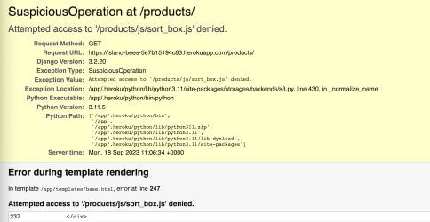
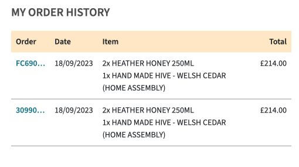
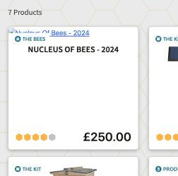
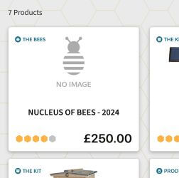

# Island Bees - E-Commerce Site


#### **By Emma Hewson**
[Click here to view the live web application](https://island-bees-5e7b15194c83.herokuapp.com/)

This is the testing documentation for my e-commerce web application: Island Bees.

- - -
## Table of Contents

- [Introduction](#introduction)
- [Automated Testing](#automated-testing-using-test-driven-development)
- [Validation](#validation)
    - [HTML Validation](#html-validation)
    - [CSS Validation](#css-validation)
    - [JavaScript Linting](#javascript-linting)
    - [Python Linting](#python-linting)
    - [Accessibility Testing](#accessibility)
    - [Performance Testing](#performance)
- [Feature Testing](#feature-testing)
    - [Responsiveness/Device Testing](#responsiveness--device-testing)
    - [Browser Compatibility](#browser-compatibility)
    - [Feature Testing Results](#feature-testing-results)
- [User Stories Testing](#user-stories-testing)
- [Bugs and Fixes](#bugs--fixes)


---

## Introduction

In my testing I developed a comprehensive testing plan to make sure that the site was functioning correctly. I used a combination of automated testing using Django's built in test functionality and manual testing. The site was tested throughout the process, both in the development and deployed version of the sites. All the test results detailed below are based on the [deployed site](https://island-bees-5e7b15194c83.herokuapp.com/).

---

## Automated Testing using Test Driven Development

During development I tried to maintain a test driven development approach. This was my first experience of using automated testing on a project so I kept things simple and wrote and ran tests appropriate to my experience level (backed up by rigorous manual testing both during the development process and at the end - see [feature testing](#feature-testing)) This allowed me to try my hand at automated testing and build my knowledge within the scope and time restraints of the project and course requirements. As part of the TDD (test driven development) approach; all automated tests were written either alongside or immediately after each stage of development and were run at regular intervals to make sure that subsequent features had not affected earlier ones.

I found it to be a challenging but useful process, a number of times during development automated tests were able to flag up issues much earlier than I would have noticed them with manual testing alone. With large, complex project with inter-woven features and dependencies I can completely see the benefit of this approach and I look forward to expanding my knowledge and delving more in to the world of automated testing in the future.

### Automated testing coverage and results


- - -
[Go to Top](#island-bees---e-commerce-site)
- - -


## Validation


### HTML Validation

I ran the code for all the pages through the [W3C HTML Validator](https://validator.w3.org/nu/). All code passed the validation tests. Results below.


<details><summary>HTML Validation Results Table</summary>

| **Feature** | **Expected Outcome** | **Test Performed** | **Result** | **Pass / Fail** |
|---|---|---|---|---|
| **HOME** | Page passes validation with no errors | Ran page through https://validator.w3.org/nu/ | No errors | PASS |
| **PRODUCTS** | Page passes validation with no errors | Ran page through https://validator.w3.org/nu/ | No errors | PASS |
| **PRODUCT DETAILS** | Page passes validation with no errors | Ran page through https://validator.w3.org/nu/ | No errors | PASS |
| **ADD PRODUCT** | Page passes validation with no errors | Ran page through https://validator.w3.org/nu/ | Form table errors & custom clearable fit input issue - resolved | PASS |
| **EDIT PRODUCT** | Page passes validation with no errors | Ran page through https://validator.w3.org/nu/ | Form table errors & custom clearable fit input issue - resolved | PASS |
| **ADD REVIEW** | Page passes validation with no errors | Ran page through https://validator.w3.org/nu/ | No errors | PASS |
| **EDIT REVIEW** | Page passes validation with no errors | Ran page through https://validator.w3.org/nu/ | No errors | PASS |
| **BAG** | Page passes validation with no errors | Ran page through https://validator.w3.org/nu/ | Duplicate ID error - resolved | PASS |
| **CHECKOUT** | Page passes validation with no errors | Ran page through https://validator.w3.org/nu/ | No errors | PASS |
| **CHECKOUT SUCCESS** | Page passes validation with no errors | Ran page through https://validator.w3.org/nu/ | No errors | PASS |
| **PROFILE** | Page passes validation with no errors | Ran page through https://validator.w3.org/nu/ | No errors | PASS |
| **FAQS** | Page passes validation with no errors | Ran page through https://validator.w3.org/nu/ | No errors | PASS |
| **ADD FAQ** | Page passes validation with no errors | Ran page through https://validator.w3.org/nu/ | Form table errors - resolved | PASS |
| **EDIT FAQ** | Page passes validation with no errors | Ran page through https://validator.w3.org/nu/ | Form table errors - resolved | PASS |
| **CONTACT US** | Page passes validation with no errors | Ran page through https://validator.w3.org/nu/ | No errors | PASS |
| **MANAGE** | Page passes validation with no errors | Ran page through https://validator.w3.org/nu/ | No errors | PASS |
| **ALLAUTH TEMPLATES** | Page passes validation with no errors | Ran page through https://validator.w3.org/nu/ | contact_us tag error - resolved | PASS |
| **400** | Page passes validation with no errors | Ran page through https://validator.w3.org/nu/ | No errors | PASS |
| **403** | Page passes validation with no errors | Ran page through https://validator.w3.org/nu/ | No errors | PASS |
| **404** | Page passes validation with no errors | Ran page through https://validator.w3.org/nu/ | No errors | PASS |
| **500** | Page passes validation with no errors | Ran page through https://validator.w3.org/nu/ | No errors | PASS |


</details>


#### Issues resolved during validation:

- Django forms renders its form inputs as a table and there were multiple errors about stray `<tr>` tags in the code, which I couldn't access as the form was added by using just `{{form}}`. I got around this based on a [post](https://code-institute-room.slack.com/archives/C7HS3U3AP/p1548669436265400) I found on the CI Slack Channel suggesting rendering them as `<p>` elements instead using `{{form.as_p}}` and amending the styling as necessary.

- Image selection in the custom_clearable_file_input on the product form was throwing an error as it had 2 ID attributes, one that I had set which was used in the JavaScript to display the filename and another that was added by the `` tag. I solved this problem by changing the JavaScript to get an element using a class name rather than ID and removing the class.

- The shopping bag was throwing an error about duplicate IDs, this came down to the 2 versions of the shopping bag, one for large screens one for mobile, which used the same include template from quantity-form.html, effectively putting 2 versions of the same code on the page. I solved this by changing the ID attribute to a data-id attribute, and adjusting the relevant JavaScript code.

- adding url tag to allauth email templates threw an error when these templates were rendered as they had `` tags in which don't allow tags inside the translated area. I solved this issue by removing the contact us links.

---

### CSS Validation

I ran the CSS code through the [W3C CSS Validator](https://jigsaw.w3.org/css-validator/#validate_by_input). All code passed the validation tests. Results below.

<details><summary>CSS Validation Results Table</summary>

| **Feature**    | **Expected Outcome**                  | **Test Performed**                                   | **Result**                                                                                                              | **Pass / Fail** |
|----------------|---------------------------------------|------------------------------------------------------|-------------------------------------------------------------------------------------------------------------------------|-----------------|
| CSS Validation | Page passes validation with no errors | Ran CSS through https://jigsaw.w3.org/css-validator/ | 2 issues - both resolved (see below) | PASS            |

</details>


#### Issues resolved during validation:

- I was getting Parse errors on various parts where I had nested elements within a hover element which worked perfectly but the validator didn't like:
e.g.
```
.lower-nav-link:hover {
    .lower-nav-link-text {
        -webkit-text-decoration-color: rgba(20, 12, 0, 0);
        text-decoration-color: rgba(20, 12, 0, 1);
    }
}
```
I solved this by refactoring all of them to the below syntax:

```
.lower-nav-link:hover .lower-nav-link-text {
        -webkit-text-decoration-color: rgba(20, 12, 0, 0);
        text-decoration-color: rgba(20, 12, 0, 1);
}
```

- The responsive hex grid with the category links on the homepage that I had taken from [this page](https://dev.to/afif/responsive-hexagon-grid-without-media-query-57g7) was throwing an error on use of pixel values rather than % values in the following code:

```
.container-hex-grid::before {
    shape-outside: repeating-linear-gradient(#0000 0 calc(var(--f) - 3px), #000 0 var(--f));
}
```

- This code uses some advanced mathematical and CSS skills. I have been unable to come up with a way of avoiding this error. It works perfectly in the browser and creates an elegant responsive hexagon grid but due to the need to resolve all errors I have removed this hexagon grid section and replaced it with a simpler layout. I am including a video of the hexagon grid in action below as I was disappointed to have to remove it.

##################################### INSERT VIDEO OF GRID

---

### JavaScript Linting

I ran the JavaScript code through [JSHint](https://jshint.com/). For full results see the dropdowns below.

<details><summary>JavaScript Results Table</summary>

| **Feature** | **Expected Outcome** | **Test Performed** | **Result** | **Pass / Fail** |
|---|---|---|---|---|
| **quantity_input.js (bag)** | Page passes validation with no errors | Ran JavaScript through https://jshint.com/ | No Errors | PASS |
| **stripe_elements.js** | Page passes validation with no errors | Ran JavaScript through https://jshint.com/ | Missing semi-colons. All fixed. Undeclared variable (Stripe - declared elsewhere) | PASS |
| **message_toggle.js** | Page passes validation with no errors | Ran JavaScript through https://jshint.com/ | Missing semi-colons. All fixed. No errors remaining | PASS |
| **review_toggle.js** | Page passes validation with no errors | Ran JavaScript through https://jshint.com/ | Missing semi-colons. All fixed. No errors remaining | PASS |
| **scroll_messages.js** | Page passes validation with no errors | Ran JavaScript through https://jshint.com/ | No Errors | PASS |
| **form-image.js** | Page passes validation with no errors | Ran JavaScript through https://jshint.com/ | No Errors | PASS |
| **quantity_input.js (products)** | Page passes validation with no errors | Ran JavaScript through https://jshint.com/ | No Errors | PASS |
| **sort_box.js** | Page passes validation with no errors | Ran JavaScript through https://jshint.com/ | Missing semi-colons. All fixed. No errors remaining | PASS |
| **countryfield.js** | Page passes validation with no errors | Ran JavaScript through https://jshint.com/ | Unnecessary semi-colon. All fixed. No errors remaining | PASS |
| **rating_select.js** | Page passes validation with no errors | Ran JavaScript through https://jshint.com/ | Missing semi-colons. All fixed. No errors remaining | PASS |
| **scroll_top.js** | Page passes validation with no errors | Ran JavaScript through https://jshint.com/ | Missing semi-colons. All fixed. No errors remaining | PASS |
| **Script tag - bag.html** | Page passes validation with no errors | Ran JavaScript through https://jshint.com/ | Missing semi-colons. All fixed. No errors remaining | PASS |


</details>

---

### Python Linting

I ran the app.py code through [https://pep8ci.herokuapp.com/](https://pep8ci.herokuapp.com/) to check the Syntax. GitPod also has a built in Python Linter which was used throughout the development process (see below). All code passed the validation tests. For full results see the dropdowns below.

<details><summary>Python Results Table</summary>

| **App** | **File** | **Expected Outcome** | **Test Performed** | **Result** | **Pass / Fail** |
|---|---|---|---|---|---|
| island_bees | settings | Code passes with no errors | Ran app.py through https://extendsclass.com/python-tester.html | Code passes with no errors | PASS |
| island_bees | urls | Code passes with no errors | Ran app.py through https://extendsclass.com/python-tester.html | Code passes with no errors | PASS |
| bag | urls | Code passes with no errors | Ran app.py through https://extendsclass.com/python-tester.html | Code passes with no errors | PASS |
| bag | views | Code passes with no errors | Ran app.py through https://extendsclass.com/python-tester.html | Code passes with no errors | PASS |
| bag | contexts | Code passes with no errors | Ran app.py through https://extendsclass.com/python-tester.html | Code passes with no errors | PASS |
| bag | test_views | Code passes with no errors | Ran app.py through https://extendsclass.com/python-tester.html | Code passes with no errors | PASS |
| checkout | admin | Code passes with no errors | Ran app.py through https://extendsclass.com/python-tester.html | Code passes with no errors | PASS |
| checkout | forms | Code passes with no errors | Ran app.py through https://extendsclass.com/python-tester.html | Code passes with no errors | PASS |
| checkout | models | Code passes with no errors | Ran app.py through https://extendsclass.com/python-tester.html | Code passes with no errors | PASS |
| checkout | signals | Code passes with no errors | Ran app.py through https://extendsclass.com/python-tester.html | Code passes with no errors | PASS |
| checkout | urls | Code passes with no errors | Ran app.py through https://extendsclass.com/python-tester.html | Code passes with no errors | PASS |
| checkout | views | Code passes with no errors | Ran app.py through https://extendsclass.com/python-tester.html | Code passes with no errors | PASS |
| checkout | webhook_handler | Code passes with no errors | Ran app.py through https://extendsclass.com/python-tester.html | Code passes with no errors | PASS |
| checkout | webhooks | Code passes with no errors | Ran app.py through https://extendsclass.com/python-tester.html | Code passes with no errors | PASS |
| checkout | test_forms | Code passes with no errors | Ran app.py through https://extendsclass.com/python-tester.html | Code passes with no errors | PASS |
| checkout | test_models | Code passes with no errors | Ran app.py through https://extendsclass.com/python-tester.html | Code passes with no errors | PASS |
| checkout | test_views | Code passes with no errors | Ran app.py through https://extendsclass.com/python-tester.html | Code passes with no errors | PASS |
| faqs | admin | Code passes with no errors | Ran app.py through https://extendsclass.com/python-tester.html | Code passes with no errors | PASS |
| faqs | forms | Code passes with no errors | Ran app.py through https://extendsclass.com/python-tester.html | Code passes with no errors | PASS |
| faqs | models | Code passes with no errors | Ran app.py through https://extendsclass.com/python-tester.html | Code passes with no errors | PASS |
| faqs | urls | Code passes with no errors | Ran app.py through https://extendsclass.com/python-tester.html | Code passes with no errors | PASS |
| faqs | views | Code passes with no errors | Ran app.py through https://extendsclass.com/python-tester.html | Code passes with no errors | PASS |
| faqs | test_forms | Code passes with no errors | Ran app.py through https://extendsclass.com/python-tester.html | Code passes with no errors | PASS |
| faqs | test_models | Code passes with no errors | Ran app.py through https://extendsclass.com/python-tester.html | Code passes with no errors | PASS |
| faqs | test_views | Code passes with no errors | Ran app.py through https://extendsclass.com/python-tester.html | Code passes with no errors | PASS |
| home | urls | Code passes with no errors | Ran app.py through https://extendsclass.com/python-tester.html | Code passes with no errors | PASS |
| home | views | Code passes with no errors | Ran app.py through https://extendsclass.com/python-tester.html | Code passes with no errors | PASS |
| home | test_views | Code passes with no errors | Ran app.py through https://extendsclass.com/python-tester.html | Code passes with no errors | PASS |
| manage | admin | Code passes with no errors | Ran app.py through https://extendsclass.com/python-tester.html | Code passes with no errors | PASS |
| manage | forms | Code passes with no errors | Ran app.py through https://extendsclass.com/python-tester.html | Code passes with no errors | PASS |
| manage | models | Code passes with no errors | Ran app.py through https://extendsclass.com/python-tester.html | Code passes with no errors | PASS |
| manage | urls | Code passes with no errors | Ran app.py through https://extendsclass.com/python-tester.html | Code passes with no errors | PASS |
| manage | views | Code passes with no errors | Ran app.py through https://extendsclass.com/python-tester.html | Code passes with no errors | PASS |
| manage | test_forms | Code passes with no errors | Ran app.py through https://extendsclass.com/python-tester.html | Code passes with no errors | PASS |
| manage | test_models | Code passes with no errors | Ran app.py through https://extendsclass.com/python-tester.html | Code passes with no errors | PASS |
| manage | test_views | Code passes with no errors | Ran app.py through https://extendsclass.com/python-tester.html | Code passes with no errors | PASS |
| products | admin | Code passes with no errors | Ran app.py through https://extendsclass.com/python-tester.html | Code passes with no errors | PASS |
| products | forms | Code passes with no errors | Ran app.py through https://extendsclass.com/python-tester.html | Code passes with no errors | PASS |
| products | models | Code passes with no errors | Ran app.py through https://extendsclass.com/python-tester.html | Code passes with no errors | PASS |
| products | urls | Code passes with no errors | Ran app.py through https://extendsclass.com/python-tester.html | Code passes with no errors | PASS |
| products | views | Code passes with no errors | Ran app.py through https://extendsclass.com/python-tester.html | Code passes with no errors | PASS |
| products | widgets | Code passes with no errors | Ran app.py through https://extendsclass.com/python-tester.html | Code passes with no errors | PASS |
| products | test_forms | Code passes with no errors | Ran app.py through https://extendsclass.com/python-tester.html | Code passes with no errors | PASS |
| products | test_models | Code passes with no errors | Ran app.py through https://extendsclass.com/python-tester.html | Code passes with no errors | PASS |
| products | test_views | Code passes with no errors | Ran app.py through https://extendsclass.com/python-tester.html | Code passes with no errors | PASS |
| profiles | admin | Code passes with no errors | Ran app.py through https://extendsclass.com/python-tester.html | Code passes with no errors | PASS |
| profiles | forms | Code passes with no errors | Ran app.py through https://extendsclass.com/python-tester.html | Code passes with no errors | PASS |
| profiles | models | Code passes with no errors | Ran app.py through https://extendsclass.com/python-tester.html | Code passes with no errors | PASS |
| profiles | urls | Code passes with no errors | Ran app.py through https://extendsclass.com/python-tester.html | Code passes with no errors | PASS |
| profiles | views | Code passes with no errors | Ran app.py through https://extendsclass.com/python-tester.html | Code passes with no errors | PASS |
| profiles | test_forms | Code passes with no errors | Ran app.py through https://extendsclass.com/python-tester.html | Code passes with no errors | PASS |
| profiles | test_models | Code passes with no errors | Ran app.py through https://extendsclass.com/python-tester.html | Code passes with no errors | PASS |
| profiles | test_views | Code passes with no errors | Ran app.py through https://extendsclass.com/python-tester.html | Code passes with no errors | PASS |
| reviews | admin | Code passes with no errors | Ran app.py through https://extendsclass.com/python-tester.html | Code passes with no errors | PASS |
| reviews | forms | Code passes with no errors | Ran app.py through https://extendsclass.com/python-tester.html | Code passes with no errors | PASS |
| reviews | models | Code passes with no errors | Ran app.py through https://extendsclass.com/python-tester.html | Code passes with no errors | PASS |
| reviews | urls | Code passes with no errors | Ran app.py through https://extendsclass.com/python-tester.html | Code passes with no errors | PASS |
| reviews | views | Code passes with no errors | Ran app.py through https://extendsclass.com/python-tester.html | Code passes with no errors | PASS |
| reviews | test_forms | Code passes with no errors | Ran app.py through https://extendsclass.com/python-tester.html | Code passes with no errors | PASS |
| reviews | test_models | Code passes with no errors | Ran app.py through https://extendsclass.com/python-tester.html | Code passes with no errors | PASS |
| reviews | test_views | Code passes with no errors | Ran app.py through https://extendsclass.com/python-tester.html | Code passes with no errors | PASS |


</details>


#### Additional Linting Using Flake8 in GitPod

I used the inbuilt linting in GitPod (Flake8) to check my code and keep it as clean as possible. All code was cleaned up, errors dealt with and any suggested changes made apart from the following issues which I was unable to solve:

- **checkout/apps.py - checkout.signals is imported but unused** - signals is being passed in and used elsewhere so can be disregarded
- **checkout/webhooks.py - local variable e is assigned to but never used** - have investigated this and it appears to be an industry standard way of assigning this particular error checking. I also passed this same code through the [CI Python Linter](https://pep8ci.herokuapp.com/) and it didn't raise an issue so I am disregarding this.
- remaining linting errors are in files that are automatically created by Django such as migration files & vscode/arctictern.py


#### Lighthouse Testing & Google Dev Tools

- There were some Google console warnings about a lack of autocomplete on the allauth form fields. I have looked in to a way to add autocomplete to a Django form field using Django Widget Tweaks add on but it doesn't seem to work within the allauth forms. However as this was a warning rather than an error I decided to leave it

---


### Accessibility

I ran the site through the [Wave Web Accessibility Evaluation Tool](https://wave.webaim.org/). There were some minor errors & warnings which I was unable to rectify which are detailed in the notes below. Based on the research done in to these errors, and the fact that they are mostly due to errors on the part of the validator or external code over which I have no control I have accepted them and marked the tests as passed for the purposes and scope of this project. For full results see the dropdowns below.


<details><summary>Accessibility Results Table</summary>


</details>


**Notes on Accessibility Results**


- - -


### Performance

I ran the site through Google Chrome Dev Tools' Lighthouse to check on its performance scores. All pages passed the validation tests. For full results see the dropdowns below.


<details><summary>Lighthouse Results Table</summary>


</details>


- - -
[Go to Top](#island-bees---e-commerce-site)
- - -

## Feature Testing

The whole site and all its features were tested thoroughly throughout the development process and at the end of development. This testing covered content, style, interactive feature functionality as well as making sure all backend processes worked as expected including testing of all CRUD functionality and routing.

### **Responsiveness / Device Testing**

The site was tested on the following devices
* Apple Macbook Pro 16inch
* LG Ultrafine Display 27inch External Monitor
* Apple iMac 5K 27-inch
* Apple iPhone SE 2020
* Apple iPhone SE 2022
* Google Chrome Developer Tools - simulator for all different device options as well as using the adjustable sizing options

### **Browser Compatibility**

The site was tested on the following browsers.
* Google Chrome
* Mozilla Firefox
* Apple Safari

#### **Links to Bugs found specific to device & browser testing**


__ __

### **Feature Testing Results**


<details><summary>WHOLE SITE (base.html)</summary>


</details>


- - -
[Go to Top](#island-bees---e-commerce-site)
- - -


## User Stories Testing

The site was built from the outset with user stories at its core. The site was tested against each of the user stories, running through the steps a user would take to achieve their goal. The results can be found below.


### User Stories Testing Screen Recordings / Images


<details><summary>User Story 1.1</summary>


INSERT VIDEOS HERE IN GITHUB


</details>


- - -
[Go to Top](#island-bees---e-commerce-site)
- - -


## Bugs & Fixes

I encountered the following significant or interesting bugs during development. All of these were fixed and I am unaware of any remaining bugs on the site.

#### Bug 1 - Remove Bag Item JS - move to external JS file

**Issue:** I attempted to move the JavaScript for the remove item from bag in to an external static file - update worked ok but remove didn't work once in the external file. I was not able to work out why this behaved in this way.

**Fix:** Put back in to HTML file as a script tag.

#### Bug 2 - Checkout delivery & total calculations - type errors

**Issue:** The checkout delivery & total calculations threw an error about not being able to add a float & a decimal type numbers together. 

**Fix:** Had to convert the order_total and total_delivery_chargeable to float values with checks to make sure they had a value in the first place. This accounted for the various different scenarios.
1. Under delivery threshold & delivery chargeable on all products
2. Under delivery threshold & delivery changeable on some but not all products
3. Over delivery threshold


#### Bug 3 - Save Info checkbox on checkout form not working properly

**Issue:** The save info checkbox on the checkout was saving the form information regardless of whether the checkbox was selected or not.

**Fix:** After a lot of testing and research I found out the problem was stemming from 2 places:
1. In stripe_elements.js there was an issue with the JQuery assignment of the Boolean value and the value being sent to the post_data was always true no matter whether the checkbox was selected or not. I couldn't pin point exactly why it was behaving like this but I was able to solve it by assigning the value using vanilla JavaScript.

    - Original Code: `var saveInfo = Boolean($('#id-save-info').attr('checked'));`
    - Final Working Code: `var saveInfo = document.getElementById('id-save-info').checked`

2. Even after changing the above code I found that the profile details were still being saved when the box was unchecked. With the help of this [post](https://code-institute-room.slack.com/archives/C7HS3U3AP/p1605302104469800?thread_ts=1605222094.452700&cid=C7HS3U3AP) on the Code Institute Slack Channel I discovered that the problem was related to code in webhook_handler.py which checked if save_info was true. Rather than now returning a Boolean value from the new JS code it was returning a string of "true" or "false" - which meant that when checking if save_info: it was always returning True because it always had contents. I fixed the issue by changing this code to check for a string instead.

- Original Code:

```
save_info = intent.metadata.save_info
if save_info:
    # code to update userProfile based on data
```

- Final Working Code

```
save_info = intent.metadata.save_info
if save_info == "true:
    # code to update userProfile based on data
```

#### Bug 4 - Toast showing shopping bag summary after user actions not related to shopping bag

**Issue:** This was more of a user experience issue than a bug. I had followed the Boutique Ado walkthrough for the Toasts & user feedback messages and whilst the little shopping bag summary was a great touch it was showing after every successful user action apart from on the profile page where there was code to stop this happening. I needed to find a more comprehensive way to hide the summary when users added reviews, FAQs, filled in the Contact Us form etc.

**Fix:** I removed it by firstly adding an additional conditional statement to the message_success template to check whether the referring page url contained the word 'accounts' to stop the bag showing when any messages.success were called by the built-in allauth code. Then in addition, I added a session variable called show_bag_summary to true or false each time I called messages.success and an additional conditional value in the template tag to check this value: 

``
    

#### Bug 5 - Label styling on Django Form Checkboxes - add product

**Issue:** I wanted to have different styling on the labels for the text & textarea labels compared to the checkbox labels. I couldn't find a way to add class attributes to the labels themselves within the forms.py logic or by using template logic.

**Fix:** I separated the fields out to individual tags and styled them in this way. However I discovered that this had the unintended result of not showing any form error messages e.g. if the price had too many digits. I got around this by explicitly including the error messages below the labels as separate tags:
```
{{ form.category.label_tag }}
{{ form.category }}

    <span class="text-ib-warning weight-semibold ib-lh-2">{{error}}</span>

```

#### Bug 6 - Products page wouldn't load after deployment

**Issue:** After initial deployment my products page wouldn't load and returned a 400 error.

**Fix:** I turned debug back on in the deployed site and discovered that it couldn't load the sort_box.js file and was throwing up a suspicious operation error and blocking the page. I fixed this error with the help of this [Slackoverflow Post](https://stackoverflow.com/questions/43529912/suspicious-operation-attempted-access-to-denied-while-loading-static-files) by removing the leading '/' on the script tag in the template.


<details><summary>Screenshots</summary>
    
</details>

#### Bug 7 - Checkout creating duplicate orders

**Issue:** Whilst initially working correctly I found that my checkout began to create duplicates when placing an order - one in the view and another in the webhook.

**Fix:** After extensive research and testing using print statements I discovered that the problem was at the point where the webhook searches for the order in the database and if it didn't find it, creates the order. The problem stemmed from the form fields which were not required and so could be empty - phone number and street address 2. I fixed the problem by removing these fields from the search parameters in the webhook query.

<details><summary>Screenshots</summary>
    
</details>

#### Bug 8 - Deleting Products with associated OrderLineItems

**Issue:** When attempting to delete a product that is linked to a previous order as a line item in the OrderLineItem model it throws an error because, due to the CASCADE setting on the field, by deleting the product you are also then deleting all references to it. This posed a problem because I wanted to give superusers the ability to delete a product to remove it from sale, but keeping all old order information is also very important.

**Fix:** I solved this problem with an idea from this CI Slack channel [post](https://code-institute-room.slack.com/archives/C7HS3U3AP/p1598004199059700?thread_ts=1597961336.047800&cid=C7HS3U3AP) by stopping store owners deleting products using model.PROTECT on the OrderLineItem foreign key field but allowing them to remove them from sale with a 'discontinued' Boolean field. This meant additional changes had to be made to the site to ensure smooth running and good user experience:
- added a conditional check to the delete_product view to see if the product appears on any OrderLineItems and if so rather than deleting it, to mark it as 'discontinued'
- Dynamically changing the text in the delete product modal depending on whether the product has associated OrderLineItems and if so removing the ability to delete it and offering the admin the chance to 'discontinue' it instead.
- Only displaying cards products that are not 'discontinued' on the products & home pages
- Adding a check on the product_detail view to redirect users who link to a discontinued product directly using the url or back button
- Adding an additional field to the add/edit product form to mark a product as 'discontinued'
- Removing the edit/delete buttons from the product cards to improve user experience and keep the site logic as simple and bug free as possible
- When a form is submitted with the 'discontinue' input checked, if that product is in the shopping bag, remove it.
- Added a conditional check on the add_to_bag view to only add it if the product is not discontinued.

#### Bug 9 - Broken Image Links show icon rather than backup no-image

**Issue:** Broken image links showing when image is missing, rather than the 'no-image' backup which provides a better user experience. This also meant that if there was an error getting the product image the product cards were hard to click on to link to the product detail page as the image is the link element.

**Fix:** I added an 'onerror' to the image tags to show the no-image if there was an error displaying the image.

`onerror="this.onerror=null;this.src='{{ MEDIA_URL }}no_image.jpg'"`

<details><summary>Screenshots</summary>
    
    
</details>


- - -

[Go to Top](#island-bees---e-commerce-site)

- - -