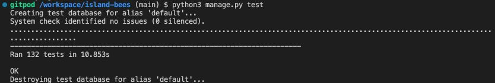
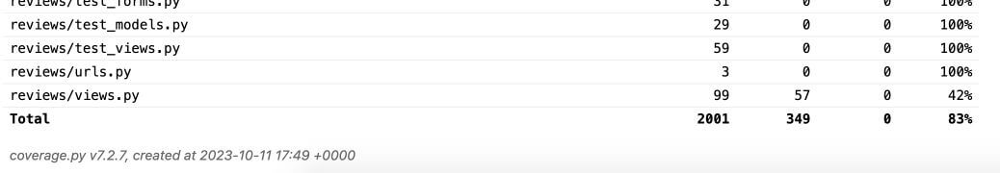
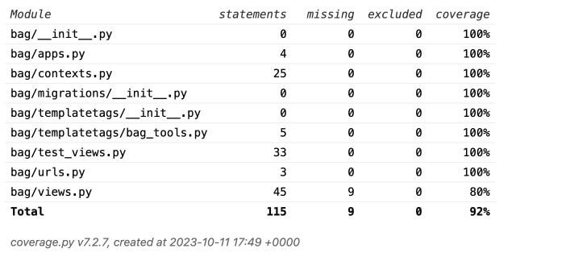

# Island Bees - E-Commerce Site - Testing


#### **By Emma Hewson**
[Click here to view the live web application](https://island-bees-5e7b15194c83.herokuapp.com/)

This is the testing documentation for my e-commerce web application: Island Bees.

- - -
## Table of Contents

- [Introduction](#introduction)
- [Automated Testing](#automated-testing-using-test-driven-development)
- [Validation](#validation)
    - [HTML Validation](#html-validation)
    - [CSS Validation](#css-validation)
    - [JavaScript Linting](#javascript-linting)
    - [Python Linting](#python-linting)
    - [Accessibility Testing](#accessibility)
    - [Performance Testing](#performance)
- [Feature Testing](#feature-testing)
    - [Responsiveness/Device Testing](#responsiveness--devices)
    - [Browser Compatibility](#browser-compatibility)
    - [Feature Testing Results](#feature-testing-results)
- [User Stories Testing](#user-stories-testing)
- [Bugs and Fixes](#bugs--fixes)


---

## Introduction

In my testing I developed a comprehensive testing plan to make sure that the site was functioning correctly. I used a combination of automated testing using Django's built in test functionality and manual testing. The site was tested throughout the process, both in the development and deployed version of the sites. All the test results detailed below are based on the [deployed site](https://island-bees-5e7b15194c83.herokuapp.com/).

---

## Automated Testing using Test Driven Development

During development I tried to maintain a test driven development approach. This was my first experience of using automated testing on a project so I kept things simple and wrote and ran tests appropriate to my experience level (backed up by rigorous manual testing both during the development process and at the end - see [feature testing](#feature-testing)) This allowed me to try my hand at automated testing and build my knowledge within the scope and time restraints of the project and course requirements. As part of the TDD (test driven development) approach; all automated tests were written either alongside or immediately after each stage of development and were run at regular intervals to make sure that subsequent features had not affected earlier ones.

I managed to achieve 83% coverage with my tests. I would have liked to reach 100% but as this was my first time doing any automated testing in a project, and with limitations on my time and experience, I was happy with this result, especially as the automated testing is backed up with comprehensive manual testing.

I found it to be a challenging but useful process, a number of times during development automated tests were able to flag up issues much earlier than I would have noticed them with manual testing alone. With large, complex project with inter-woven features and dependencies I can completely see the benefit of this approach and I look forward to expanding my knowledge and delving more in to the world of automated testing in the future.

### Automated testing coverage and results

**Automated Testing - Test Results**



**Coverage Report - Total Coverage**




**Coverage For Individual Apps**

<details><summary>Home App</summary>

</details>

<details><summary>Bag App</summary>

</details>

<details><summary>Checkout App</summary>

</details>

<details><summary>FAQs App</summary>

</details>

<details><summary>Island Bees App</summary>

</details>

<details><summary>Manage App</summary>

</details>

<details><summary>Products App</summary>

</details>

<details><summary>Profiles App</summary>

</details>

<details><summary>Reviews App</summary>

</details>


- - -
[Go to Top](#island-bees---e-commerce-site---testing)
- - -


## Validation


### HTML Validation

I ran the code for all the pages through the [W3C HTML Validator](https://validator.w3.org/nu/) using the textarea input by generating the source code from the deployed site (right click and select 'View Page Source' in Chrome) and pasting it in to allow me to check all pages whether requiring log in or not. All code passed the validation tests. Results below.


<details><summary>HTML Validation Results Table</summary>

| **Feature** | **Expected Outcome** | **Test Performed** | **Result** | **Pass / Fail** |
|---|---|---|---|---|
| **HOME** | Page passes validation with no errors | Ran page through https://validator.w3.org/nu/ | No errors | PASS |
| **PRODUCTS** | Page passes validation with no errors | Ran page through https://validator.w3.org/nu/ | No errors | PASS |
| **PRODUCT DETAILS** | Page passes validation with no errors | Ran page through https://validator.w3.org/nu/ | No errors | PASS |
| **ADD PRODUCT** | Page passes validation with no errors | Ran page through https://validator.w3.org/nu/ | Form table errors & custom clearable fit input issue - resolved | PASS |
| **EDIT PRODUCT** | Page passes validation with no errors | Ran page through https://validator.w3.org/nu/ | Form table errors & custom clearable fit input issue - resolved | PASS |
| **ADD REVIEW** | Page passes validation with no errors | Ran page through https://validator.w3.org/nu/ | No errors | PASS |
| **EDIT REVIEW** | Page passes validation with no errors | Ran page through https://validator.w3.org/nu/ | No errors | PASS |
| **BAG** | Page passes validation with no errors | Ran page through https://validator.w3.org/nu/ | Duplicate ID error - resolved | PASS |
| **CHECKOUT** | Page passes validation with no errors | Ran page through https://validator.w3.org/nu/ | No errors | PASS |
| **CHECKOUT SUCCESS** | Page passes validation with no errors | Ran page through https://validator.w3.org/nu/ | No errors | PASS |
| **PROFILE** | Page passes validation with no errors | Ran page through https://validator.w3.org/nu/ | No errors | PASS |
| **FAQS** | Page passes validation with no errors | Ran page through https://validator.w3.org/nu/ | No errors | PASS |
| **ADD FAQ** | Page passes validation with no errors | Ran page through https://validator.w3.org/nu/ | Form table errors - resolved | PASS |
| **EDIT FAQ** | Page passes validation with no errors | Ran page through https://validator.w3.org/nu/ | Form table errors - resolved | PASS |
| **CONTACT US** | Page passes validation with no errors | Ran page through https://validator.w3.org/nu/ | No errors | PASS |
| **MANAGE** | Page passes validation with no errors | Ran page through https://validator.w3.org/nu/ | No errors | PASS |
| **ALLAUTH TEMPLATES** | Page passes validation with no errors | Ran page through https://validator.w3.org/nu/ | contact_us tag error - resolved | PASS |
| **400** | Page passes validation with no errors | Ran page through https://validator.w3.org/nu/ | No errors | PASS |
| **403** | Page passes validation with no errors | Ran page through https://validator.w3.org/nu/ | No errors | PASS |
| **404** | Page passes validation with no errors | Ran page through https://validator.w3.org/nu/ | No errors | PASS |
| **500** | Page passes validation with no errors | Ran page through https://validator.w3.org/nu/ | No errors | PASS |


</details>


#### Issues resolved during validation:

- Django forms renders its form inputs as a table and there were multiple errors about stray `<tr>` tags in the code, which I couldn't access as the form was added by using just `{{form}}`. I got around this based on a [post](https://code-institute-room.slack.com/archives/C7HS3U3AP/p1548669436265400) I found on the CI Slack Channel suggesting rendering them as `<p>` elements instead using `{{form.as_p}}` and amending the styling as necessary.

- Image selection in the custom_clearable_file_input on the product form was throwing an error as it had 2 ID attributes, one that I had set which was used in the JavaScript to display the filename and another that was added by the `` tag. I solved this problem by changing the JavaScript to get an element using a class name rather than ID and removing the class.

- The shopping bag was throwing an error about duplicate IDs, this came down to the 2 versions of the shopping bag, one for large screens one for mobile, which used the same include template from quantity-form.html, effectively putting 2 versions of the same code on the page. I solved this by changing the ID attribute to a data-id attribute, and adjusting the relevant JavaScript code.

- adding url tag to allauth email templates threw an error when these templates were rendered as they had `` tags in which don't allow tags inside the translated area. I solved this issue by removing the contact us links.


<details><summary>Validation Final Results Screenshot</summary>


</details>

*I have only included 1 screenshot of the results as an example because they are identical for every page and give no indication of which page is being checked.*

---

### CSS Validation

I ran the CSS code through the [W3C CSS Validator](https://jigsaw.w3.org/css-validator/#validate_by_input). All code passed the validation tests. Results below.


<details><summary>CSS Validation Results Table</summary>

| **Feature**    | **Expected Outcome**                  | **Test Performed**                                   | **Result**                                                                                                              | **Pass / Fail** |
|----------------|---------------------------------------|------------------------------------------------------|-------------------------------------------------------------------------------------------------------------------------|-----------------|
| CSS Validation | Page passes validation with no errors | Ran CSS through https://jigsaw.w3.org/css-validator/ | 2 issues - both resolved (see below) | PASS            |

</details>


#### Issues resolved during validation:

- I was getting Parse errors on various parts where I had nested elements within a hover element which worked perfectly but the validator didn't like:
e.g.
```
.lower-nav-link:hover {
    .lower-nav-link-text {
        -webkit-text-decoration-color: rgba(20, 12, 0, 0);
        text-decoration-color: rgba(20, 12, 0, 1);
    }
}
```
I solved this by refactoring all of them to the below syntax:

```
.lower-nav-link:hover .lower-nav-link-text {
        -webkit-text-decoration-color: rgba(20, 12, 0, 0);
        text-decoration-color: rgba(20, 12, 0, 1);
}
```

- The responsive hex grid with the category links on the homepage that I had taken from [this page](https://dev.to/afif/responsive-hexagon-grid-without-media-query-57g7) was throwing an error on use of pixel values rather than % values in the following code:

```
.container-hex-grid::before {
    shape-outside: repeating-linear-gradient(#0000 0 calc(var(--f) - 3px), #000 0 var(--f));
}
```

- This code uses some advanced mathematical and CSS skills. I have been unable to come up with a way of avoiding this error. It works perfectly in the browser and creates an elegant responsive hexagon grid but due to the need to resolve all errors I have removed this hexagon grid section and replaced it with a simpler layout. I am including a video of the hexagon grid in action below as I was disappointed to have to remove it.

**Hex grid buttons video**


https://github.com/emmahewson/island-bees/assets/116887840/659c7dd3-2a47-493f-8910-bd3ab84ba567


#### CSS Warnings

There were some warnings thrown up by the CSS Validator.

- Vendor extension warnings: refer to browser specific CSS classes such as `-webkit-transition`. These classes are best practice to make sure that certain CSS elements perform correctly in different browsers and so I have disregarded these warnings.
- Imported style sheets: This refers to Google's font import, again this is a standard way to import fonts directly in to the CSS.
- CSS Variables are not checked: This refers to the :root directory of colours and is just a warning that it cannot check these. They all performed as expected during testing and so I'm happy with this CSS code.
- Border and Background Colour are the same: whilst this is a legitimate warning about what could be an oversight in the code, in this case it was intentional as I was using it to restyle some Bootstrap elements, which often requires some fiddly CSS hacks, in this case I needed to specify the border colour rather than get rid of the border to make the button look the way I wanted.


<details><summary>Validation Final Results Screenshot</summary>


</details>

---

### JavaScript Linting

I ran the JavaScript code through [JSHint](https://jshint.com/). For full results see the dropdowns below.

<details><summary>JavaScript Results Table</summary>

| **Feature** | **Expected Outcome** | **Test Performed** | **Result** | **Pass / Fail** |
|---|---|---|---|---|
| **quantity_input.js (bag)** | Page passes validation with no errors | Ran JavaScript through https://jshint.com/ | No Errors | PASS |
| **stripe_elements.js** | Page passes validation with no errors | Ran JavaScript through https://jshint.com/ | Missing semi-colons. All fixed. Undeclared variable (Stripe - declared elsewhere) | PASS |
| **message_toggle.js** | Page passes validation with no errors | Ran JavaScript through https://jshint.com/ | Missing semi-colons. All fixed. No errors remaining | PASS |
| **review_toggle.js** | Page passes validation with no errors | Ran JavaScript through https://jshint.com/ | Missing semi-colons. All fixed. No errors remaining | PASS |
| **scroll_messages.js** | Page passes validation with no errors | Ran JavaScript through https://jshint.com/ | No Errors | PASS |
| **form-image.js** | Page passes validation with no errors | Ran JavaScript through https://jshint.com/ | No Errors | PASS |
| **quantity_input.js (products)** | Page passes validation with no errors | Ran JavaScript through https://jshint.com/ | No Errors | PASS |
| **sort_box.js** | Page passes validation with no errors | Ran JavaScript through https://jshint.com/ | Missing semi-colons. All fixed. No errors remaining | PASS |
| **countryfield.js** | Page passes validation with no errors | Ran JavaScript through https://jshint.com/ | Unnecessary semi-colon. All fixed. No errors remaining | PASS |
| **rating_select.js** | Page passes validation with no errors | Ran JavaScript through https://jshint.com/ | Missing semi-colons. All fixed. No errors remaining | PASS |
| **scroll_top.js** | Page passes validation with no errors | Ran JavaScript through https://jshint.com/ | Missing semi-colons. All fixed. No errors remaining | PASS |
| **Script tag - bag.html** | Page passes validation with no errors | Ran JavaScript through https://jshint.com/ | Missing semi-colons. All fixed. No errors remaining | PASS |


</details>

<details><summary>JavaScript Results Images</summary>

<details><summary>quantity_input.js (Bag)</summary>

</details>

<details><summary>stripe_element.js</summary>

</details>

<details><summary>message_toggle.js</summary>

</details>

<details><summary>review_toggle.js</summary>

</details>

<details><summary>scroll_message.js</summary>

</details>

<details><summary>form-image.js</summary>

</details>

<details><summary>quantity_input.js (Products)</summary>

</details>

<details><summary>sort_box.js</summary>

</details>

<details><summary>countryfield.js</summary>

</details>

<details><summary>rating_select.js</summary>

</details>

<details><summary>scroll_top.js</summary>

</details>

<details><summary>Script Tag in bag.html</summary>

</details>


</details>

---

### Python Linting

I ran the app.py code through [https://pep8ci.herokuapp.com/](https://pep8ci.herokuapp.com/) to check the Syntax. GitPod also has a built in Python Linter which was used throughout the development process (see below). All code passed the validation tests. For full results see the dropdowns below.

<details><summary>Python Results Table</summary>

| **App** | **File** | **Expected Outcome** | **Test Performed** | **Result** | **Pass / Fail** |
|---|---|---|---|---|---|
| island_bees | settings | Code passes with no errors | Ran app.py through https://extendsclass.com/python-tester.html | Code passes with no errors | PASS |
| island_bees | urls | Code passes with no errors | Ran app.py through https://extendsclass.com/python-tester.html | Code passes with no errors | PASS |
| bag | urls | Code passes with no errors | Ran app.py through https://extendsclass.com/python-tester.html | Code passes with no errors | PASS |
| bag | views | Code passes with no errors | Ran app.py through https://extendsclass.com/python-tester.html | Code passes with no errors | PASS |
| bag | contexts | Code passes with no errors | Ran app.py through https://extendsclass.com/python-tester.html | Code passes with no errors | PASS |
| bag | test_views | Code passes with no errors | Ran app.py through https://extendsclass.com/python-tester.html | Code passes with no errors | PASS |
| checkout | admin | Code passes with no errors | Ran app.py through https://extendsclass.com/python-tester.html | Code passes with no errors | PASS |
| checkout | forms | Code passes with no errors | Ran app.py through https://extendsclass.com/python-tester.html | Code passes with no errors | PASS |
| checkout | models | Code passes with no errors | Ran app.py through https://extendsclass.com/python-tester.html | Code passes with no errors | PASS |
| checkout | signals | Code passes with no errors | Ran app.py through https://extendsclass.com/python-tester.html | Code passes with no errors | PASS |
| checkout | urls | Code passes with no errors | Ran app.py through https://extendsclass.com/python-tester.html | Code passes with no errors | PASS |
| checkout | views | Code passes with no errors | Ran app.py through https://extendsclass.com/python-tester.html | Code passes with no errors | PASS |
| checkout | webhook_handler | Code passes with no errors | Ran app.py through https://extendsclass.com/python-tester.html | Code passes with no errors | PASS |
| checkout | webhooks | Code passes with no errors | Ran app.py through https://extendsclass.com/python-tester.html | Code passes with no errors | PASS |
| checkout | test_forms | Code passes with no errors | Ran app.py through https://extendsclass.com/python-tester.html | Code passes with no errors | PASS |
| checkout | test_models | Code passes with no errors | Ran app.py through https://extendsclass.com/python-tester.html | Code passes with no errors | PASS |
| checkout | test_views | Code passes with no errors | Ran app.py through https://extendsclass.com/python-tester.html | Code passes with no errors | PASS |
| faqs | admin | Code passes with no errors | Ran app.py through https://extendsclass.com/python-tester.html | Code passes with no errors | PASS |
| faqs | forms | Code passes with no errors | Ran app.py through https://extendsclass.com/python-tester.html | Code passes with no errors | PASS |
| faqs | models | Code passes with no errors | Ran app.py through https://extendsclass.com/python-tester.html | Code passes with no errors | PASS |
| faqs | urls | Code passes with no errors | Ran app.py through https://extendsclass.com/python-tester.html | Code passes with no errors | PASS |
| faqs | views | Code passes with no errors | Ran app.py through https://extendsclass.com/python-tester.html | Code passes with no errors | PASS |
| faqs | test_forms | Code passes with no errors | Ran app.py through https://extendsclass.com/python-tester.html | Code passes with no errors | PASS |
| faqs | test_models | Code passes with no errors | Ran app.py through https://extendsclass.com/python-tester.html | Code passes with no errors | PASS |
| faqs | test_views | Code passes with no errors | Ran app.py through https://extendsclass.com/python-tester.html | Code passes with no errors | PASS |
| home | urls | Code passes with no errors | Ran app.py through https://extendsclass.com/python-tester.html | Code passes with no errors | PASS |
| home | views | Code passes with no errors | Ran app.py through https://extendsclass.com/python-tester.html | Code passes with no errors | PASS |
| home | test_views | Code passes with no errors | Ran app.py through https://extendsclass.com/python-tester.html | Code passes with no errors | PASS |
| manage | admin | Code passes with no errors | Ran app.py through https://extendsclass.com/python-tester.html | Code passes with no errors | PASS |
| manage | forms | Code passes with no errors | Ran app.py through https://extendsclass.com/python-tester.html | Code passes with no errors | PASS |
| manage | models | Code passes with no errors | Ran app.py through https://extendsclass.com/python-tester.html | Code passes with no errors | PASS |
| manage | urls | Code passes with no errors | Ran app.py through https://extendsclass.com/python-tester.html | Code passes with no errors | PASS |
| manage | views | Code passes with no errors | Ran app.py through https://extendsclass.com/python-tester.html | Code passes with no errors | PASS |
| manage | test_forms | Code passes with no errors | Ran app.py through https://extendsclass.com/python-tester.html | Code passes with no errors | PASS |
| manage | test_models | Code passes with no errors | Ran app.py through https://extendsclass.com/python-tester.html | Code passes with no errors | PASS |
| manage | test_views | Code passes with no errors | Ran app.py through https://extendsclass.com/python-tester.html | Code passes with no errors | PASS |
| products | admin | Code passes with no errors | Ran app.py through https://extendsclass.com/python-tester.html | Code passes with no errors | PASS |
| products | forms | Code passes with no errors | Ran app.py through https://extendsclass.com/python-tester.html | Code passes with no errors | PASS |
| products | models | Code passes with no errors | Ran app.py through https://extendsclass.com/python-tester.html | Code passes with no errors | PASS |
| products | urls | Code passes with no errors | Ran app.py through https://extendsclass.com/python-tester.html | Code passes with no errors | PASS |
| products | views | Code passes with no errors | Ran app.py through https://extendsclass.com/python-tester.html | Code passes with no errors | PASS |
| products | widgets | Code passes with no errors | Ran app.py through https://extendsclass.com/python-tester.html | Code passes with no errors | PASS |
| products | test_forms | Code passes with no errors | Ran app.py through https://extendsclass.com/python-tester.html | Code passes with no errors | PASS |
| products | test_models | Code passes with no errors | Ran app.py through https://extendsclass.com/python-tester.html | Code passes with no errors | PASS |
| products | test_views | Code passes with no errors | Ran app.py through https://extendsclass.com/python-tester.html | Code passes with no errors | PASS |
| profiles | admin | Code passes with no errors | Ran app.py through https://extendsclass.com/python-tester.html | Code passes with no errors | PASS |
| profiles | forms | Code passes with no errors | Ran app.py through https://extendsclass.com/python-tester.html | Code passes with no errors | PASS |
| profiles | models | Code passes with no errors | Ran app.py through https://extendsclass.com/python-tester.html | Code passes with no errors | PASS |
| profiles | urls | Code passes with no errors | Ran app.py through https://extendsclass.com/python-tester.html | Code passes with no errors | PASS |
| profiles | views | Code passes with no errors | Ran app.py through https://extendsclass.com/python-tester.html | Code passes with no errors | PASS |
| profiles | test_forms | Code passes with no errors | Ran app.py through https://extendsclass.com/python-tester.html | Code passes with no errors | PASS |
| profiles | test_models | Code passes with no errors | Ran app.py through https://extendsclass.com/python-tester.html | Code passes with no errors | PASS |
| profiles | test_views | Code passes with no errors | Ran app.py through https://extendsclass.com/python-tester.html | Code passes with no errors | PASS |
| reviews | admin | Code passes with no errors | Ran app.py through https://extendsclass.com/python-tester.html | Code passes with no errors | PASS |
| reviews | forms | Code passes with no errors | Ran app.py through https://extendsclass.com/python-tester.html | Code passes with no errors | PASS |
| reviews | models | Code passes with no errors | Ran app.py through https://extendsclass.com/python-tester.html | Code passes with no errors | PASS |
| reviews | urls | Code passes with no errors | Ran app.py through https://extendsclass.com/python-tester.html | Code passes with no errors | PASS |
| reviews | views | Code passes with no errors | Ran app.py through https://extendsclass.com/python-tester.html | Code passes with no errors | PASS |
| reviews | test_forms | Code passes with no errors | Ran app.py through https://extendsclass.com/python-tester.html | Code passes with no errors | PASS |
| reviews | test_models | Code passes with no errors | Ran app.py through https://extendsclass.com/python-tester.html | Code passes with no errors | PASS |
| reviews | test_views | Code passes with no errors | Ran app.py through https://extendsclass.com/python-tester.html | Code passes with no errors | PASS |


</details>


#### Additional Linting Using Flake8 in GitPod

I used the inbuilt linting in GitPod (Flake8) to check my code and keep it as clean as possible. All code was cleaned up, errors dealt with and any suggested changes made apart from the following issues which I was unable to solve:

- **checkout/apps.py - checkout.signals is imported but unused** - signals is being passed in and used elsewhere so can be disregarded
- **checkout/webhooks.py - local variable e is assigned to but never used** - have investigated this and it appears to be an industry standard way of assigning this particular error checking. I also passed this same code through the [CI Python Linter](https://pep8ci.herokuapp.com/) and it didn't raise an issue so I am disregarding this.
- remaining linting errors are in files that are automatically created by Django such as migration files & vscode/arctictern.py


---


### Accessibility

I ran the site through the [Wave Web Accessibility Evaluation Tool](https://wave.webaim.org/). There were some minor warnings which are detailed in the notes below.


<details><summary>Accessibility Results Table</summary>

| Feature           | Expected Outcome                      | Test Performed                            | Results - Fixed                                                                                                                                                 | Results - issues remaining (see notes) | Pass / Fail |
|-------------------|---------------------------------------|-------------------------------------------|-----------------------------------------------------------------------------------------------------------------------------------------------------------------|----------------------------------------|-------------|
| HOME              | Page passes validation with no errors | Ran page through https://wave.webaim.org/ | Added aria label to search box • Added sr-only text to search button • Increased size & contrast of rating hexes                                                | Recurring warnings (see below)         | PASS        |
| PRODUCTS          | Page passes validation with no errors | Ran page through https://wave.webaim.org/ | Added an aria-label to the select input                                                                                                                         | Recurring warnings (see below)         | PASS        |
| PRODUCT DETAILS   | Page passes validation with no errors | Ran page through https://wave.webaim.org/ | Added an aria-label to the quantity input • Added sr-only spans to + / - buttons • Changed heading level order                                                  | Recurring warnings (see below)         | PASS        |
| ADD PRODUCT       | Page passes validation with no errors | Ran page through https://wave.webaim.org/ | Added an aria-label to the select image input button                                                                                                            | Recurring warnings (see below)         | PASS        |
| EDIT PRODUCT      | Page passes validation with no errors | Ran page through https://wave.webaim.org/ | Added an aria-label to the select image input button                                                                                                            | Recurring warnings (see below)         | PASS        |
| ADD REVIEW        | Page passes validation with no errors | Ran page through https://wave.webaim.org/ | No fixes required                                                                                                                                               | Recurring warnings (see below)         | PASS        |
| EDIT REVIEW       | Page passes validation with no errors | Ran page through https://wave.webaim.org/ | No fixes required                                                                                                                                               | Recurring warnings (see below)         | PASS        |
| BAG               | Page passes validation with no errors | Ran page through https://wave.webaim.org/ | Added an aria-label to the quantity input • Added sr-only spans to + / - buttons • Fixed the alt value on the product image / Increased contrast of Update Link | Recurring warnings (see below)         | PASS        |
| CHECKOUT          | Page passes validation with no errors | Ran page through https://wave.webaim.org/ | Added aria labels to the form inputs using Widget Tweaks                                                                                                        | Recurring warnings (see below)         | PASS        |
| CHECKOUT SUCCESS  | Page passes validation with no errors | Ran page through https://wave.webaim.org/ | Fixed contrast error on ‘Order Details’ heading                                                                                                                 | Recurring warnings (see below)         | PASS        |
| PROFILE           | Page passes validation with no errors | Ran page through https://wave.webaim.org/ | Rendered form as individual fields with aria labels using Widget Tweaks • Fixed contrast error on Toasts • Changed heading level order                          | Recurring warnings (see below)         | PASS        |
| FAQS              | Page passes validation with no errors | Ran page through https://wave.webaim.org/ | Changed heading level order                                                                                                                                     | Recurring warnings (see below)         | PASS        |
| ADD FAQ           | Page passes validation with no errors | Ran page through https://wave.webaim.org/ | No fixes required                                                                                                                                               | Recurring warnings (see below)         | PASS        |
| EDIT FAQ          | Page passes validation with no errors | Ran page through https://wave.webaim.org/ | No fixes required                                                                                                                                               | Recurring warnings (see below)         | PASS        |
| CONTACT US        | Page passes validation with no errors | Ran page through https://wave.webaim.org/ | No fixes required                                                                                                                                               | Recurring warnings (see below)         | PASS        |
| MANAGE            | Page passes validation with no errors | Ran page through https://wave.webaim.org/ | Changed heading level order • Increased contrast on delete button                                                                                               | Recurring warnings (see below)         | PASS        |
| ALLAUTH TEMPLATES | Page passes validation with no errors | Ran page through https://wave.webaim.org/ | Added aria labels to the form inputs using Widget Tweaks                                                                                                      | Recurring warnings (see below)         | PASS        |
| 400               | Page passes validation with no errors | Ran page through https://wave.webaim.org/ | No fixes required                                                                                                                                               | Recurring warnings (see below)         | PASS        |
| 403               | Page passes validation with no errors | Ran page through https://wave.webaim.org/ | No fixes required                                                                                                                                               | Recurring warnings (see below)         | PASS        |
| 404               | Page passes validation with no errors | Ran page through https://wave.webaim.org/ | No fixes required                                                                                                                                               | Recurring warnings (see below)         | PASS        |
| 500               | Page passes validation with no errors | Ran page through https://wave.webaim.org/ | No fixes required                                                                                                                                               | Recurring warnings (see below)         | PASS        |


</details>


#### Notes on Accessibility Results

There were some recurring warnings which are detailed below:

**Possible headings**

Lots of references to text that is a possible heading - all checked and confirmed that the tag type best reflects the content in them (ie changed to a heading if text is a heading or left as a p element if not)


**Underlined text**

One of the hover effects I have used on the nav bar involves an underline on any link text on hover. Wave threw up a warning about these saying that underline tends to suggest a link, however as these are all links they can be safely disregarded.

**Redundant link**

Warning about links to the same place next to each other. All were checked to make sure that the site layout and links made sense in terms of user experience and to make sure that they couldn’t cause any confusion.

<details><summary>Accessibility Sample Screenshot</summary>


</details>

*As the alerts are repeated across many of the pages (they are generally on elements in the nav bar) I have just included a single screenshot as an example.*


- - -


### Performance

I ran the site through Google Chrome Dev Tools' Lighthouse to check on its performance scores. All pages passed the validation tests. For full results see the dropdowns below.

<details><summary>Performance Results Table</summary>


| **Feature**                             | **Expected Outcome**                          | **Test Performed**                | **Change / Final Result**               | **Pass / Fail** |
|-----------------------------------------|-----------------------------------------------|-----------------------------------|-----------------------------------------|-----------------|
| **HOME**                                | All scores 90+ with no errors or major issues | Chrome Lighthouse Report for page | Tinified Hero image • All scores 90+    | PASS            |
| **PRODUCTS**                            | All scores 90+ with no errors or major issues | Chrome Lighthouse Report for page | All scores 90+                          | PASS            |
| **PRODUCT DETAILS**                     | All scores 90+ with no errors or major issues | Chrome Lighthouse Report for page | All scores 90+                          | PASS            |
| **ADD PRODUCT**                         | All scores 90+ with no errors or major issues | Chrome Lighthouse Report for page | All scores 90+                          | PASS            |
| **EDIT PRODUCT**                        | All scores 90+ with no errors or major issues | Chrome Lighthouse Report for page | All scores 90+                          | PASS            |
| **ADD REVIEW**                          | All scores 90+ with no errors or major issues | Chrome Lighthouse Report for page | All scores 90+                          | PASS            |
| **EDIT REVIEW**                         | All scores 90+ with no errors or major issues | Chrome Lighthouse Report for page | All scores 90+                          | PASS            |
| **BAG**                                 | All scores 90+ with no errors or major issues | Chrome Lighthouse Report for page | All scores 90+                          | PASS            |
| **CHECKOUT**                            | All scores 90+ with no errors or major issues | Chrome Lighthouse Report for page | All scores 90+                          | PASS            |
| **CHECKOUT SUCCESS**                    | All scores 90+ with no errors or major issues | Chrome Lighthouse Report for page | All scores 90+                          | PASS            |
| **PROFILE**                             | All scores 90+ with no errors or major issues | Chrome Lighthouse Report for page | All scores 90+                          | PASS            |
| **FAQS**                                | All scores 90+ with no errors or major issues | Chrome Lighthouse Report for page | All scores 90+                          | PASS            |
| **ADD FAQ**                             | All scores 90+ with no errors or major issues | Chrome Lighthouse Report for page | All scores 90+                          | PASS            |
| **EDIT FAQ**                            | All scores 90+ with no errors or major issues | Chrome Lighthouse Report for page | All scores 90+                          | PASS            |
| **CONTACT US**                          | All scores 90+ with no errors or major issues | Chrome Lighthouse Report for page | All scores 90+                          | PASS            |
| **MANAGE**                              | All scores 90+ with no errors or major issues | Chrome Lighthouse Report for page | All scores 90+                          | PASS            |
| **SIGN IN (login)**                     | All scores 90+ with no errors or major issues | Chrome Lighthouse Report for page | Added meta description • All scores 90+ | PASS            |
| **REGISTER (signup)**                   | All scores 90+ with no errors or major issues | Chrome Lighthouse Report for page | Added meta description • All scores 90+ | PASS            |
| **MANAGE EMAIL (email)**                | All scores 90+ with no errors or major issues | Chrome Lighthouse Report for page | Added meta description • All scores 90+ | PASS            |
| **CHANGE PASSWORD (password/change)**   | All scores 90+ with no errors or major issues | Chrome Lighthouse Report for page | Added meta description • All scores 90+ | PASS            |
| **FORGOT PASSWORD (password/reset)**    | All scores 90+ with no errors or major issues | Chrome Lighthouse Report for page | Added meta description • All scores 90+ | PASS            |
| **SIGN OUT (logout)**                   | All scores 90+ with no errors or major issues | Chrome Lighthouse Report for page | Added meta description • All scores 90+ | PASS            |
| **VERFICATION SENT (confirm-email)**    | All scores 90+ with no errors or major issues | Chrome Lighthouse Report for page | Added meta description • All scores 90+ | PASS            |
| **CONFIRM EMAIL (confirm-email/(key))** | All scores 90+ with no errors or major issues | Chrome Lighthouse Report for page | Added meta description • All scores 90+ | PASS            |


</details>


<details><summary>Performance Results Images</summary>

<details><summary>HOME</summary>

</details>

<details><summary>PRODUCTS</summary>

</details>

<details><summary>PRODUCT DETAILS</summary>

</details>

<details><summary>ADD PRODUCT</summary>

</details>

<details><summary>EDIT PRODUCT</summary>

</details>

<details><summary>ADD REVIEW</summary>

</details>

<details><summary>EDIT REVIEW</summary>

</details>

<details><summary>BAG</summary>

</details>

<details><summary>CHECKOUT</summary>

</details>

<details><summary>CHECKOUT SUCCESS</summary>

</details>

<details><summary>PROFILE</summary>

</details>

<details><summary>FAQS</summary>

</details>

<details><summary>ADD FAQ</summary>

</details>

<details><summary>EDIT FAQ</summary>

</details>

<details><summary>CONTACT US</summary>

</details>

<details><summary>MANAGE</summary>

</details>

<details><summary>SIGN IN (AllAuth Name - login)</summary>

</details>

<details><summary>REGISTER (AllAuth Name - signup)</summary>

</details>

<details><summary>MANAGE EMAIL (AllAuth name - email)</summary>

</details>

<details><summary>CHANGE PASSWORD (AllAuth name - password/change)</summary>

</details>

<details><summary>FORGOT PASSWORD (AllAuth name - password/reset)</summary>

</details>

<details><summary>SIGN OUT (AllAuth name - logout)</summary>

</details>

<details><summary>VERFICATION SENT (AllAuth name - confirm-email)</summary>

</details>

<details><summary>CONFIRM EMAIL (AllAuth name - confirm-email/(key))</summary>

</details>

</details>


#### Issues resolved during performance validation:

- Console Error about one of the Favicon icons being missing returning a 404, the site appeared to be looking in the wrong location for the file. I fixed this by explicitly naming all the icons in the `<head>` element and removing the web manifest.

<details><summary>Screenshot</summary>


</details>


- - -
[Go to Top](#island-bees---e-commerce-site---testing)
- - -

## Feature Testing

The whole site and all its features were tested manually thoroughly throughout the development process and at the end of development. This testing covered content, style, interactive feature functionality as well as making sure all backend processes worked as expected including testing of all CRUD functionality and routing. This was in addition to the automated testing described [above](#automated-testing-using-test-driven-development). The results of the final full manual test are below.

### **Responsiveness / Devices**

The manual testing was done on the following devices
* Apple Macbook Pro 16inch
* LG Ultrafine Display 27inch External Monitor
* Apple iMac 5K 27-inch
* Apple iPhone SE 2020
* Apple iPhone SE 2022
* Google Chrome Developer Tools - simulator for all different device options as well as using the adjustable sizing options

### **Browser Compatibility**

The manual testing was done on the following browsers
* Google Chrome
* Mozilla Firefox
* Apple Safari


### **Feature Testing Results**


<details><summary>All Pages</summary>

| **Testing**                           | **Expected Outcome**                                                                                                         | **Test Performed**                                                                                                      | **Pass / Fail** |
|---------------------------------------|------------------------------------------------------------------------------------------------------------------------------|-------------------------------------------------------------------------------------------------------------------------|-----------------|
| **Site width**                        | Max width 1400px with grey background                                                                                        | Expand window & use dev tools to check size                                                                             | PASS            |
| **Favicon**                           | Appears in browser tab                                                                                                       | Check favicon appears in multiple browsers                                                                              | PASS            |
| **Navbar - contents**                 | Contains logo and nav links. All links lead to correct pages.                                                                | Check nav contents. Click on all links.                                                                                 | PASS            |
| **Navbar - accounts dropdown**        | Account dropdown is clickable and displays nav links                                                                         | Click on dropdown menu & dropdown links                                                                                 | PASS            |
| **Navbar - products dropdown**        | Products dropdown displays correct working links                                                                             | Click on products dropdown menu & dropdown links - check products are filtered correctly                                | PASS            |
| **Navbar - sticky**                   | Stays at the top of the browser page                                                                                         | Scroll to bottom of page                                                                                                | PASS            |
| **Navbar - logo**                     | Clickable and links to homepage                                                                                              | Click on logo                                                                                                           | PASS            |
| **Navbar - hover**                    | Hover effect with transition                                                                                                 | Hover over nav links                                                                                                    | PASS            |
| **Navbar - responsive**               | On smaller devices nav links change to a burger menu which displays all links and submenus. Logo changes on smaller screens. | Use dev tools to simulate smaller screen & check on mobile devices. Click on burger menu & all links                    | PASS            |
| **Navbar - logged out**               | "Visible links on Accounts Dropdown: Register, Sign In"                                                                      | Sign out of site & check nav bar                                                                                        | PASS            |
| **Navbar - logged in (non-admin)**    | "Visible links on Accounts Dropdown: My Profile, Sign Out"                                                                   | Sign in to site as non-admin & check nav bar                                                                            | PASS            |
| **Navbar - logged in (admin)**        | "Visible links on Accounts Dropdown: Site Management, My Profile, Sign Out"                                                  | Sign in to site as admin & check nav bar                                                                                | PASS            |
| **Navbar - bag (empty)**              | Bag icon is yellow with £0 showing if bag is empty                                                                           | Check nav bar with empty bag                                                                                            | PASS            |
| **Navbar - bag (contents)**           | Bag icon is white with correct total showing                                                                                 | Add products to bag and check nav bar                                                                                   | PASS            |
| **Navbar - search box (no contents)** | Search term submits and links to products page. Message appears (no search term)                                             | Click on search icon with no contents in search box                                                                     | PASS            |
| **Navbar - search box (contents)**    | Search term submits and links to products page with correct results. Search term appears on page.                            | Add search term to search box and click on search icon. Check results and page contents.                                | PASS            |
| **Navbar - search box dropdown**      | On Medium & smaller screens clicking the search icon triggers the dropdown search bar.                                       | "Using dev tools simulate a medium or small screen, click on search icon. Add contents to search bar and click search." | PASS            |
| **Delivery Banner**                   | Delivery banner shows correct text and amount                                                                                | Check banner contents                                                                                                   | PASS            |
| **Back To Top Button**                | "Appears when scrolling down page, click smooth scrolls to top"                                                              | "On all pages scroll down, click on button"                                                                             | PASS            |
| **Footer - contents**                 | "Contains Social links, more info links, about us text, disclaimer & personal links"                                         | Check footer                                                                                                            | PASS            |
| **Footer - responsive**               | Contents stack on smaller devices & margins adjust                                                                           | Use dev tools to simulate different screen sizes & check on smaller devices                                             | PASS            |
| **Footer - Hover on links**           | Hover effect with transition                                                                                                 | Hover over links                                                                                                        | PASS            |
| **Footer - social**                   | Open correct pages in separate tab                                                                                           | Click on links                                                                                                          | PASS            |
| **Footer - More Info links**          | Link to correct pages                                                                                                        | Click on links                                                                                                          | PASS            |


</details>

<details><summary>Home</summary>

| **Testing**                       | **Expected Outcome**                                                   | **Test Performed**                                                                                      | **Pass / Fail** |
|-----------------------------------|------------------------------------------------------------------------|---------------------------------------------------------------------------------------------------------|-----------------|
| **Page Contents**                 | All page contents appear and are fully responsive                      | Check page contents on different devices and in Chrome Dev Tools                                        | PASS            |
| **Page Links**                    | All page links lead to correct location                                | Click on all links & check page contents                                                                | PASS            |
| **Product Category Filter Links** | All category links lead to products page with correct products visible | Click on category links & categories in product cards & check products page contents.                   | PASS            |
| **Hover effects**                 | Buttons and links have hover effect with smooth transition             | Hover over buttons & links                                                                              | PASS            |
| **Authentication Tests**          | Page is visible to all users                                           | "Navigate to page as an unauthenticated, authenticatied & superuser"                                    | PASS            |
| **Featured Products**             | Only featured products appear                                          | "Go to admin panel, change ‘is_featured’ boolean value on a product, check if product appears on page." | PASS            |


</details>

<details><summary>Products</summary>

| **Testing**                                | **Expected Outcome**                                                   | **Test Performed**                                                            | **Pass / Fail** |
|--------------------------------------------|------------------------------------------------------------------------|-------------------------------------------------------------------------------|-----------------|
| **Page Contents**                          | All page contents appear and are fully responsive                      | Check page contents on different devices and in Chrome Dev Tools              | PASS            |
| **Page Links**                             | All page links lead to correct location                                | Click on all links & check page contents                                      | PASS            |
| **Authentication Tests**                   | Page is visible to all users                                           | "Navigate to page as an unauthenticated, authenticatied & superuser"          | PASS            |
| **Product Count**                          | Product Count matches number of products                               | Check product count with filtered & unfiltered product selection              | PASS            |
| **Product Category Filters**               | All category links lead to products page with correct products visible | Click on categories in product cards & check product cards and category name. | PASS            |
| **Filtered Products - All Products Reset** | All Products button removes all filters and shows all products         | Filter products by category. Click on ‘All Products’                          | PASS            |
| **Sorting**                                | Sort box sets the correct sort and direction of the product cards      | Select all sorting options and check product cards                            | PASS            |
| **Product Cards**                          | Clicking on card image links to correct product page                   | Click on product card                                                         | PASS            |
| **Product Cards**                          | Product cards contain correct information for products                 | Check card contents against products in database                              | PASS            |


</details>

<details><summary>Product Details</summary>

| **Testing**                                    | **Expected Outcome**                                                                                | **Test Performed**                                                                                                             | **Pass / Fail** |
|------------------------------------------------|-----------------------------------------------------------------------------------------------------|--------------------------------------------------------------------------------------------------------------------------------|-----------------|
| **Page Contents**                              | All page contents appear and are fully responsive                                                   | Check page contents on different devices and in Chrome Dev Tools                                                               | PASS            |
| **Page Links**                                 | All page links lead to correct location                                                             | Click on all links & check page contents                                                                                       | PASS            |
| **Hover effects**                              | Buttons and links have hover effect with smooth transition                                          | Hover over buttons & links                                                                                                     | PASS            |
| **Product Category Filter Links**              | Category link lead to products page with correct products visible                                   | Click on category link & check products page contents.                                                                         | PASS            |
| **Authentication Tests**                       | Page is visible to all users                                                                        | "Navigate to page as an unauthenticated, authenticatied & superuser"                                                           | PASS            |
| **Authentication Tests - Edit/Delete Product** | Edit / Delete buttons only visible to superusers                                                    | "Navigate to page as an unauthenticated, authenticatied & superuser"                                                           | PASS            |
| **Authentication Tests - Edit Review**         | Edit buttons only visible to creator                                                                | "Navigate to page as an unauthenticated, authenticatied & superuser"                                                           | PASS            |
| **Authentication Tests - Delete Review**       | Delete buttons only visible to creator & superusers                                                 | "Navigate to page as an unauthenticated, authenticatied & superuser"                                                           | PASS            |
| **Non-existent product**                       | 404 page displays if product doesn’t exist                                                          | Navigate to product details for a product id that doesn’t exist on database.                                                   | PASS            |
| **Discontinued product**                       | Error message shows if product is discontinued and user redirected to ‘products’ page               | "Set a product to ‘discontinued’, attempt to navigate to that product using direct URL input."                                 | PASS            |
| **Quantity Input**                             | Quantity Buttons increment/decrement quantity. Quantity can be typed in.                            | Click on quantity buttons. Type in to quantity box.                                                                            | PASS            |
| **Quantity Input**                             | Buttons are disabled when lower/upper limit is reached                                              | Input 1 as quantity & check decrement button. Input 99 as quantity & check increment button                                    | PASS            |
| **Add to Bag Button**                          | Adds the correct item and quantity to the bag. Shows a message & bag summary with correct contents. | Input quantity and click on ‘add to bag’. Add another of the same item. Add a different item. Check bag matches at each stage. | PASS            |
| **Bag Summary**                                | View Bag link leads to bag page & contents match summary.                                           | Click on view bag and compare contents                                                                                         | PASS            |
| **Product Contents**                           | "Product name, description, image & price are correct."                                             | Navigate to page and check product details.                                                                                    | PASS            |
| **Product Image**                              | Clicking on image opens full size image in a new tab.                                               | Navigate to page and click on product image.                                                                                   | PASS            |
| **Product Rating**                             | Product rating is the average of the review ratings.                                                | Compare product rating to ratings on reviews                                                                                   | PASS            |
| **Product Reviews**                            | Reviews are for correct product and sorted by rating (high-low) then date                           | Check random selection of reviews against database entries and check rating/date                                               | PASS            |


</details>

<details><summary>Add / Edit / Delete Products</summary>

| **Testing**                                               | **Expected Outcome**                                                                                               | **Test Performed**                                                                                                                                                                            | **Pass / Fail** |
|-----------------------------------------------------------|--------------------------------------------------------------------------------------------------------------------|-----------------------------------------------------------------------------------------------------------------------------------------------------------------------------------------------|-----------------|
| **Page Contents**                                         | All page contents appear and are fully responsive                                                                  | Check page contents on different devices and in Chrome Dev Tools                                                                                                                              | PASS            |
| **Page Links**                                            | All page links lead to correct location                                                                            | Click on all links & check page contents                                                                                                                                                      | PASS            |
| **Hover effects**                                         | Buttons and links have hover effect with smooth transition                                                         | Hover over buttons & links                                                                                                                                                                    | PASS            |
| **Authentication Tests - Add Product - Logged Out**       | Redirects to login for unauthenticated user with error message & redirects back after sign in.                     | Log out of site. Navigate to add product direct via URL                                                                                                                                       | PASS            |
| **Authentication Tests - Add Product - Non-superuser**    | Redirects to home with error message if user is not superuser                                                      | "Log in as non-superuser, navigate to add product direct via URL"                                                                                                                             | PASS            |
| **Authentication Tests - Add Product - Superuser**        | Opens Add Product Form                                                                                             | "Log in as superuser, navigate to add product page"                                                                                                                                           | PASS            |
| **Add product form**                                      | Has correct fields & all are required (apart from image)                                                           | Navigate to add product form. Attempt to submit form with empty inputs.                                                                                                                       | PASS            |
| **Add product form**                                      | Form can be submitted without an image                                                                             | Submit form without selecting an image                                                                                                                                                        | PASS            |
| **Add product form - submission**                         | "On submission success message displays, product is created in database with correct information"                  | "Submit form, check message and check database (and site if product is not discontinued)"                                                                                                     | PASS            |
| **Authentication Tests - Edit Product - Logged Out**      | Redirects to login for unauthenticated user with error message & redirects back after sign in.                     | Log out of site. Navigate to edit product direct via URL                                                                                                                                      | PASS            |
| **Authentication Tests - Edit Product - Non-superuser**   | Redirects to home with error message if user is not superuser                                                      | "Log in as non-superuser, navigate to edit product direct via URL"                                                                                                                            | PASS            |
| **Authentication Tests - Edit Product - Superuser**       | Opens Edit Product Form                                                                                            | "Log in as superuser, navigate to edit product page"                                                                                                                                          | PASS            |
| **Edit Product Message**                                  | Message displays on page load with product name                                                                    | Click on ‘edit’ on a product and check message contents.                                                                                                                                      | PASS            |
| **Edit Product - Non existent Product**                   | 404 page displays if product doesn’t exist                                                                         | Navigate to edit product for a product id that doesn’t exist on database.                                                                                                                     | PASS            |
| **Edit product form**                                     | Form contains correct information for product                                                                      | Click on edit product and check form contents                                                                                                                                                 | PASS            |
| **Edit product form**                                     | Has correct fields & all are required (apart from image)                                                           | Navigate to add product form. Attempt to submit form with empty inputs.                                                                                                                       | PASS            |
| **Edit product form**                                     | Form can be submitted without an image                                                                             | Remove image if required. Submit form without selecting an image                                                                                                                              | PASS            |
| **Edit product form - submission**                        | "On submission success message displays, product is updated in database with correct information"                  | "Submit form, check message and check database (and site if product is not discontinued)"                                                                                                     | PASS            |
| **Authentication Tests - Delete Product - Logged Out**    | Redirects to login for unauthenticated user with error message & redirects back after sign in.                     | Log out of site. Navigate to delete product direct via URL                                                                                                                                    | PASS            |
| **Authentication Tests - Delete Product - Non-superuser** | Redirects to home page if user is not superuser with error message                                                 | "Log in as non-superuser, navigate to delete product direct via URL."                                                                                                                         | PASS            |
| **Authentication Tests - Delete Product - superuser**     | Superuser is able to delete or discontinue product                                                                 | Sign in to site. Navigate to delete product.                                                                                                                                                  | PASS            |
| **Delete Product - Non existent Product**                 | 404 page displays if product doesn’t exist                                                                         | Navigate to delete product for a product id that doesn’t exist on database.                                                                                                                   | PASS            |
| **Delete Product Modal**                                  | Modal appears when deleting a product to confirm deletion                                                          | Click on delete product                                                                                                                                                                       | PASS            |
| **Delete Product Modal**                                  | Clicking on ‘close’  or cross icon closes the modal and doesn’t delete product                                     | "Click on delete product, click on close button, check product details page still exists, repeat with cross icon."                                                                            | PASS            |
| **Delete Product Modal - non-protected product**          | Clicking on ‘delete’ deletes product from site & displays success message                                          | "Click on delete product, then ‘delete’ in modal. Check message. Check product has gone from site and database."                                                                              | PASS            |
| **Delete Product Modal - protected product**              | Clicking on delete for a product that appears on an previous order brings up modal with option to ‘remove’ product | Attempt to delete a product which appears as a line item on an order. Check modal contents                                                                                                    | PASS            |
| **Delete Product Modal - protected product**              | Clicking ‘remove’ sets the ‘discontinued’ field to True & removes product from site                                | Attempt to delete a product which appears as a line item on an order. Click on remove & check product has gone from site. Check product exists on database with correct ‘discontinued’ value. | PASS            |
| **Products General - Discontinued Products**              | No discontinued products appear on the site                                                                        | "Go to admin panel, set ‘discontinued’ to true on a product. Check the product doesn’t appear anywhere on site."                                                                              | PASS            |
| **Products General - Missing Image**                      | Product without an image displays no-image alternative                                                             | Log in as a superused. Add a new product without an image. Check product on all relevant pages.                                                                                               | PASS            |


</details>

<details><summary>Add / Edit / Delete Reviews</summary>

| **Testing**                                            | **Expected Outcome**                                                                           | **Test Performed**                                                                                                                                              | **Pass / Fail** |
|--------------------------------------------------------|------------------------------------------------------------------------------------------------|-----------------------------------------------------------------------------------------------------------------------------------------------------------------|-----------------|
| **Page Contents**                                      | All page contents appear and are fully responsive                                              | Check page contents on different devices and in Chrome Dev Tools                                                                                                | PASS            |
| **Page Links**                                         | All page links lead to correct location                                                        | Click on all links & check page contents                                                                                                                        | PASS            |
| **Hover effects**                                      | Buttons and links have hover effect with smooth transition                                     | Hover over buttons & links                                                                                                                                      | PASS            |
| **Authentication Tests - Add Review**                  | Redirects to login for unauthenticated user & redirects back after sign in                     | Navigate to page as an unauthenticated user and click on add review then log in.                                                                                | PASS            |
| **Add Review form**                                    | Product name & image match expected product                                                    | Navigate to ‘add review’ from product details page. Check form header.                                                                                          | PASS            |
| **Add Review form**                                    | Title and contents inputs are required                                                         | Check form for ‘*’ symbol. Attempt to submit form with empty inputs.                                                                                            | PASS            |
| **Add Review - Non existent Product**                  | 404 page displays if product doesn’t exist                                                     | Navigate to add review for a product id that doesn’t exist on database.                                                                                         | PASS            |
| **Add Review form - rating**                           | Clicking on rating hexes changes colour correctly                                              | "Click on hexes, check colour changes with multiple selections."                                                                                                | PASS            |
| **Add Review form - submission**                       | Submitted review only visible on profile page until approved.                                  | Submit form and check review doesn’t appear on product details page. Check product rating hasn’t updated. Go to profile page & check review has ‘pending’ flag. | PASS            |
| **Add Review form - submission**                       | Success message displays. Review contents match form submission                                | "Submit form, check message, navigate to profile page, check review contents."                                                                                  | PASS            |
| **Authentication Tests - Edit Review - Logged Out**    | Redirects to login for unauthenticated user with error message & redirects back after sign in. | Log out of site. Navigate to edit_review direct via URL                                                                                                         | PASS            |
| **Authentication Tests - Edit Review - Non-creator**   | Redirects to product details page if user is not creator with error message                    | "Log in as superuser & non-superuser, navigate to edit_review direct via URL for a review created by a different user."                                         | PASS            |
| **Authentication Tests - Edit Review - creator**       | User is able to access edit form for own review                                                | Sign in to site. Navigate to edit_review for a review created by current user.                                                                                  | PASS            |
| **Edit Review - Non existent Review**                  | 404 page displays if review doesn’t exist                                                      | Navigate to edit review for a review id that doesn’t exist on database.                                                                                         | PASS            |
| **Edit Review Message**                                | Message displays on page load with review title                                                | Click on ‘edit’ on a review and check message contents.                                                                                                         | PASS            |
| **Edit Review Form**                                   | Form contains correct contents                                                                 | Click on edit review and check form contents                                                                                                                    | PASS            |
| **Edit Review Form**                                   | All form inputs are required                                                                   | Attempt to submit form with empty inputs.                                                                                                                       | PASS            |
| **Edit Review Form - Submission**                      | Submitted review only visible on profile page until approved.                                  | Submit form and check review doesn’t appear on product details page. Check product rating has updated. Go to profile page & check review has ‘pending’ flag.    | PASS            |
| **Edit Review form - submission**                      | Success message displays. Review contents match form submission                                | "Submit form, navigate to profile page, check review contents."                                                                                                 | PASS            |
| **Edit Review form - post submission**                 | After submission the user is returned to the page where they clicked EDIT                      | "Click on edit review from the profile page, product page & admin page, submit form and check where redirected to."                                             | PASS            |
| **Authentication Tests - Delete Review - Logged Out**  | Redirects to login for unauthenticated user with error message & redirects back after sign in. | Log out of site. Navigate to delete_review direct via URL                                                                                                       | PASS            |
| **Authentication Tests - Delete Review - Non-creator** | Redirects to product details page if user is not creator with error message                    | "Log in as superuser & non-superuser, navigate to delete_review direct via URL for a review created by a different user."                                       | PASS            |
| **Authentication Tests - Delete Review - creator**     | User is able to access edit form for own review                                                | Sign in to site. Navigate to delete_review for a review created by current user.                                                                                | PASS            |
| **Delete Review - Non existent Review**                | 404 page displays if review doesn’t exist                                                      | Navigate to delete review for a review id that doesn’t exist on database.                                                                                       | PASS            |
| **Delete Review Modal**                                | Modal appears when deleting a review to confirm deletion                                       | Click on delete review                                                                                                                                          | PASS            |
| **Delete Review Modal**                                | Clicking on ‘close’  or cross icon closes the modal and doesn’t delete review                  | "Click on delete review, click on close button, check review is still on page, repeat with cross icon."                                                         | PASS            |
| **Delete Review Modal**                                | Clicking on ‘delete’ deletes review from site & displays success message                       | "Click on delete review, click on delete button, check message, check review is no longer on page. Check product rating has updated accordingly."               | PASS            |
| **Delete Review form - post submission**               | After submission the user is returned to the page where they clicked DELETE                    | "Click on edit review from the profile page, product page & admin page, submit form and check where redirected to."                                             | PASS            |


</details>

<details><summary>Bag</summary>

| **Testing**                    | **Expected Outcome**                                                                                              | **Test Performed**                                                                          | **Pass / Fail** |
|--------------------------------|-------------------------------------------------------------------------------------------------------------------|---------------------------------------------------------------------------------------------|-----------------|
| **Page Contents**              | All page contents appear and are fully responsive                                                                 | Check page contents on different devices and in Chrome Dev Tools                            | PASS            |
| **Page Links**                 | All page links lead to correct location                                                                           | Click on all links & check page contents                                                    | PASS            |
| **Hover effects**              | Buttons and links have hover effect with smooth transition                                                        | Hover over buttons & links                                                                  | PASS            |
| **Authentication Tests (bag)** | Page is visible to all users                                                                                      | "Navigate to page as an unauthenticated, authenticatied & superuser"                        | PASS            |
| **Bag summary message**        | "Appears when adding, removing or updating a product in the bag. Totals match bag contents and exclude delivery." | "Add, remove & update an item in the bag, check message contents."                          | PASS            |
| **Bag summary message**        | “Spend £— more” message appears when total is under free delivery threshold in summary.                           | "Add items under £100, check message contents."                                             | PASS            |
| **Bag Contents**               | Match items added to bag                                                                                          | "Add items to bag, navigate to bag page & check contents"                                   | PASS            |
| **Product Image Link**         | Clicking on product image leads to the product detail page.                                                       | "Add product to bag, navigate to bag page, click on image."                                 | PASS            |
| **Quantity Input**             | Quantity Buttons increment/decrement quantity for correct product. Quantity can be typed in.                      | Click on quantity buttons. Type in to quantity box. Click on ‘update’.                      | PASS            |
| **Quantity Input**             | Buttons are disabled when lower/upper limit is reached                                                            | Input 1 as quantity & check decrement button. Input 99 as quantity & check increment button | PASS            |
| **Remove Item**                | Removes item from bag & updates bag totals.                                                                       | Click on ‘remove’ for a product. Check bag contents & totals.                               | PASS            |
| **Bag totals**                 | Bag total matches bag contents. Grand total = bag total + Delivery Charge.                                        | Add contents to bag & check totals add up.                                                  | PASS            |
| **Delivery Charge**            | Is 10% of total for qualifying products                                                                           | Add items to bag which qualify for delivery charge. Check totals.                           | PASS            |
| **Delivery Charge**            | Items which are subject to delivery charge aren’t included in delivery calculations                               | "Add item to bag with no delivery charge, check delivery total."                            | PASS            |
| **Free delivery threshold**    | “Spend £— more” message appears when total is under free delivery threshold on bag page.                          | "Add items under £100 and navigate to the bag page, check message & contents."              | PASS            |
| **Checkout Link**              | Checkout button links to checkout page and order summary matches bag contents.                                    | "Add items to bag, navigate to bag page, click on ‘checkout’"                               | PASS            |


</details>

<details><summary>Checkout & Checkout Success</summary>

| **Testing**                                                   | **Expected Outcome**                                                                                                             | **Test Performed**                                                                                                                                                                        | **Pass / Fail** |
|---------------------------------------------------------------|----------------------------------------------------------------------------------------------------------------------------------|-------------------------------------------------------------------------------------------------------------------------------------------------------------------------------------------|-----------------|
| **Page Contents**                                             | All page contents appear and are fully responsive                                                                                | Check page contents on different devices and in Chrome Dev Tools                                                                                                                          | PASS            |
| **Page Links**                                                | All page links lead to correct location                                                                                          | Click on all links & check page contents                                                                                                                                                  | PASS            |
| **Hover effects**                                             | Buttons and links have hover effect with smooth transition                                                                       | Hover over buttons & links                                                                                                                                                                | PASS            |
| **Authentication Tests (checkout)**                           | Page is visible to all users. Logged in - save info checkbox. Logged out - links to sign in / register.                          | "Navigate to page as an unauthenticated, authenticatied & superuser"                                                                                                                      | PASS            |
| **Authentication Tests (checkout)**                           | Attempting to visit page with no bag contents redirects to products page with error message                                      | Empty bag. Navigate to checkout by URL input.                                                                                                                                             | PASS            |
| **Checkout totals**                                           | Grand total on checkout page matches bag page                                                                                    | "Add items to bag, navigate to bag page, click on ‘checkout’"                                                                                                                             | PASS            |
| **Forms**                                                     | All inputs are required apart from ‘Street address 2’ & phone.                                                                   | "Check ‘*’ appears in required input placeholder text. Attempt to submit form with empty inputs, check form doesn’t submit."                                                              | PASS            |
| **Details Form (Logged in)**                                  | Logged in User name & email are pre-filled on form.                                                                              | "Log in to site, navigate to admin panel, add user details. On site add items to bag, navigate to checkout. Check details form."                                                          | PASS            |
| **Delivery Form (Logged in)**                                 | Delivery form is pre-filled with user data.                                                                                      | "Log in to site, navigate to admin panel, add user details. On site add items to bag, navigate to checkout, check delivery form. "                                                        | PASS            |
| **User details update (logged in)**                           | Submitting a payment updates the user’s profile with details & delivery info.                                                    | "Log in to site, add items to bag, navigate to checkout, update details, add test payment information, place order. Navigate to user profile, check details have updated."                | PASS            |
| **Valid form submission (logged in)**                         | Inputs are disabled while page is processing order & loading icon appears for logged out user.                                   | Submit valid card number (using Stripe test number) & submit form.                                                                                                                        | PASS            |
| **Valid form submission - order created (logged in)**         | Successful form submission creates an order in the database for logged in user.                                                  | Submit valid card number (using Stripe test number) & submit form. Check database for order including line items and totals.                                                              | PASS            |
| **Valid form submission (logged out)**                        | Inputs are disabled while page is processing order & loading icon appears  for logged out user.                                  | Submit valid card number (using Stripe test number) & submit form.                                                                                                                        | PASS            |
| **Valid form submission - order created (logged out)**        | Successful form submission creates an order in the database for logged out user.                                                 | Submit valid card number (using Stripe test number) & submit form. Check database for order including line items and totals.                                                              | PASS            |
| **Order created in webhook backup**                           | Any failure to create order during valid submission will result in order being created by the web hook. Only 1 order is created. | Amend code in checkout views.py to stop order being created in database on form submission. Place an order and check stripe dashboard webhooks and database to ensure 1 order is created. | PASS            |
| **Invalid form submission -  user details (logged in user)**  | Logged in user cannot submit form with invalid information.                                                                      | Log in to site. Attempt to submit form with missing or invalid user information triggers error message & form doesn’t submit.                                                             | PASS            |
| **Invalid form submission -  payment info (logged in user)**  | Errors in card info are reflected in text below the payment form.                                                                | "Log in to site. Fill in partial card number in ‘payment’ input, click away from input, check error message & input. Attempt to submit form with invalid info. "                          | PASS            |
| **Invalid form submission -  user details (logged out user)** | Logged out user cannot submit form with invalid information.                                                                     | Whilst logged out attempt to submit form with missing or invalid information triggers error message & form doesn’t submit.                                                                | PASS            |
| **Invalid form submission -  payment info (logged out user)** | Errors in card info are reflected in text below the payment form.                                                                | "Whilst logged out fill in partial card number in ‘payment’ input, click away from input, check error message & input. Attempt to submit form with invalid info. "                        | PASS            |
| **Invalid form submission - order not created**               | Any submission with errors in form or incomplete information doesn’t create an order in the database.                            | "Submit an order with incomplete information, check order doesn’t appear in database."                                                                                                    | PASS            |
| **Confirmation email**                                        | Email is sent to email address provided by user on successful checkout submission                                                | Submit an order with a valid email address and check email arrives and contents match order details.                                                                                      | PASS            |
| **Success Message**                                           | User is directed to checkout success page with a success message containing email and order number on successful submission.     | Submit an order and check page contents.                                                                                                                                                  | PASS            |
| **Authentication Tests (checkout success)**                   | Page is visible to all users.                                                                                                    | "Place order as an unauthenticated, authenticatied & superuser"                                                                                                                           | PASS            |
| **Page Contents (text)**                                      | Text at top of page is set to ‘checkout success’ version (not order history)                                                     | "Navigate to checkout success page, check text."                                                                                                                                          | PASS            |
| **Page contents (order)**                                     | "Details match order placed (email, order info, delivery & price)"                                                               | Place order and check page contents                                                                                                                                                       | PASS            |
| **Page Contents (button)**                                    | Button text and link lead to products page                                                                                       | "Navigate to order history page, check button text, click on button."                                                                                                                     | PASS            |
| **Order added to profile**                                    | Order appears in user profile (logged in only)                                                                                   | "Place an order, navigate to profile page, check order appears, click on link for details. Check details match."                                                                          | PASS            |
| **Checkout Success - Non existent Order**                     | 404 page displays if order number doesn’t exist (navigating direct via URL)                                                      | Navigate to checkout/checkout_success/1 (non-existent order number).                                                                                                                      | PASS            |


</details>

<details><summary>Profile & Order History</summary>

| **Testing**                                      | **Expected Outcome**                                                                                                        | **Test Performed**                                                                                                  | **Pass / Fail** |
|--------------------------------------------------|-----------------------------------------------------------------------------------------------------------------------------|---------------------------------------------------------------------------------------------------------------------|-----------------|
| **Page Contents**                                | All page contents appear and are fully responsive                                                                           | Check page contents on different devices and in Chrome Dev Tools                                                    | PASS            |
| **Page Links**                                   | All page links lead to correct location                                                                                     | Click on all links & check page contents                                                                            | PASS            |
| **Hover effects**                                | Buttons and links have hover effect with smooth transition                                                                  | Hover over buttons & links                                                                                          | PASS            |
| **Authentication Tests (Profile)**               | Page is only visible to logged in user. Logged out users are redirected to login & then returned to this page after log in. | "Navigate to page as an unauthenticated, authenticatied user."                                                      | PASS            |
| **Form**                                         | No inputs are required                                                                                                      | Attempt to submit form with empty inputs                                                                            | PASS            |
| **User Details Form**                            | Form is pre-populated with user name (if supplied)                                                                          | "Log in to admin panel, set user name. Navigate to profile & check form."                                           | PASS            |
| **Delivery Info Form**                           | Form is pre-populated with user delivery info (if supplied)                                                                 | "Log in to admin panel, set default delivery info. Navigate to profile & check form."                               | PASS            |
| **Valid Form Submission**                        | Submitting form updates user’s details                                                                                      | "Change information on form, click submit, check form is pre-filled with new info, check user profile on database." | PASS            |
| **Valid Form Submission - Message**              | Submitting form displays success message                                                                                    | Click on update.                                                                                                    | PASS            |
| **Order History**                                | "Order History shows all user’s orders, and no others."                                                                     | Compare orders to order on database                                                                                 | PASS            |
| **Reviews**                                      | Reviews shows all users’ reviews and no others                                                                              | Compare reviews to reviews on database                                                                              | PASS            |
| **Reviews - pending**                            | Unapproved reviews have an ‘approval pending’ flag                                                                          | Compare reviews to reviews on database - check ‘is_approved’ field                                                  | PASS            |
| **Reviews - edit/delete**                        | User can edit & delete their reviews                                                                                        | "Navigate to profile, check that edit / delete buttons appear on reviews and lead to correct pages"                 | PASS            |
| **Reviews - image link**                         | Clicking on review image leads to product details page                                                                      | "Navigate to profile, click on a review image, check leads to correct product details page."                        | PASS            |
| **Authentication Tests (Order History Details)** | Order history is only visible to user who placed order or superuser                                                         | Attempt to navigate to another user’s order history page.                                                           | PASS            |
| **Order History - Non existent Order**           | 404 page displays if order number doesn’t exist (navigating direct via URL)                                                 | Navigate to profile/order_history/1 (non-existent order number).                                                    | PASS            |
| **Page Contents (text)**                         | Text at top of page is set to ‘order history’ version (not checkout success)                                                | "Navigate to order history page, check text."                                                                       | PASS            |
| **Page Contents (order)**                        | Order history matches order details.                                                                                        | "Navigate to order history page, check order against order info in database"                                        | PASS            |
| **Page Contents (button)**                       | Button text and link lead to user profile                                                                                   | "Navigate to order history page, check button text, click on button."                                               | PASS            |


</details>

<details><summary>FAQs</summary>

| **Testing**                           | **Expected Outcome**                                                                                                     | **Test Performed**                                                                                        | **Pass / Fail** |
|---------------------------------------|--------------------------------------------------------------------------------------------------------------------------|-----------------------------------------------------------------------------------------------------------|-----------------|
| **Page Contents**                     | All page contents appear and are fully responsive                                                                        | Check page contents on different devices and in Chrome Dev Tools                                          | PASS            |
| **Page Links**                        | All page links lead to correct location                                                                                  | Click on all links & check page contents                                                                  | PASS            |
| **Hover effects**                     | Buttons and links have hover effect with smooth transition                                                               | Hover over buttons & links                                                                                | PASS            |
| **Authentication Tests**              | Page is visible to all users                                                                                             | "Navigate to page as an unauthenticated, authenticatied & superuser"                                      | PASS            |
| **Authentication Tests**              | "Add FAQ button, edit/delete buttons only visible to superuser"                                                          | Navigate to page as an unauthenticated & superuser                                                        | PASS            |
| **FAQ Content**                       | All FAQs on database appear on site                                                                                      | Compare FAQ content to database                                                                           | PASS            |
| **FAQ concertina**                    | "Clicking on a question reveals the answer and hides the other answers, clicking again hides that answer"                | Click on questions                                                                                        | PASS            |
| **Authentication Tests - Add FAQ**    | Page is only accessible to logged in superuser. Logged out users will be redirected to login page then returned to page. | Attempt to navigate to page as an unauthenticated user. Attempt to navigate to page as a logged out user. | PASS            |
| **Add FAQ Form**                      | Both inputs are required                                                                                                 | Check ‘*’ appears on inputs. Attempt to submit form with empty inputs.                                    | PASS            |
| **Add FAQ Submission**                | Adds new FAQ to database and FAQ page. Success message shows                                                             | "Fill in form & submit, check database and FAQs page."                                                    | PASS            |
| **Authentication Tests - Edit FAQ**   | Page is only accessible to logged in superuser. Logged out users will be redirected to login page then returned to page. | Attempt to navigate to page as an unauthenticated user. Attempt to navigate to page as a logged out user. | PASS            |
| **Edit FAQ - Non existent FAQ**       | 404 page displays if FAQ id doesn’t exist                                                                                | Navigate to faqs/edit/999 (non-existent id).                                                              | PASS            |
| **Edit FAQ Form**                     | Both inputs are required                                                                                                 | Check ‘*’ appears on inputs. Attempt to submit form with empty inputs.                                    | PASS            |
| **Message on page load**              | Navigating to edit FAQ form shows info message with FAQ question                                                         | Navigate to form and check message                                                                        | PASS            |
| **Edit FAQ Submission**               | Edits FAQ on database and FAQ page. Success message shows                                                                | "Update form & submit, check message, check database and FAQs page."                                      | PASS            |
| **Authentication Tests - Delete FAQ** | View is only accessible to logged in superuser. Logged out users will be redirected to login page then returned to view. | Attempt to navigate to page as an unauthenticated user. Attempt to navigate to page as a logged out user. | PASS            |
| **Delete FAQ - Non existent FAQ**     | 404 page displays if FAQ id doesn’t exist                                                                                | Navigate to faqs/delete/999 (non-existent id).                                                            | PASS            |
| **Delete FAQ Modal**                  | Modal appears when deleting an FAQ to confirm deletion                                                                   | Click on delete FAQ                                                                                       | PASS            |
| **Delete FAQ Modal**                  | Clicking on ‘close’  or cross icon closes the modal and doesn’t delete FAQ                                               | "Click on delete FAQ, click on close button, check FAQ is still on page, repeat with cross icon."         | PASS            |
| **Delete FAQ Modal**                  | Clicking on ‘delete’ deletes FAQ from site & displays success message                                                    | "Click on delete FAQ, click on delete button, check message, check FAQ is no longer on page & database."  | PASS            |


</details>

<details><summary>Contact</summary>

| **Testing**              | **Expected Outcome**                                                                             | **Test Performed**                                                                                      | **Pass / Fail** |
|--------------------------|--------------------------------------------------------------------------------------------------|---------------------------------------------------------------------------------------------------------|-----------------|
| **Page Contents**        | All page contents appear and are fully responsive                                                | Check page contents on different devices and in Chrome Dev Tools                                        | PASS            |
| **Page Links**           | All page links lead to correct location                                                          | Click on all links & check page contents                                                                | PASS            |
| **Hover effects**        | Buttons and links have hover effect with smooth transition                                       | Hover over buttons & links                                                                              | PASS            |
| **Authentication Tests** | Page is visible to all users                                                                     | "Navigate to page as an unauthenticated, authenticatied & superuser"                                    | PASS            |
| **Contact Form**         | Form is pre-filled with logged in user’s name and email                                          | "Log in, navigate to contact form, check form, compare against user details on database."               | PASS            |
| **Contact Form**         | All fields are required                                                                          | Check ‘*’ appears on inputs. Attempt to submit form with empty inputs.                                  | PASS            |
| **Contact Detail Links** | Email link opens email client with supplied address. Telephone link provides call functionality. | Click on phone and email links                                                                          | PASS            |
| **Form Submission**      | "Success message appears after form is submitted, form is reset to original state."              | Submit form and check page                                                                              | PASS            |
| **Form Submission**      | Message appears on Site Management page with correct contents. Message is marked as ‘open’       | Submit form and navigate to ‘site management’ page (as admin) Check message appears as is set to ‘open’ | PASS            |


</details>

<details><summary>Site Management</summary>

| **Testing**                          | **Expected Outcome**                                                                                                                          | **Test Performed**                                                                                                                            | **Pass / Fail** |
|--------------------------------------|-----------------------------------------------------------------------------------------------------------------------------------------------|-----------------------------------------------------------------------------------------------------------------------------------------------|-----------------|
| **Page Contents**                    | All page contents appear and are fully responsive                                                                                             | Check page contents on different devices and in Chrome Dev Tools                                                                              | PASS            |
| **Page Links**                       | All page links lead to correct location                                                                                                       | Click on all links & check page contents                                                                                                      | PASS            |
| **Hover effects**                    | Buttons and links have hover effect with smooth transition                                                                                    | Hover over buttons & links                                                                                                                    | PASS            |
| **Authentication Tests**             | Page is only accessible to logged in superuser. Logged out users will be redirected to login page then returned to page.                      | Attempt to navigate to page as an unauthenticated user. Attempt to navigate to page as a logged out user.                                     | PASS            |
| **Messages**                         | All messages from database appear on page load. Number of messages matches.                                                                   | Compare messages to messages on database                                                                                                      | PASS            |
| **Messages**                         | Clicking on open/closed filters messages. Clicking on all resets filters.                                                                     | Click on open / closed / all. Check messages.                                                                                                 | PASS            |
| **Message Toggle**                   | Clicking on toggle on a message changes it to the opposite state. Page reloads and message changes state.                                     | Select ‘all’ button. Click on toggle. Check message status and styling change                                                                 | PASS            |
| **Message Toggle - scroll**          | After toggling a message page reloads and scrolls back to the same place so message remains in the same place when ‘all’ messages are visible | Select ‘all’ button. Scroll down to a message near the bottom. Click on toggle switch. Check page & div scroll location on reload.            | PASS            |
| **Message Toggle - scroll**          | When messages are filtered page scroll stays the same on reload but div scroll resets to top.                                                 | Select ‘open’ or ‘closed’ button. Scroll down to a message near the bottom. Click on toggle switch. Check page and div scroll on reload.      | PASS            |
| **Message Toggle - success message** | Success message displays on toggle                                                                                                            | "Toggle message, check success message."                                                                                                      | PASS            |
| **Reviews**                          | Check only unapproved reviews appear on page                                                                                                  | Compare reviews on database to reviews on page.                                                                                               | PASS            |
| **Reviews - toggle**                 | Clicking on approve review toggle sets the review to approved and and it disappears from site management page.                                | Click on approve review toggle.                                                                                                               | PASS            |
| **Reviews - toggle**                 | Once approved a review appears on product details page and product rating updates accordingly.                                                | Click on approve review toggle. Navigate to relevant product details page. Check review appears and rating is average of all visible reviews. | PASS            |
| **Reviews - Edit**                   | Edit button only visible if superuser was author of review                                                                                    | "Sign in as non-superuser, create a review. Sign in as superuser, navigate to site management. Check review doesn’t have ‘edit’ button."      | PASS            |
| **Reviews - Delete**                 | Delete button is visible on all reviews.                                                                                                      | Navigate to page (as superuser) and check reviews.                                                                                            | PASS            |
| **Reviews - image link**             | Review image links to product details page                                                                                                    | Click on image on a review & check page.                                                                                                      | PASS            |


</details>

<details><summary>Authentication</summary>

| **Testing**                                | **Expected Outcome**                                                                                                                             | **Test Performed**                                                                                                                                    | **Pass / Fail** |
|--------------------------------------------|--------------------------------------------------------------------------------------------------------------------------------------------------|-------------------------------------------------------------------------------------------------------------------------------------------------------|-----------------|
| **Page Contents**                          | All page contents appear and are fully responsive                                                                                                | Check page contents on different devices and in Chrome Dev Tools                                                                                      | PASS            |
| **Page Links**                             | All page links lead to correct location                                                                                                          | Click on all links & check page contents                                                                                                              | PASS            |
| **Hover effects**                          | Buttons and links have hover effect with smooth transition                                                                                       | Hover over buttons & links                                                                                                                            | PASS            |
| **Authentication Tests - Sign In**         | Only logged out users can access page. Logged in users - redirects to home.                                                                      | Navigate to page when already signed in                                                                                                               | PASS            |
| **Authentication Tests - Sign In**         | Unverified user is redirected to confirm email page & cannot log in to account.                                                                  | Register as a new user but don’t confirm email. Attempt to sign in as user.                                                                           | PASS            |
| **Sign In Page**                           | "Register link, home button & forgot password link appear and link to correct places"                                                            | Navigate to page & check contents                                                                                                                     | PASS            |
| **Sign In Page**                           | All fields are required                                                                                                                          | Attempt to submit form with empty inputs                                                                                                              | PASS            |
| **Sign In Page**                           | Incorrect username / email results in error message & user is not logged in.                                                                     | Attempt to submit form with incorrect username & password                                                                                             | PASS            |
| **Sign In Page**                           | User can log in with email address or username                                                                                                   | Attempt to submit form with username. Sign out and attempt again with email.                                                                          | PASS            |
| **Authentication Tests - Register**        | Only logged out users can access page. Logged in users redirected to home.                                                                       | Navigate to page when already signed in                                                                                                               | PASS            |
| **Register Page**                          | "Sign in link, home button & forgot password link appear and link to correct places"                                                             | Navigate to page & check contents                                                                                                                     | PASS            |
| **Register Page**                          | All fields are required                                                                                                                          | Attempt to submit form with empty inputs                                                                                                              | PASS            |
| **Register Page**                          | Non matching email or password fields result in an error message and user is not created.                                                        | Attempt to submit for with non-matching email. Attempt again with non-matching passwords.                                                             | PASS            |
| **Register Page**                          | Common or weak passwords throw an error and user is not created                                                                                  | Attempt to submit form with ‘password’ as password. Attempt again with ‘123’. Attempt again with ‘mypass’.                                            | PASS            |
| **Register Page - Success**                | Successful form submission creates a new user on the database - user email is unverified                                                         | Submit valid form & check user on database                                                                                                            | PASS            |
| **Register Page - Success**                | Successful form submission shows an info message with email confirmation info.                                                                   | Submit valid form & check message contents                                                                                                            | PASS            |
| **Register Page - Success**                | Successful form submission sends an email to the user to verify their address.                                                                   | Submit valid form with real email address and check confirmation email.                                                                               | PASS            |
| **Register Page - Success**                | Email confirmation link redirects user to page to verify email address                                                                           | Submit valid form with real email address and click on link in confirmation email.                                                                    | PASS            |
| **Register Page - Success**                | Clicking on ‘confirm’ on confirm email address page confirms the user’s email                                                                    | "Submit valid form with real email address and click on link in confirmation email, then ‘confirm’ Check user on database now has a confirmed email." | PASS            |
| **Register Page - Success**                | Once registered user can now sign in to site with new credentials                                                                                | Sign in to site with new credentials.                                                                                                                 | PASS            |
| **Authentication Tests - Sign Out**        | Only logged in users can access page. Logged out users - page reloads.                                                                           | Navigate to page when already signed out                                                                                                              | PASS            |
| **Sign Out**                               | Click on sign out directs user to confirmation page. Clicking on ‘sign out’ button signs user out and clears current bag. Success message shows. | "Click on sign out in nav dropdown, then on ‘sign out’ button"                                                                                        | PASS            |
| **Authentication Tests - Manage Email**    | Only logged in users can access page. Logged out users redirected to login then back to page.                                                    | Navigate to page direct via URL when signed out.                                                                                                      | PASS            |
| **Manage Email**                           | All user emails are visible and the status matches the database                                                                                  | "Sign in to site, navigate to manage emails. Compare user emails to database"                                                                         | PASS            |
| **Manage Email - Make Primary**            | Make Primary sets the user’s primary email to the current selection                                                                              | Create user with multiple email addresses. Navigate to manage emails. Change primary email.                                                           | PASS            |
| **Manage Email - Remove**                  | Clicking remove removes user’s email address & shows success message                                                                             | Create a user with 2 email addresses. Navigate to manage emails. Select non-primary address and ‘remove’                                              | PASS            |
| **Manage Email - Remove**                  | User cannot remove their primary email address                                                                                                   | Navigate to manage emails and attempt to remove a primary email address.                                                                              | PASS            |
| **Manage Email - Add**                     | Attempting to submit form with empty input shows error message                                                                                   | Navigate to manage emails and click on ‘add email’ with empty input                                                                                   | PASS            |
| **Manage Email - Add**                     | "Adding a valid email address sends a confirmation email, the new address appears on page as unverified. Info message appears."                  | Navigate to manage emails and submit a new email address.                                                                                             | PASS            |
| **Authentication Tests - Change Password** | Only logged in users can access page. Logged out users redirected to login then back to page.                                                    | Navigate to page direct via URL when signed out.                                                                                                      | PASS            |
| **Change Password**                        | Users can change their password by adding their current and new passwords x2                                                                     | "Navigate to change password page, fill in form. Log out. Attempt to log in with old password, then new password."                                    | PASS            |
| **Change Password**                        | All inputs are required                                                                                                                          | Attempt to submit form with empty inputs                                                                                                              | PASS            |
| **Authentication Tests - Forgot Password** | Page is visible to all users. If logged in note appears telling user they are signed in.                                                         | "Navigate to page as an unauthenticated, authenticatied & superuser"                                                                                  | PASS            |
| **Forgot Password**                        | Filling in email that doesn’t exist on database shows error message                                                                              | Navigate to forgot password page and input email that doesn’t exist on database                                                                       | PASS            |
| **Forgot Password**                        | Valid form submission sends email to address to reset password.                                                                                  | Navigate to forgot password page and input valid email. Check email arrives.                                                                          | PASS            |
| **Forgot Password**                        | Clicking on link in reset password email directs user to ‘change password’ page.                                                                 | Navigate to forgot password page and input valid email. Click on link in email.                                                                       | PASS            |
| **Forgot Password - reset password form**  | All inputs are required                                                                                                                          | Attempt to submit form with empty inputs                                                                                                              | PASS            |
| **Forgot Password - reset password form**  | Non-matching password fields result in an error message and form is not submitted.                                                               | Attempt to submit form with non-matching passwords                                                                                                    | PASS            |
| **Forgot Password - reset password form**  | Common or weak passwords throw an error and user is not created                                                                                  | Attempt to submit form with ‘password’ as password. Attempt again with ‘123’. Attempt again with ‘mypass’.                                            | PASS            |
| **Forgot Password - reset password form**  | Valid form submission changes user password                                                                                                      | Submit valid form & sign in with new password.                                                                                                        | PASS            |


</details>

<details><summary>Error Pages</summary>

| **Testing**       | **Expected Outcome**                                                  | **Test Performed**                                                                                                                                                                                         | **Pass / Fail** |
|-------------------|-----------------------------------------------------------------------|------------------------------------------------------------------------------------------------------------------------------------------------------------------------------------------------------------|-----------------|
| **Page Contents** | All page contents appear and are fully responsive                     | Check page contents on different devices and in Chrome Dev Tools                                                                                                                                           | PASS            |
| **Page Links**    | All page links lead to correct location                               | Click on all links & check page contents                                                                                                                                                                   | PASS            |
| **403 csrf Page** | Test custom 403 page is loaded when csrf token isn’t present on form  | "On ‘add review’ form fill in form and in Dev Tools remove the hidden csrf input from the code, then submit form."                                                                                         | PASS            |
| **404 Page**      | Test custom 404 page is loaded when navigating to a non-existent page | Navigate to URL that doesn’t exist on site.                                                                                                                                                                | PASS            |
| **500 Page**      | Test custom 500 page is loaded when a server error occurs             | "In the review views change `product = get_object_or_404(Product, pk=product_id)` to `Product.objects.get(id=product_id)` and attempt to navigate to add_review for a non-existent product id via the URL" | PASS            |


</details>


- - -
[Go to Top](#island-bees---e-commerce-site---testing)
- - -


## User Stories Testing

The site was built from the outset with user stories at its core. The site was tested against each of the user stories, running through the steps a user would take to achieve their goal. The results can be found below.

| **No.** | **User type**             | **User Story**                                                                                                            | **How is it achieved**                                                                                                                                                                                                                                                                                                                                                                                                                                                                                                                                                                                                      |
|------|---------------------------|---------------------------------------------------------------------------------------------------------------------------|-----------------------------------------------------------------------------------------------------------------------------------------------------------------------------------------------------------------------------------------------------------------------------------------------------------------------------------------------------------------------------------------------------------------------------------------------------------------------------------------------------------------------------------------------------------------------------------------------------------------------------|
| 1.1  | As a general user         | I want to understand the purpose of the site immediately upon entering                                                    | The home page is the first place that a user will land and contains the logo of the site in the nav, a large hero image with bees on honeycomb, making it clear what the subject of the site is, a large shop now button making it clear it’s a shop and explanatory welcome text. The featured products on the home page also make it clear the kind of products the site sells.                                                                                                                                                                                                                                         |
| 1.2  | As a general user         | I want to be able to find what I need immediately and for the navigation to be easy to follow & intuitive                 | All pages contain a nav which is highly intuitive and had links which lead to the main pages of the site. There are also many user journeys that the site leads users on e.g. home -> products (with multiple ways to do this), products -> product details, product details -> add review, product details -> add to bag -> checkout -> checkout success. The footer also contains links to secondary pages such as FAQs and contact us.                                                                                                                                                                                 |
| 1.3  | As a general user         | I want to be able to use all features on the site on any device and for it to be fully responsive                         | All pages of the site have been designed and built to be fully responsive using a combination of Bootstrap classes and custom CSS, as well as thoroughly tested on multiple devices and browsers. All functionality works for all devices, no matter the screen size.                                                                                                                                                                                                                                                                                                                                                     |
| 1.4  | As a general user         | I want to be able to find answers to common questions                                                                     | The footer of the site contains a link to the FAQs page (this is a standard place for links to pages such as this so it is intuitive to find.) Users can then browse questions and click on them to see answers.                                                                                                                                                                                                                                                                                                                                                                                                            |
| 1.5  | As a general user         | I want to be able to contact the company with any questions or queries                                                    | The footer of the site contains a link to the contact us page (this is a standard place for links to pages such as this so it is intuitive to find.) Users can either fill in a form to contact the company or get in touch via post, phone or email, with the email and phone links being clickable to access call or email clients. Messages appear on the site management page with their status set to open so that site admins can see who has got in touch and respond accordingly.                                                                                                                                 |
| 1.6  | As a general user         | I want to be able to find the company on social media to find out more                                                    | The footer of the site contains links to social media sites which are clickable with a hover effect and open the relevant site in a new browser tab.                                                                                                                                                                                                                                                                                                                                                                                                                                                                        |
| 1.7  | As a general user         | I want to be able to return to the main site without having to use the browser buttons if I end up on a non-existent page | If a user navigates to a page that doesn’t exist they arrive at a bespoke 404 page with brand styling and a ‘home’ button to take them back to the home page.                                                                                                                                                                                                                                                                                                                                                                                                                                                               |
| 1.8  | As a general user         | I want to get feedback when interacting with the site to know if my actions have been successful                          | The site implements Django’s ‘messaging’ functionality using Bootstrap ‘Toasts’ to provide user feedback at all times for all user actions. Users are informed of successful actions with a success message, a failed action with an error message, and a neutral action with an info message. The success message also includes a bag summary which appears when the user amends their bag contents.                                                                                                                                                                                                                     |
| 2.1  | As a shopper              | I want to be able to browse products easily, with options to filter & search to find what I need                        | Users can navigate to the products page in a number of ways, using the nav and various links across the site. There they can view products cards with summary information about the products. The products page allows users to filter products by category as well as by a search term that they input in the nav bar. Filters are easily reset using the ‘all products’ link. Users are informed about how many products they are seeing at all times. They also have the ability to sort products by rating, category, price and name.                                                                                 |
| 2.2  | As a shopper              | I want to be able to find out information about products                                                                  | Users can click on a product card to reach the product details page, this gives more information about a product as well as user reviews of that product to help a user find out more and make their purchasing decision. The product detail page is also available from various points around the site by clicking on the product image when it appears.                                                                                                                                                                                                                                                                 |
| 2.3  | As a shopper              | I want to see ratings & reviews of a product to know more about the quality and whether it's right for me                 | On the product details page users can scroll down to view product reviews. These all provide details about a user’s opinion on a product, they are sorted to put the highest rated reviews near the top to encourage users to buy the product but lower rated reviews are also visible. All reviews are approved by an admin to avoid inappropriate content appearing on the site. Every product has a rating which is the average of all the approved reviews.                                                                                                                                                           |
| 2.4  | As a shopper              | I want to be able to shop for multiple items at once, from across the site                                              | Users are able to add items to their shopping bag from across the site by storing the bag contents in the session cookie. This is all handled in the bag functionality, as long as the user doesn’t sign out of the site then this information will carry from page to page, allowing them to add multiple products.                                                                                                                                                                                                                                                                                                      |
| 2.5  | As a shopper              | I want to be able to add multiples of a single product to my bag at once                                                  | On the product details and bag pages users have the ability to add multiples of a single product to their bag, they are also able to amend that quantity in the bag page. If a user already has a product in their bag and they add another from the product detail page that product’s quantity is updated accordingly.                                                                                                                                                                                                                                                                                                  |
| 2.6  | As a shopper              | I want to be able to edit my shopping bag if I change my mind                                                             | Users are able to navigate to their shopping bag via the nav or bag summary message and edit the items. They can either input a number in to the quantity box or use the +/- buttons. They can then click ‘update’ to update the quantity and refresh the bag totals. They can also remove items by clicking ‘remove’.                                                                                                                                                                                                                                                                                                      |
| 2.7  | As a shopper              | I want to know what I will be charged for delivery                                                                        | On the bag page users can see what the delivery charge will be under the bag contents, broken down in the the total, delivery charge and grand total (which is the total + the delivery charge.) They are also informed how much more they need to spend to get free delivery (if they are under the threshold).                                                                                                                                                                                                                                                                                                           |
| 2.8  | As a shopper              | I want my payment and order to be fully secure and trustworthy                                                            | The site uses Stripe to process payments which has built in security. The site doesn’t receive any card information, that is all sent to Stripe securely. Stripe is a well established, respected payment provider with excellent security credentials.                                                                                                                                                                                                                                                                                                                                                                   |
| 2.9  | As a shopper              | I want to be able to set up an account to save my order history                                                           | Users can set up an account by navigating to the ‘register’ link in the accounts dropdown menu in the nav. There is also a link on the checkout page prompting users to sign up prior to purchasing to save their order information. All authentication is handled by Django allauth which has strong security and solid functionality for setting up an account.                                                                                                                                                                                                                                                           |
| 3.1  | As a user with an account | I want my account to be secure & easy to set up                                                                           | All site authentication is handled by Django allauth which has strong security and solid well-tested functionality for setting up an account. The process is very simple. Users navigate to register, provide email, username and password (with repetition to ensure accuracy). Users then need to verify their email by clicking on a link in an email they receive from the site before signing in with their new credentials. It is a quick and easy process.                                                                                                                                                         |
| 3.2  | As a user with an account | I want to see my order history                                                                                            | Users with an account can navigate to their profile page to view a list of their historic orders, which are clickable to provide more detailed information about that particular order.                                                                                                                                                                                                                                                                                                                                                                                                                                   |
| 3.3  | As a user with an account | I want to be able to update & save my personal information                                                                | On the profile page users are able to fill in a form to update their personal information including their name and their default delivery information. The profile page also provides links to pages where they can change their password and manage their email addresses. Users can also save their information when placing an order by checking the ‘update my profile’ checkbox in the checkout.                                                                                                                                                                                                                       |
| 3.4  | As a user with an account | I want to leave reviews of products I have purchased for the benefit of other customers                                   | Users who are logged in can navigate to the product details page and click ‘add review’ to add a review of that product. They need to provide a title, content and a rating using a simple clickable rating (an alternative input is provided for screen readers to make it fully accessible.) This review is then sent for approval but visible on the user’s profile page in the mean time for them to view, edit or delete.                                                                                                                                                                                            |
| 3.5  | As a user with an account | I want to be able to edit my reviews                                                                                      | Users can edit their own reviews by clicking on the EDIT button anywhere the review appears. This will take them to a pre-populated review form which can be easily edited. After editing a review will be sent back for approval to the site admins.                                                                                                                                                                                                                                                                                                                                                                       |
| 3.6  | As a user with an account | I don't want admins or other customers to be able to change my reviews                                                    | Site admins cannot edit reviews, only delete them or approve them. This stops the site admins from changing negative reviews to positive ones. This helps to show that the company values their customers’ opinions and builds trust.                                                                                                                                                                                                                                                                                                                                                                                     |
| 4.1  | As an admin of the site   | I want to be able to add & edit products                                                                                  | Site admins can navigate to the site management page to add a product using the ADD PRODUCT button which takes them to a form where they can add all the details about the product including. This information can be edited by navigating to that product’s details page and clicking on EDIT.                                                                                                                                                                                                                                                                                                                             |
| 4.2  | As an admin of the site   | I want to be able to remove products from sale                                                                            | Site admins can remove any product from sale by clicking on DELETE on the product details page. If the product has never been sold they are able to delete it. If it has been sold this will instead mark the product as discontinued and remove it from sale but leave it on the database. This means that the order history of the online store is preserved (removing the product would remove it from historic orders too.) Admins can also edit any product and change it to ‘discontinued’ on the edit product form. They can also go to the admin panel and uncheck discontinued to add it back to the site later on. |
| 4.3  | As an admin of the site   | I want to view & filter customer messages and manage whether they need further action                                     | Site admins can access the site management page which has a messaging dashboard showing all customer messages sent using the contact us form. The messages are styled by the status of ‘open’ or ‘closed’ and they filterable using buttons above the messages. Admins can toggle a message’s status using a simple toggle switch.                                                                                                                                                                                                                                                                                          |
| 4.4  | As an admin of the site   | I want to approve customer reviews before they go live & delete any with inappropriate content only                       | Site admins can access the site management page to view any reviews which are unapproved. These messages are automatically marked as ‘unapproved’ when they are added or updated by a user. Admins can approve a review using a simple toggle switch. They can also delete reviews from here if they contain inappropriate content.                                                                                                                                                                                                                                                                                         |
| 4.5  | As an admin of the site   | I want to be able to update the site FAQs                                                                                 | On the FAQs page site admins have functionality to add, edit and delete FAQs using the ADD FAQ button and each FAQ’s EDIT/DELETE buttons.                                                                                                                                                                                                                                                                                                                                                                                                                                                                                 |
| 4.6  | As an admin of the site   | I want all the admin controls to be quick and easy to find and use                                                        | The site management page gives site admins a single point to access the main site management controls including adding products, navigating to the FAQs page to update them, navigating to the Django admin panel for more complex administrative tasks, seeing and toggling the status of customer messages and approving user reviews.                                                                                                                                                                                                                                                                                  |


### User Stories Testing Screen Recordings / Images

#### As a General User...


<details><summary>1.1: I want to understand the purpose of the site immediately upon entering</summary>


https://github.com/emmahewson/island-bees/assets/116887840/b619ac4f-28eb-4cce-a394-2ba86ac13b9f


</details>


<details><summary>1.2: I want to be able to find what I need immediately and for the navigation to be easy to follow & intuitive
</summary>


https://github.com/emmahewson/island-bees/assets/116887840/a7c744bf-d28a-4b9d-9d4a-b38a6ee1ba7a


</details>

<details><summary>1.3: I want to be able to use all features on the site on any device and for it to be fully responsive</summary>


https://github.com/emmahewson/island-bees/assets/116887840/7d281cf6-b00a-4552-a3b0-ab1bcbc0b168


</details>

<details><summary>1.4: I want to be able to find answers to common questions
</summary>


https://github.com/emmahewson/island-bees/assets/116887840/ccae7869-2909-4656-ac5b-5c538a0635b3


</details>

<details><summary>1.5: I want to be able to contact the company with any questions or queries
</summary>


https://github.com/emmahewson/island-bees/assets/116887840/4af9daa6-1cfb-40f8-b595-df38d9cbdd03


</details>

<details><summary>1.6: I want to be able to find the company on social media to find out more
</summary>


https://github.com/emmahewson/island-bees/assets/116887840/aedae15b-b638-4552-9fe2-3ebf44483c59


</details>

<details><summary>1.7: I want to be able to return to the main site without having to use the browser buttons if I end up on a non-existent page
</summary>


https://github.com/emmahewson/island-bees/assets/116887840/b0cd0113-681f-4b97-9a37-14ac0f795631


</details>

<details><summary>1.8: I want to get feedback when interacting with the site to know if my actions have been successful
</summary>


https://github.com/emmahewson/island-bees/assets/116887840/ee50dff5-43d2-428b-9ebb-99ad21eaabcc


</details>

#### As a Shopper...


<details><summary>2.1: I want to be able to browse products easily, with options to filter & search to find what I need
</summary>


https://github.com/emmahewson/island-bees/assets/116887840/690452d5-091f-4050-b54e-b6709dc698fa


</details>

<details><summary>2.2: I want to be able to find out information about products
</summary>


https://github.com/emmahewson/island-bees/assets/116887840/9e522065-e8ec-4ca5-8cbd-85314b7de0fd


</details>

<details><summary>2.3: I want to see ratings & reviews of a product to know more about the quality and whether it's right for me
</summary>


https://github.com/emmahewson/island-bees/assets/116887840/f9a4a14f-4fc6-46f8-a308-290831982f05


</details>


<details><summary>2.4: I want to be able to shop for multiple items at once, from across the site
</summary>


https://github.com/emmahewson/island-bees/assets/116887840/a705c3d0-0656-45f4-a8e8-873e3b442242


</details>

<details><summary>2.5: I want to be able to add multiples of a single product to my bag at once
</summary>


https://github.com/emmahewson/island-bees/assets/116887840/1f62c0d1-ec10-44ab-87fc-ded1997fd2ae


</details>

<details><summary>2.6: I want to be able to edit my shopping bag if I change my mind
</summary>


https://github.com/emmahewson/island-bees/assets/116887840/5dd67ef6-1a9f-48a4-bc90-50b9613feca2


</details>

<details><summary>2.7: I want to know what I will be charged for delivery
</summary>


https://github.com/emmahewson/island-bees/assets/116887840/94210b62-89d2-4d40-b54f-c6c4762a91c3


</details>

<details><summary>2.8: I want my payment and order to be fully secure and trustworthy
</summary>


https://github.com/emmahewson/island-bees/assets/116887840/9b659047-466d-4d64-9730-38eea8a2b842


</details>

<details><summary>2.9: I want to be able to set up an account to save my order history
</summary>


https://github.com/emmahewson/island-bees/assets/116887840/ce6923d5-0773-4d8e-b3fa-5283345cbc9c


</details>

#### As a user with an account...


<details><summary>3.1: I want my account to be secure & easy to set up
</summary>


https://github.com/emmahewson/island-bees/assets/116887840/822129d6-9a2c-4118-a15f-da1f2c9f3ba5


</details>

<details><summary>3.2: I want to see my order history
</summary>


https://github.com/emmahewson/island-bees/assets/116887840/cd5b5659-b080-4c16-8bc3-e276217d2bba


</details>

<details><summary>3.3: I want to be able to update & save my personal information
</summary>


https://github.com/emmahewson/island-bees/assets/116887840/9e92fee7-bce8-4e6b-852b-cb1ce2e3257a


</details>

<details><summary>3.4: I want to leave reviews of products I have purchased for the benefit of other customers
</summary>


https://github.com/emmahewson/island-bees/assets/116887840/d45de283-3a92-448e-80d6-32dcd9b20867


</details>


<details><summary>3.5: I want to be able to edit my reviews
</summary>


https://github.com/emmahewson/island-bees/assets/116887840/c3e8f94e-7236-4d8b-a987-fe1fb1b29f62


</details>

<details><summary>3.6: I don't want admins or other customers to be able to change my reviews
</summary>


https://github.com/emmahewson/island-bees/assets/116887840/685facb5-57ea-42e2-807b-c2cdf3e5527d


</details>

#### As an admin of the site...

<details><summary>4.1: I want to be able to add & edit products
</summary>


https://github.com/emmahewson/island-bees/assets/116887840/3eb7c7d1-0ed3-46a5-9d8b-b30dad708191


</details>

<details><summary>4.2: I want to be able to remove products from sale
</summary>


https://github.com/emmahewson/island-bees/assets/116887840/cd02ad3f-3ba1-4eca-9aef-23dba5f5fe1b


</details>

<details><summary>4.3: I want to view & filter customer messages and manage whether they need further action
</summary>


https://github.com/emmahewson/island-bees/assets/116887840/f1cab167-d25d-4ab5-9c97-08d86674c936


</details>

<details><summary>4.4: I want to approve customer reviews before they go live & delete any with inappropriate content only
</summary>


https://github.com/emmahewson/island-bees/assets/116887840/c5c6b38e-5c68-4f47-bf39-cbed611b8cb2


</details>

<details><summary>4.5: I want to be able to update the site FAQs
</summary>


https://github.com/emmahewson/island-bees/assets/116887840/80e3f530-6989-4d70-a4bf-1f865503efaa


</details>

<details><summary>4.6: I want all the admin controls to be quick and easy to find and use
</summary>


https://github.com/emmahewson/island-bees/assets/116887840/d2503e0b-2ee0-449c-a204-c47e31914644


</details>


- - -
[Go to Top](#island-bees---e-commerce-site---testing)
- - -


## Bugs & Fixes

I encountered the following significant or interesting bugs during development. All of these were fixed and I am unaware of any remaining bugs on the site.

#### Bug 1 - Remove Bag Item JS - move to external JS file

**Issue:** I attempted to move the JavaScript for the remove item from bag in to an external static file - update worked ok but remove didn't work once in the external file. I was not able to work out why this behaved in this way.

**Fix:** Put back in to HTML file as a script tag.

#### Bug 2 - Checkout delivery & total calculations - type errors

**Issue:** The checkout delivery & total calculations threw an error about not being able to add a float & a decimal type numbers together. 

**Fix:** Had to convert the order_total and total_delivery_chargeable to float values with checks to make sure they had a value in the first place. This accounted for the various different scenarios.
1. Under delivery threshold & delivery chargeable on all products
2. Under delivery threshold & delivery changeable on some but not all products
3. Over delivery threshold


#### Bug 3 - Save Info checkbox on checkout form not working properly

**Issue:** The save info checkbox on the checkout was saving the form information regardless of whether the checkbox was selected or not.

**Fix:** After a lot of testing and research I found out the problem was stemming from 2 places:
1. In stripe_elements.js there was an issue with the JQuery assignment of the Boolean value and the value being sent to the post_data was always true no matter whether the checkbox was selected or not. I couldn't pin point exactly why it was behaving like this but I was able to solve it by assigning the value using vanilla JavaScript.

    - Original Code: `var saveInfo = Boolean($('#id-save-info').attr('checked'));`
    - Final Working Code: `var saveInfo = document.getElementById('id-save-info').checked`

2. Even after changing the above code I found that the profile details were still being saved when the box was unchecked. With the help of this [post](https://code-institute-room.slack.com/archives/C7HS3U3AP/p1605302104469800?thread_ts=1605222094.452700&cid=C7HS3U3AP) on the Code Institute Slack Channel I discovered that the problem was related to code in webhook_handler.py which checked if save_info was true. Rather than now returning a Boolean value from the new JS code it was returning a string of "true" or "false" - which meant that when checking if save_info: it was always returning True because it always had contents. I fixed the issue by changing this code to check for a string instead.

- Original Code:

```
save_info = intent.metadata.save_info
if save_info:
    # code to update userProfile based on data
```

- Final Working Code

```
save_info = intent.metadata.save_info
if save_info == "true:
    # code to update userProfile based on data
```

#### Bug 4 - Toast showing shopping bag summary after user actions not related to shopping bag

**Issue:** This was more of a user experience issue than a bug. I had followed the Boutique Ado walkthrough for the Toasts & user feedback messages and whilst the little shopping bag summary was a great touch it was showing after every successful user action apart from on the profile page where there was code to stop this happening. I needed to find a more comprehensive way to hide the summary when users added reviews, FAQs, filled in the Contact Us form etc.

**Fix:** I removed it by firstly adding an additional conditional statement to the message_success template to check whether the referring page url contained the word 'accounts' to stop the bag showing when any messages.success were called by the built-in allauth code. Then in addition, I added a session variable called show_bag_summary to true or false each time I called messages.success and an additional conditional value in the template tag to check this value: 

``
    

#### Bug 5 - Label styling on Django Form Checkboxes - add product

**Issue:** I wanted to have different styling on the labels for the text & textarea labels compared to the checkbox labels. I couldn't find a way to add class attributes to the labels themselves within the forms.py logic or by using template logic.

**Fix:** I separated the fields out to individual tags and styled them in this way. However I discovered that this had the unintended result of not showing any form error messages e.g. if the price had too many digits. I got around this by explicitly including the error messages below the labels as separate tags:
```
{{ form.category.label_tag }}
{{ form.category }}

    <span class="text-ib-warning weight-semibold ib-lh-2">{{error}}</span>

```

#### Bug 6 - Products page wouldn't load after deployment

**Issue:** After initial deployment my products page wouldn't load and returned a 400 error.

**Fix:** I turned debug back on in the deployed site and discovered that it couldn't load the sort_box.js file and was throwing up a suspicious operation error and blocking the page. I fixed this error with the help of this [Slackoverflow Post](https://stackoverflow.com/questions/43529912/suspicious-operation-attempted-access-to-denied-while-loading-static-files) by removing the leading '/' on the script tag in the template.


<details><summary>Screenshots</summary>
    
</details>

#### Bug 7 - Checkout creating duplicate orders

**Issue:** Whilst initially working correctly I found that my checkout began to create duplicates when placing an order - one in the view and another in the webhook.

**Fix:** After extensive research and testing using print statements I discovered that the problem was at the point where the webhook searches for the order in the database and if it didn't find it, creates the order. The problem stemmed from the form fields which were not required and so could be empty - phone number and street address 2. I fixed the problem by removing these fields from the search parameters in the webhook query.

<details><summary>Screenshots</summary>
    
</details>

#### Bug 8 - Deleting Products with associated OrderLineItems

**Issue:** When attempting to delete a product that is linked to a previous order as a line item in the OrderLineItem model it throws an error because, due to the CASCADE setting on the field, by deleting the product you are also then deleting all references to it. This posed a problem because I wanted to give superusers the ability to delete a product to remove it from sale, but keeping all old order information is also very important.

**Fix:** I solved this problem with an idea from this CI Slack channel [post](https://code-institute-room.slack.com/archives/C7HS3U3AP/p1598004199059700?thread_ts=1597961336.047800&cid=C7HS3U3AP) by stopping store owners deleting products using model.PROTECT on the OrderLineItem foreign key field but allowing them to remove them from sale with a 'discontinued' Boolean field. This meant additional changes had to be made to the site to ensure smooth running and good user experience:
- added a conditional check to the delete_product view to see if the product appears on any OrderLineItems and if so rather than deleting it, to mark it as 'discontinued'
- Dynamically changing the text in the delete product modal depending on whether the product has associated OrderLineItems and if so removing the ability to delete it and offering the admin the chance to 'discontinue' it instead.
- Only displaying cards products that are not 'discontinued' on the products & home pages
- Adding a check on the product_detail view to redirect users who link to a discontinued product directly using the url or back button
- Adding an additional field to the add/edit product form to mark a product as 'discontinued'
- Removing the edit/delete buttons from the product cards to improve user experience and keep the site logic as simple and bug free as possible
- When a form is submitted with the 'discontinue' input checked, if that product is in the shopping bag, remove it.
- Added a conditional check on the add_to_bag view to only add it if the product is not discontinued.

#### Bug 9 - Broken Image Links show icon rather than backup no-image

**Issue:** Broken image links showing when image is missing, rather than the 'no-image' backup which provides a better user experience. This also meant that if there was an error getting the product image the product cards were hard to click on to link to the product detail page as the image is the link element.

**Fix:** I added an 'onerror' to the image tags to show the no-image if there was an error displaying the image.

`onerror="this.onerror=null;this.src='{{ MEDIA_URL }}no_image.jpg'"`

<details><summary>Screenshots</summary>
    
    
</details>


#### Bug 10 - No feedback on AllAuth forms with error

**Issue:** When using the AllAuth forms to login, register, change email etc there was no feedback to the user when the form failed verification e.g. if an email address already existed on another account, and the page would reset with no indication of whether it had worked or not. I had used the AllAuth forms as provided and had simply adapted the styling to make it look like the rest of the site.

**Fix:** I added the error messages for each input as separate template tags with bespoke styling as I had done with the other forms using the following syntax:

```

    <span class="text-ib-warning weight-semibold d-block mb-1">{{error}}</span>

```

**Additional Fix:** For the login form I discovered that the error messages weren't showing as the errors were linked to the whole form rather than the individual fields, I found the answer to this problem [here](https://stackoverflow.com/questions/39183479/django-all-auth-form-errors-not-displaying) and added code to display the whole form errors. I added this to the other forms too to make sure that all errors were displayed.

```

    
        <span class="text-ib-warning weight-semibold d-block mb-1">{{error}}</span>
    

```

#### Bug 11 - Non logged in user placing order with invalid payment info - failure in validation

**Issue:** During testing I discovered that if a non-logged in user attempted to place an order with incomplete or incorrect card details that the form validation didn't work properly, the loading animation appeared but the user wasn't being sent back to the checkout with an error message about the form and so they were stuck on the loading page with no indication of whether their order had gone through.

**Fix:** I realised that this issue must stem from something that was unique to logged-out users as it was working correctly for logged-in users. Using logic and the console I narrowed it down to an error in getting the value of the 'saveInfo' box which, for logged out users, had been hidden and the stripe_elements.js was unable to progress to the stage of returning the user to the form to correct the error. I fixed this by putting the code in a try/catch block which set the value explicitly to false if the attempt to find the value failed.

```
var saveInfo;
try {
    saveInfo = document.getElementById('id-save-info').checked;
}
catch(err) {
    saveInfo = false
}
```

#### Bug 12 - Search bar dropdown on medium and smaller screens has glitch in animation

**Issue:** When the search-bar dropdown is triggered there is a glitch in the styling, the bar has grey padding at the sides initially which then disappears.

**Fix:** I attempted to resolve this issue using various CSS techniques but as it has been built using a combination of Bootstrap styling and bespoke CSS I have been unable to find the cause of the glitch. As this is purely an aesthetic issue and not a problem with functionality I have left it as it is, so this is a remaining bug.


#### Bug 13 - Bag quantity input doesn't validate max & min values

**Issue:** During testing I noticed that whilst the product detail page input worked exactly as expected with the max/min values (0-99), on the bag page the user was able to enter a value higher than 99 and successfully update their bag. This could feasibly cause problems with large numbers in the order process as the totals on the orders are limited by the number of digits.

**Fix:** I worked out that this was because the form submission was handled differently in the bag than with the product details input. Rather than being handled by a submit button it was being controlled with JavaScript, which meant the front end validation didn't work. I solved this by putting an if statement in to the 'adjust_bag' view to check if the value was over 99, or under 0 (to avoid negative numbers) and if so returning the user to the page with an error message and not updating the bag until the value was within the accepted range.

```
quantity = int(request.POST.get('quantity'))

if quantity > 99 or quantity < 0:
    messages.error(
        request, "Please enter a value between 0-99, " +
        "quantity has not been updated.")
    return redirect(reverse('view_bag'))

else:
# Code to update bag...

```


#### Bug 14 - Various styling issues on mobile

**Issue:** During testing on a mobile (rather than dev tools mobile emulator) I discovered that some of the site styling was being over-ridden by the mobile browsers on both Safari and Chrome. This included form inputs (the inner shadow and the dropdowns had lost their styling), the FAQs accordion question styling & the products sort selector.

**Fix:** I fixed these by adding explicit CSS styling to elements, including adding the -webkit-appearance to 'none' to over-ride the browser styling.


#### Bug 15 - Site Management - messages scroll on mobile not working

**Issue:** During device testing I discovered that the JavaScript I had written to save the scroll position on the site management page wasn't working on mobile. The page would scroll to the top on reload, either when clicking on a filter or on a message toggle. No console errors were logged and the page behaved correctly otherwise.

**Fix:** I did some investigation in to this issue but I was unable to come up with a solution within the timeframe I had to complete the project, so this is a remaining bug.


#### Bug 16 - 500.html - images not loading on error page

**Issue:** During testing I discovered that if a 500 server error occurred and the user was routed to 500.html, that the site images on the page weren't loading and throwing a load of 404 errors on the console for all the images. That included both the logo, the favicon images and the cartoon bees. Investigating on dev tools it appeared that the site was attempting to load the image by just its filename and wasn't including the MEDIA_URL.

**Fix:** This was a really challenging issue, I assumed that the 500 error was blocking the MEDIA_URL from being accessed, but I didn't have the experience to know why this might be, even stranger was that the 404 page was loading correctly with the images, it was unique to the 500 page. I wasn't able to fix the root cause of this issue in the time I had, but I was able to work around it by changing the MEDIA_URL value to the absolute URL for the images on AWS. I did this for all the images that would appeared on the 500 error page including the logo & favicons as well as the cartoon bees. I also did the same on the other error pages just in case this should happen on those. In an ideal world I would have liked to keep the MEDIA_URL value as this feels like it would be best practice, e.g. if a site's static storage was being moved and the URLs changed, but for the purposes of this project and for the time available it was the best solution.


#### Bug 17 - Security Issue - Checkout Success page accessible to any user

**Issue:** I realised during testing that any user would technically be able to navigate to the checkout success page for any order if they had the order number and entered the relevant URL. 

**Fix:** I was unable to come up with a solution for this issue. I had put authentication in place for the same issue on the order history page, to check if the current user was the user connected with the order, but with checkout success an order could be placed by a logged out user so the page had to be accessible to both logged in and logged out users, and then it wouldn't be possible to check the current user in the session against anything as there may not be a user in the session. I didn't have the time to add in the logic to sort this problem, but it would definitely be something to think about in the planning of future projects as it could constitute a significant security risk in a real life e-commerce site.

- - -


### Known & Remaining Bugs

All information about remaining bugs is included in the information above. Click on the links below to find out more details:

[Bug 12: Search bar dropdown on medium and smaller screens has glitch in animation](#bug-12---search-bar-dropdown-on-medium-and-smaller-screens-has-glitch-in-animation)

[Bug 15 - Site Management - messages scroll on mobile not working](#bug-15---site-management---messages-scroll-on-mobile-not-working)

[Bug 17 - Security Issue - Checkout Success page accessible to any user](#bug-17---security-issue---checkout-success-page-accessible-to-any-user)
- - -

[Go to Top](#island-bees---e-commerce-site---testing)

- - -
